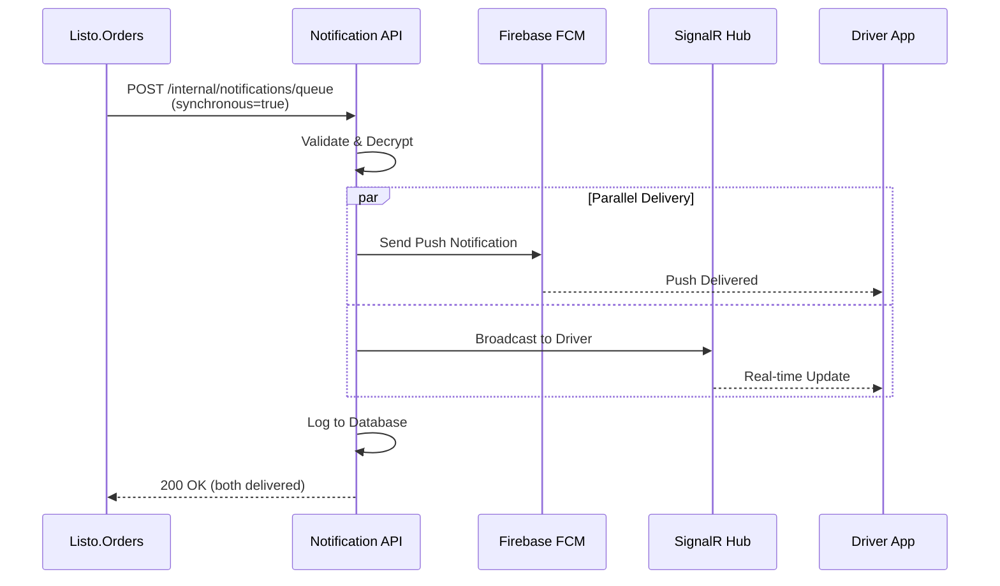
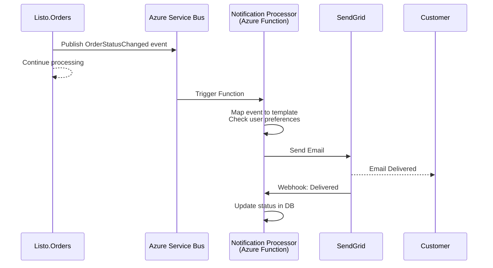

# Notification & Communication Service API Implementation Plan

This plan details the architecture, implementation steps, tools, and best practices for building a **shared Notification & Communication Service** for the ListoExpress ecosystem using **.NET 9**, **SQL Server**, **Azure Service Bus**, **Azure Functions**, and deploying as a container on **Azure**.

This service integrates with **Listo.Auth**, **Listo.Orders**, **Listo.RideSharing**, and other microservices to provide unified notification delivery across multiple channels (Push, SMS, Email, In-App Messaging).

**Related Documentation:**
- API Endpoints: [`notification_api_endpoints.md`](./notification_api_endpoints.md)
- Auth Service: [Listo.Auth Documentation](../Listo.Auth/docs/)
- Orders Service: [Listo.Orders Documentation](../Listo.Orders/docs/)
- RideSharing Service: [Listo.RideSharing Documentation](../Listo.RideSharing/)

---

## Table of Contents

1. [Requirements Analysis](#1-requirements-analysis)
2. [Technology Stack](#2-technology-stack)
3. [Service Integration & Architecture](#3-service-integration--architecture)
4. [Data Modeling & Database Schema](#4-data-modeling--database-schema)
5. [Authentication & Authorization](#5-authentication--authorization)
6. [Service-Specific Event Mappings](#6-service-specific-event-mappings)
7. [Cost Management & Rate Limiting](#7-cost-management--rate-limiting)
8. [Notification Delivery Strategy](#8-notification-delivery-strategy)
9. [Real-Time Messaging with SignalR](#9-real-time-messaging-with-signalr)
10. [API Implementation](#10-api-implementation)
11. [Validation & Error Handling](#11-validation--error-handling)
12. [File & Image Upload Handling](#12-file--image-upload-handling)
13. [Testing Strategy](#13-testing-strategy)
14. [Azure Functions Configuration](#14-azure-functions-configuration)
15. [Configuration Management](#15-configuration-management)
16. [Containerization](#16-containerization)
17. [Azure Deployment](#17-azure-deployment)
18. [Monitoring & Logging](#18-monitoring--logging)
19. [API Documentation](#19-api-documentation)
20. [CI/CD Pipeline](#20-cicd-pipeline)
21. [Security](#21-security)
22. [GDPR & Compliance](#22-gdpr--compliance)
23. [Clean Architecture Implementation](#23-clean-architecture-implementation)
24. [Maintenance & Future Enhancements](#24-maintenance--future-enhancements)

---

## 1. Requirements Analysis

### Core Requirements

- **Review API Spec:** Thoroughly review [`notification_api_endpoints.md`](./notification_api_endpoints.md) for endpoints, authentication, data models, and business logic.
- **Identify Resources:** Notifications (Push, SMS, Email, In-App), Devices, Templates, Preferences, Conversations, Analytics, Health.
- **Multi-Channel Support:** Email, SMS, Push Notifications, Real-time In-App Messaging.
- **Service Integration:** Integrate with Listo.Auth, Listo.Orders, Listo.RideSharing via REST APIs, Azure Service Bus, and event-driven patterns.

### Authentication & Authorization

- **Client Authentication:** JWT Bearer tokens issued by Listo.Auth
- **Service-to-Service:** Shared secrets stored in Azure Key Vault (X-Service-Secret header)
- **Roles:** Customer, Driver, Support, Admin (managed by Listo.Auth)

### Delivery Requirements

- **Synchronous:** Driver assignment alerts (push + SignalR) must be synchronous
- **Asynchronous:** All other notifications queued via Azure Service Bus
- **Retry Policy:** Exponential backoff with jitter, max 6 attempts, no dead-letter queues
- **Rate Limiting:** Per-user and per-service quotas with cost management

### Compliance

- **GDPR:** Data retention, audit trails, user data export and deletion
- **PII Encryption:** Encrypt email, phone numbers, device tokens at rest
- **Audit Logging:** Track all notification activities for compliance

### Default Configuration Values

- **Retention:**
  - Notification content: 90 days
  - In-app chat (Support): 180 days
  - In-app chat (Customer-Driver): 30 days
  - Audit logs: 13 months
  - Queue rows: Purged 30 days after completion
- **Retry Policy:**
  - Base delay: 5 seconds
  - Backoff factor: 2
  - Jitter: Enabled
  - Max attempts: 6
- **Rate Limits:**
  - Per-user per channel: 60/hour with burst of 20
  - Per-service daily caps: Email 50k, SMS 10k, Push 200k, In-app unlimited
  - Redis token bucket implementation
- **Budget Thresholds:**
  - Alert at 80% and 100% per month per service and channel
  - Block non-critical notifications beyond budget (admin override available)
- **Localization:**
  - Default locale: en-US
  - Template fallback strategy
- **Idempotency:**
  - X-Idempotency-Key required on create/send POSTs
  - Uniqueness window: 24 hours per serviceOrigin
- **Observability:**
  - OpenTelemetry tracing with W3C traceparent
  - X-Correlation-Id headers required

---

## 2. Technology Stack

### Backend Framework

- **.NET 9** (ASP.NET Core Web API)
- **NO MediatR** (per architectural guidelines - use direct service injection)

### Data Layer

- **Database:** Microsoft SQL Server (Dedicated Azure SQL Database)
- **ORM:** Entity Framework Core 9.0
- **Migration Tool:** EF Core Migrations

### Azure Services

- **Azure Service Bus:** Message queues and pub/sub topics
  - Queues: `listo-notifications-queue`, `listo-notifications-retry`, `listo-notifications-priority`
  - Topic: `listo-notifications-events` with subscriptions (auth, orders, ridesharing)
- **Azure Functions:** Background job processing
  - Scheduled notification runner
  - Retry processor
  - Cost and budget calculator
  - Data retention cleaner
- **Azure SignalR Service:** Real-time in-app messaging
- **Azure Key Vault:** Secrets management (provider credentials, service secrets)
- **Azure Container Apps / AKS:** Container hosting
- **Azure Application Insights:** Monitoring and logging
- **Azure Blob Storage:** File uploads for messaging

### Caching & Rate Limiting

- **Azure Cache for Redis:** Rate limiting (token bucket), presence, typing indicators

### External Providers

- **Push Notifications:** Firebase Cloud Messaging (FCM)
- **SMS Service:** Twilio
- **Email Service:** SendGrid or Azure Communication Services

### Development Tools

- **Validation:** FluentValidation
- **API Documentation:** Swashbuckle (Swagger/OpenAPI)
- **Testing:** xUnit, Moq, FluentAssertions, Testcontainers
- **Logging:** Serilog with structured logging
- **CI/CD:** GitHub Actions or Azure DevOps
- **Containerization:** Docker
- **IaC:** Bicep or Terraform

---

## 3. Service Integration & Architecture

### 3.1. Integration Patterns

The Listo.Notification service supports **three primary integration patterns** to accommodate different use cases:

#### Direct REST API Calls

**Use Case:** Synchronous operations requiring immediate feedback

**Authentication:**
- **Client Requests:** `Authorization: Bearer {jwt_token}` (issued by Listo.Auth)
- **Service-to-Service:** `X-Service-Secret: {shared_secret}` (from Azure Key Vault)

**Required Headers:**
```http
Authorization: Bearer {jwt_token}  # OR X-Service-Secret for services
Content-Type: application/json
X-Idempotency-Key: {unique_key}    # Required for POST operations
X-Correlation-Id: {trace_id}       # Required for tracing
traceparent: {w3c_trace_context}   # OpenTelemetry tracing
```

**Example:** Driver assignment push notification
```http
POST /api/v1/internal/notifications/queue
X-Service-Secret: {secret}
X-Idempotency-Key: orders-driver-assign-12345
X-Correlation-Id: trace-abc-123

{
  "userId": "driver-uuid-456",
  "serviceOrigin": "orders",
  "channel": "push",
  "templateKey": "driver_assignment",
  "priority": "high",
  "synchronous": true,
  "data": {
    "orderId": "ORD-001",
    "customerName": "John Doe",
    "pickupAddress": "123 Main St"
  },
  "encryptedEmail": null,
  "encryptedPhoneNumber": null,
  "encryptedFirebaseToken": "encrypted_fcm_token"
}
```

#### Azure Service Bus Integration

**Use Case:** Asynchronous, reliable message delivery with retry capabilities

**Queues:**
- `listo-notifications-queue`: Standard priority notifications
- `listo-notifications-priority`: High-priority time-sensitive notifications
- `listo-notifications-retry`: Failed notifications for retry processing

**Topic & Subscriptions:**
- Topic: `listo-notifications-events`
- Subscriptions:
  - `auth-notifications`: Email verification, password reset, 2FA
  - `orders-notifications`: Order confirmations, status updates
  - `ridesharing-notifications`: Ride bookings, driver assignments

**Message Envelope Format:**
```json
{
  "eventId": "evt-uuid-789",
  "occurredAt": "2024-01-15T10:30:00Z",
  "messageType": "NotificationRequested",
  "serviceOrigin": "orders",
  "userId": "user-uuid-123",
  "correlationId": "trace-abc-123",
  "idempotencyKey": "orders-status-update-456",
  "priority": "normal",
  "channels": ["email", "push"],
  "templateKey": "order_status_updated",
  "data": {
    "orderId": "ORD-001",
    "newStatus": "preparing",
    "estimatedTime": "30 minutes"
  },
  "metadata": {
    "locale": "en-US",
    "timezone": "America/New_York"
  }
}
```

**Application Properties (Service Bus):**
```json
{
  "ServiceOrigin": "orders",
  "MessageType": "NotificationRequested",
  "Priority": "normal",
  "CorrelationId": "trace-abc-123"
}
```

#### Event-Driven Architecture

**Use Case:** Loosely coupled microservice communication via domain events

**Pattern:**
1. Service publishes domain event to Service Bus topic
2. Listo.Notification subscribes to relevant events
3. Events are mapped to notification templates
4. Notifications are processed based on user preferences

**Example Event Flow:**
```
Listo.Orders → OrderStatusChanged event
     ↓
Service Bus Topic (listo-notifications-events)
     ↓
Listo.Notification Subscription (orders-notifications)
     ↓
Map to template: order_status_updated
     ↓
Check user preferences → Send via enabled channels
```

### 3.2. Service Origin Tracking

All notifications include `serviceOrigin` to enable:
- **Cost Attribution:** Track costs per service
- **Rate Limiting:** Apply service-specific quotas
- **Analytics:** Generate per-service reports
- **Compliance:** Audit trail scoped by service

**Valid Service Origins:**
- `auth`
- `orders`
- `ridesharing`
- `products`
- `system` (for admin/platform notifications)

### 3.3. Sequence Diagrams

#### Synchronous Driver Assignment (Critical Path)



#### Asynchronous Order Status Update



### 3.4. Idempotency & Correlation

**Idempotency:**
- **Header:** `X-Idempotency-Key` (required for all POST operations)
- **Uniqueness Window:** 24 hours per `serviceOrigin`
- **Behavior:** Duplicate requests return original response (200 OK)
- **Storage:** Redis cache with 24-hour TTL

**Correlation:**
- **Header:** `X-Correlation-Id` (required, auto-generated if missing)
- **Purpose:** End-to-end tracing across microservices
- **Format:** UUID v4 or W3C traceparent
- **Propagation:** Passed to all downstream calls (FCM, Twilio, SendGrid)

---

## 3. Solution Architecture

- **Project Structure:** Use Clean Architecture (Domain, Application, Infrastructure, API layers).
- **API Versioning:** Prefix all routes with `/api/v1`.
- **Configuration:** Use appsettings and environment variables for DB, service credentials, and secrets.

---

## 4. Data Modeling & Database Schema

### Overview

**Database:** Dedicated SQL Server instance (not shared with other services)
**Encryption:** PII encrypted at rest using AES-256-GCM with per-row IV
**Key Management:** Encryption keys stored in Azure Key Vault
**TDE:** Transparent Data Encryption enabled on SQL Server

### 4.1. Notifications Table

**Purpose:** Immutable audit log of all sent notifications

| Field              | Type           | Nullable | Description                               |
|--------------------|----------------|----------|-------------------------------------------|
| Id                 | GUID (PK)      | No       | Notification ID                           |
| UserId             | string         | Yes      | Target user (null for broadcast)          |
| ServiceOrigin      | string         | No       | auth, orders, ridesharing, products       |
| Channel            | string         | No       | push, sms, email, inApp                   |
| TemplateKey        | string         | No       | Reference to template                     |
| Status             | string         | No       | queued, sent, delivered, opened, failed   |
| Priority           | string         | No       | high, normal, low                         |
| ScheduledAt        | datetime       | Yes      | For scheduled notifications               |
| SentAt             | datetime       | Yes      | Actual send timestamp                     |
| ProviderMessageId  | string         | Yes      | External provider message ID              |
| ErrorCode          | string         | Yes      | Provider error code if failed             |
| ErrorMessage       | string         | Yes      | Error details                             |
| CorrelationId      | string         | No       | Tracing correlation ID                    |
| CreatedAt          | datetime       | No       | Record creation timestamp                 |
| UpdatedAt          | datetime       | No       | Last update timestamp                     |

**Indexes:**
- `IX_Notifications_UserId_CreatedAt` (UserId, CreatedAt DESC)
- `IX_Notifications_ServiceOrigin_CreatedAt` (ServiceOrigin, CreatedAt DESC)
- `IX_Notifications_Status_ScheduledAt` (Status, ScheduledAt) WHERE ScheduledAt IS NOT NULL
- `IX_Notifications_CorrelationId` (CorrelationId)

---

### 4.2. NotificationQueue Table

**Purpose:** Transient queue for notifications pending delivery with encrypted PII

| Field                    | Type           | Nullable | Description                               |
|--------------------------|----------------|----------|-------------------------------------------|
| QueueId                  | GUID (PK)      | No       | Queue record ID                           |
| UserId                   | string         | Yes      | Target user (null for broadcast)          |
| ServiceOrigin            | string         | No       | auth, orders, ridesharing, products       |
| Channel                  | string         | No       | push, sms, email, inApp                   |
| TemplateKey              | string         | No       | Template to use for rendering             |
| PayloadJson              | nvarchar(max)  | No       | Template variables and metadata as JSON   |
| EncryptedEmail           | varbinary(512) | Yes      | AES-256-GCM encrypted email               |
| EncryptedPhoneNumber     | varbinary(512) | Yes      | AES-256-GCM encrypted phone number        |
| EncryptedFirebaseToken   | varbinary(512) | Yes      | AES-256-GCM encrypted FCM token           |
| EmailHash                | varchar(64)    | Yes      | SHA-256 hash for deduplication            |
| PhoneHash                | varchar(64)    | Yes      | SHA-256 hash for deduplication            |
| PreferredLocale          | varchar(10)    | No       | e.g., en-US, es-MX                        |
| ScheduledAt              | datetime       | Yes      | For scheduled delivery                    |
| Attempts                 | int            | No       | Retry attempt count (default: 0)          |
| NextAttemptAt            | datetime       | Yes      | Calculated next retry time                |
| LastErrorCode            | string         | Yes      | Last failure error code                   |
| LastErrorMessage         | string         | Yes      | Last failure error message                |
| CorrelationId            | string         | No       | Tracing correlation ID                    |
| CreatedAt                | datetime       | No       | Queue entry creation timestamp            |

**Indexes:**
- `IX_NotificationQueue_ScheduledAt_Attempts` (ScheduledAt, Attempts) WHERE NextAttemptAt IS NOT NULL
- `IX_NotificationQueue_EmailHash` (EmailHash) WHERE EmailHash IS NOT NULL
- `IX_NotificationQueue_CreatedAt` (CreatedAt) for cleanup

**Encryption Notes:**
- Each row uses a unique IV (Initialization Vector) stored with encrypted data
- Encryption key from Azure Key Vault (key rotation supported)
- Hashes used for duplicate detection without decryption

**Cleanup:**
- Records purged 30 days after successful delivery or final failure

---

### 4.3. RetryPolicy Table

**Purpose:** Configurable retry policies per service origin and channel

| Field               | Type     | Nullable | Description                               |
|---------------------|----------|----------|-------------------------------------------|
| PolicyId            | GUID (PK)| No       | Policy ID                                 |
| ServiceOrigin       | string   | No       | auth, orders, ridesharing, products, *    |
| Channel             | string   | No       | push, sms, email, inApp, *                |
| MaxAttempts         | int      | No       | Maximum retry attempts (default: 6)       |
| BaseDelaySeconds    | int      | No       | Initial retry delay (default: 5)          |
| BackoffFactor       | decimal  | No       | Exponential backoff multiplier (default: 2.0) |
| JitterMs            | int      | No       | Random jitter in ms (default: 1000)       |
| TimeoutSeconds      | int      | No       | Per-attempt timeout (default: 30)         |
| Enabled             | bool     | No       | Is policy active (default: true)          |

**Unique Constraint:** (ServiceOrigin, Channel)

**Default Policies (Seeded):**
```sql
INSERT INTO RetryPolicy (PolicyId, ServiceOrigin, Channel, MaxAttempts, BaseDelaySeconds, BackoffFactor, JitterMs, TimeoutSeconds, Enabled)
VALUES
  (NEWID(), '*', '*', 6, 5, 2.0, 1000, 30, 1),              -- Default for all
  (NEWID(), 'orders', 'push', 3, 2, 2.0, 500, 15, 1),       -- Faster for driver assignment
  (NEWID(), 'auth', 'sms', 4, 3, 2.0, 500, 20, 1);          -- OTP/2FA retry policy
```

**Retry Calculation Logic:**
```
NextAttemptDelay = (BaseDelaySeconds * (BackoffFactor ^ Attempts)) + Random(0, JitterMs)
```

---

### 4.4. CostTracking Table

**Purpose:** Per-message cost tracking for budget management

| Field               | Type           | Nullable | Description                               |
|---------------------|----------------|----------|-------------------------------------------|
| CostId              | GUID (PK)      | No       | Cost record ID                            |
| ServiceOrigin       | string         | No       | auth, orders, ridesharing, products       |
| Channel             | string         | No       | push, sms, email, inApp                   |
| Provider            | string         | No       | fcm, twilio, sendgrid                     |
| UnitCostMicros      | bigint         | No       | Cost per unit in micros (1/1,000,000)     |
| Currency            | varchar(3)     | No       | USD, EUR, etc.                            |
| MessageId           | GUID           | Yes      | Reference to Notifications table          |
| UsageUnits          | int            | No       | Number of units (segments for SMS)        |
| TotalCostMicros     | bigint         | No       | UsageUnits * UnitCostMicros               |
| OccurredAt          | datetime       | No       | Cost incurred timestamp                   |

**Indexes:**
- `IX_CostTracking_ServiceOrigin_OccurredAt` (ServiceOrigin, OccurredAt DESC)
- `IX_CostTracking_Channel_OccurredAt` (Channel, OccurredAt DESC)

**Monthly Rollup View:**
```sql
CREATE VIEW CostMonthlySummary AS
SELECT 
    ServiceOrigin,
    Channel,
    YEAR(OccurredAt) AS Year,
    MONTH(OccurredAt) AS Month,
    Currency,
    SUM(TotalCostMicros) / 1000000.0 AS TotalCost,
    COUNT(*) AS MessageCount,
    AVG(TotalCostMicros) / 1000000.0 AS AvgCostPerMessage
FROM CostTracking
GROUP BY ServiceOrigin, Channel, YEAR(OccurredAt), MONTH(OccurredAt), Currency;
```

**Cost Examples:**
- FCM Push: $0 (free, but track for analytics)
- Twilio SMS (US): ~$0.0079/message → 7900 micros
- SendGrid Email: ~$0.00095/email → 950 micros

---

### 4.5. RateLimiting Table

**Purpose:** Configurable rate limits per service and user

| Field                    | Type     | Nullable | Description                               |
|--------------------------|----------|----------|-------------------------------------------|
| ConfigId                 | GUID (PK)| No       | Configuration ID                          |
| ServiceOrigin            | string   | No       | auth, orders, ridesharing, products, *    |
| Channel                  | string   | No       | push, sms, email, inApp, *                |
| PerUserWindowSeconds     | int      | No       | Time window for per-user limit (3600)     |
| PerUserMax               | int      | No       | Max per user in window (60)               |
| PerServiceWindowSeconds  | int      | No       | Time window for per-service (86400)       |
| PerServiceMax            | int      | No       | Max per service in window (50000)         |
| BurstSize                | int      | No       | Allowed burst above limit (20)            |
| Enabled                  | bool     | No       | Is limit enforced (default: true)         |

**Unique Constraint:** (ServiceOrigin, Channel)

**Default Limits (Seeded):**
```sql
INSERT INTO RateLimiting (ConfigId, ServiceOrigin, Channel, PerUserWindowSeconds, PerUserMax, PerServiceWindowSeconds, PerServiceMax, BurstSize, Enabled)
VALUES
  (NEWID(), '*', 'email', 3600, 60, 86400, 50000, 20, 1),
  (NEWID(), '*', 'sms', 3600, 60, 86400, 10000, 20, 1),
  (NEWID(), '*', 'push', 3600, 60, 86400, 200000, 20, 1),
  (NEWID(), '*', 'inApp', 3600, 1000, 86400, 999999999, 100, 1); -- Unlimited for in-app
```

**Implementation:** Redis token bucket pattern

---

### 4.6. AuditLog Table

**Purpose:** Immutable audit trail for compliance (GDPR, SOC 2)

| Field          | Type           | Nullable | Description                               |
|----------------|----------------|----------|-------------------------------------------|
| AuditId        | GUID (PK)      | No       | Audit record ID                           |
| Action         | string         | No       | created, updated, deleted, sent, delivered|
| EntityType     | string         | No       | notification, template, preference, user  |
| EntityId       | GUID           | No       | ID of the affected entity                 |
| UserId         | string         | Yes      | User who performed action (null=system)   |
| ServiceOrigin  | string         | Yes      | auth, orders, ridesharing, system         |
| ActorType      | string         | No       | user, service, system, admin              |
| IpAddress      | string         | Yes      | Source IP address                         |
| UserAgent      | string         | Yes      | Browser/client user agent                 |
| BeforeJson     | nvarchar(max)  | Yes      | Entity state before change (JSON)         |
| AfterJson      | nvarchar(max)  | Yes      | Entity state after change (JSON)          |
| OccurredAt     | datetime       | No       | Audit event timestamp (UTC)               |

**Indexes:**
- `IX_AuditLog_EntityType_EntityId` (EntityType, EntityId, OccurredAt DESC)
- `IX_AuditLog_UserId_OccurredAt` (UserId, OccurredAt DESC) WHERE UserId IS NOT NULL
- `IX_AuditLog_OccurredAt` (OccurredAt DESC)

**Retention:** 13 months (for compliance), then archived or deleted

---

### 4.7. Templates Table

**Purpose:** Notification templates with versioning and localization

| Field          | Type           | Nullable | Description                               |
|----------------|----------------|----------|-------------------------------------------|
| TemplateId     | GUID (PK)      | No       | Template ID                               |
| TemplateKey    | string         | No       | Unique key (e.g., order_confirmed)        |
| Channel        | string         | No       | push, sms, email, inApp                   |
| Locale         | varchar(10)    | No       | en-US, es-MX, fr-FR, etc.                 |
| Subject        | string         | Yes      | Email subject or push title               |
| Body           | nvarchar(max)  | No       | Template body with {{variables}}          |
| Variables      | nvarchar(max)  | No       | JSON array of expected variables          |
| Version        | int            | No       | Template version number                   |
| IsActive       | bool           | No       | Is template active (default: true)        |
| CreatedAt      | datetime       | No       | Template creation timestamp               |
| UpdatedAt      | datetime       | No       | Last update timestamp                     |

**Unique Constraint:** (TemplateKey, Channel, Locale, Version)

**Indexes:**
- `IX_Templates_TemplateKey_Channel_Locale` (TemplateKey, Channel, Locale) WHERE IsActive = 1

**Localization Fallback Strategy:**
1. Try exact locale match (e.g., en-US)
2. Try language match (e.g., en)
3. Fall back to en-US (default)

**Example Template:**
```json
{
  "templateKey": "order_confirmed",
  "channel": "email",
  "locale": "en-US",
  "subject": "Order Confirmed - {{orderId}}",
  "body": "Hi {{customerName}}, your order {{orderId}} has been confirmed! Expected delivery: {{deliveryTime}}.",
  "variables": ["customerName", "orderId", "deliveryTime"],
  "version": 1,
  "isActive": true
}
```

---

### 4.8. Preferences Table

**Purpose:** User notification preferences and quiet hours

| Field          | Type           | Nullable | Description                               |
|----------------|----------------|----------|-------------------------------------------|
| PreferenceId   | GUID (PK)      | No       | Preference ID                             |
| UserId         | string         | No       | User reference (from Listo.Auth)          |
| Channel        | string         | No       | push, sms, email, inApp, *                |
| IsEnabled      | bool           | No       | Is channel enabled (default: true)        |
| QuietHours     | nvarchar(max)  | Yes      | JSON: {enabled, startTime, endTime, tz}   |
| Topics         | nvarchar(max)  | Yes      | JSON array of enabled topics              |
| Locale         | varchar(10)    | No       | Preferred locale (default: en-US)         |
| UpdatedAt      | datetime       | No       | Last update timestamp                     |

**Unique Constraint:** (UserId, Channel)

**Indexes:**
- `IX_Preferences_UserId` (UserId)

**Default Preferences (created on user registration):**
```json
{
  "userId": "user-uuid-123",
  "channel": "*",
  "isEnabled": true,
  "quietHours": {
    "enabled": false,
    "startTime": "22:00",
    "endTime": "08:00",
    "timezone": "America/New_York"
  },
  "topics": ["order_updates", "security_alerts"],
  "locale": "en-US"
}
```

---

### 4.9. Conversations Table (In-App Messaging)

**Purpose:** In-app messaging conversations (Customer↔Support, Customer↔Driver)

| Field            | Type           | Nullable | Description                               |
|------------------|----------------|----------|-------------------------------------------|
| ConversationId   | GUID (PK)      | No       | Conversation ID                           |
| Type             | string         | No       | customer_support, customer_driver         |
| ParticipantsJson | nvarchar(max)  | No       | JSON array of participant user IDs        |
| ServiceOrigin    | string         | No       | orders, ridesharing                       |
| CreatedAt        | datetime       | No       | Conversation creation timestamp           |
| LastMessageAt    | datetime       | Yes      | Timestamp of most recent message          |

**Indexes:**
- `IX_Conversations_LastMessageAt` (LastMessageAt DESC)
- Full-text index on ParticipantsJson for user lookup

**Retention:**
- Customer↔Support: 180 days after last message
- Customer↔Driver: 30 days after last message

---

### 4.10. Messages Table (In-App Messaging)

**Purpose:** Individual messages within conversations

| Field            | Type           | Nullable | Description                               |
|------------------|----------------|----------|-------------------------------------------|
| MessageId        | GUID (PK)      | No       | Message ID                                |
| ConversationId   | GUID (FK)      | No       | Parent conversation                       |
| SenderUserId     | string         | No       | User ID of sender                         |
| RecipientUserId  | string         | Yes      | Specific recipient (null=all participants)|
| Body             | nvarchar(max)  | No       | Message content (text, markdown)          |
| AttachmentsJson  | nvarchar(max)  | Yes      | JSON array of file URLs                   |
| Status           | string         | No       | sent, delivered, read, failed             |
| SentAt           | datetime       | No       | Message sent timestamp                    |
| ReadAt           | datetime       | Yes      | Message read timestamp                    |

**Indexes:**
- `IX_Messages_ConversationId_SentAt` (ConversationId, SentAt DESC)
- `IX_Messages_RecipientUserId_Status` (RecipientUserId, Status) WHERE RecipientUserId IS NOT NULL

**Foreign Key:** ConversationId → Conversations.ConversationId (ON DELETE CASCADE)

---

### 4.11. Devices Table

**Purpose:** User devices for push notification delivery

| Field          | Type           | Nullable | Description                               |
|----------------|----------------|----------|-------------------------------------------|
| DeviceId       | GUID (PK)      | No       | Device ID                                 |
| UserId         | string         | No       | User owning the device                    |
| DeviceToken    | string         | No       | FCM/APNS token (hashed for security)      |
| Platform       | string         | No       | android, ios, web                         |
| DeviceInfo     | nvarchar(max)  | Yes      | JSON: model, osVersion, appVersion        |
| LastSeen       | datetime       | No       | Last active timestamp                     |
| Active         | bool           | No       | Is device active (default: true)          |
| CreatedAt      | datetime       | No       | Device registration timestamp             |
| UpdatedAt      | datetime       | No       | Last update timestamp                     |

**Unique Constraint:** (DeviceToken) to prevent duplicates

**Indexes:**
- `IX_Devices_UserId_Active` (UserId, Active)
- `IX_Devices_LastSeen` (LastSeen) for cleanup

**Cleanup:** Remove devices inactive for > 90 days

---

### 4.12. Entity Relationship Diagram (ERD)


---

### 4.13. Migration Strategy

**Phase 1: Core Tables**
1. Notifications, NotificationQueue, Templates, Preferences, Devices
2. Seed default RetryPolicy and RateLimiting configurations

**Phase 2: Supporting Tables**
3. CostTracking, AuditLog
4. Create monthly rollup views

**Phase 3: Messaging Tables**
5. Conversations, Messages
6. Add full-text indexes

**Phase 4: Optimization**
7. Add composite indexes based on query patterns
8. Partition AuditLog by OccurredAt (monthly partitions)
9. Create archived tables for retention compliance

**EF Core Migrations:**
```bash
dotnet ef migrations add InitialCreate --project src/Listo.Notification.Infrastructure
dotnet ef database update --project src/Listo.Notification.Infrastructure
```

**Rollback Strategy:**
- All migrations reversible with DOWN scripts
- Database backups before each migration
- Blue-green deployment for zero-downtime migrations

---

## 5. Authentication & Authorization

- **JWT Authentication:** Use Microsoft.AspNetCore.Authentication.JwtBearer.
- **Role-based Authorization:** Implement policies for Customer, Driver, Support, Admin.
- **Azure AD Integration:** For enterprise scenarios.

---

## 6. API Implementation

- **Controllers:** Scaffold controllers for each resource (Notifications, Devices, Messages, SMS, Email, Preferences, Analytics, Health).
- **Endpoints:** Implement all endpoints as per the spec, including:
  - Pagination, filtering, sorting (query params)
  - CRUD operations for templates, preferences, devices
  - Sending and scheduling notifications (push, sms, email)
  - In-app messaging (conversations, messages, participants)
  - File upload for messaging (integrate with Azure Blob Storage)
  - Analytics and health endpoints
- **Business Logic:** Place in Application layer/services.
- **Data Access:** Use EF Core in Infrastructure layer.

---

## 7. Validation & Error Handling

- **Request Validation:** Use DataAnnotations and/or FluentValidation.
- **Error Handling:** Implement global exception middleware for consistent error responses.
- **Response Formatting:** Standardize success/error responses as per API spec.

---

## 8. Notification Sending Integrations

- **Push:** Integrate with Firebase Cloud Messaging (FCM).
- **SMS:** Integrate with Twilio SDK.
- **Email:** Integrate with SendGrid or Azure Communication Services.
- **Scheduling:** Use background jobs (e.g., Hangfire, Azure Functions) for scheduled notifications.

---

## 9. File & Image Upload Handling

- **Accept Files:** Support multipart form data for messaging attachments.
- **Store Files:** Upload to Azure Blob Storage, save URLs in SQL Server.
- **Security:** Validate file types and sizes.

---

## 10. Testing

- **Unit Tests:** Use xUnit and Moq for services and controllers.
- **Integration Tests:** Use Testcontainers or a test SQL Server instance.
- **Test Coverage:** Ensure all endpoints and business logic are covered.

---

## 11. Containerization

- **Dockerfile:** Write a Dockerfile for .NET 9 API.
- **.dockerignore:** Exclude unnecessary files.
- **Configuration:** Use environment variables for secrets and connection strings.

---

## 12. Azure Deployment

- **Container Registry:** Push Docker image to Azure Container Registry.
- **Deployment:** Deploy to Azure Container Apps or AKS.
- **Networking:** Configure ingress, DNS, and SSL.
- **Scaling:** Set up autoscaling as needed.
- **Monitoring:** Enable Application Insights.

---

## 13. Monitoring & Logging

- **Logging:** Use Serilog for structured logs.
- **Monitoring:** Integrate Azure Application Insights.
- **Health Checks:** Implement `/api/v1/health` endpoint.

---

## 14. Documentation

- **Swagger/OpenAPI:** Use Swashbuckle to generate and expose API docs.
- **README:** Document setup, environment variables, and deployment steps.

---

## 15. CI/CD Pipeline

- **Build & Test:** Use GitHub Actions or Azure DevOps for build, test, and lint.
- **Container Build:** Build and push Docker image on merge to main.
- **Deploy:** Automate deployment to Azure.

---

## 16. Security

- **Secrets:** Store sensitive data in Azure Key Vault.
- **HTTPS:** Enforce HTTPS in production.
- **CORS:** Configure allowed origins.
- **Data Protection:** Encrypt sensitive data at rest and in transit.
- **Input Validation:** Prevent SQL injection, XSS, and validate file uploads.

---

## 17. Maintenance & Future Enhancements

- **Versioning:** Plan for future API versions.
- **Performance:** Monitor and optimize queries and indexes.
- **Scalability:** Design for horizontal scaling.
- **GDPR:** Ensure compliance with data privacy regulations.

---

**Summary:**  
This plan ensures a robust, secure, and scalable Notification & Communication Service API using modern .NET and Azure best practices, with SQL Server as the data store and full support for the requirements in `notification_api_endpoints.md`. The architecture supports push, SMS, email, in-app messaging, analytics, and user preferences, with integrations for FCM, Twilio, and SendGrid/Azure Communication