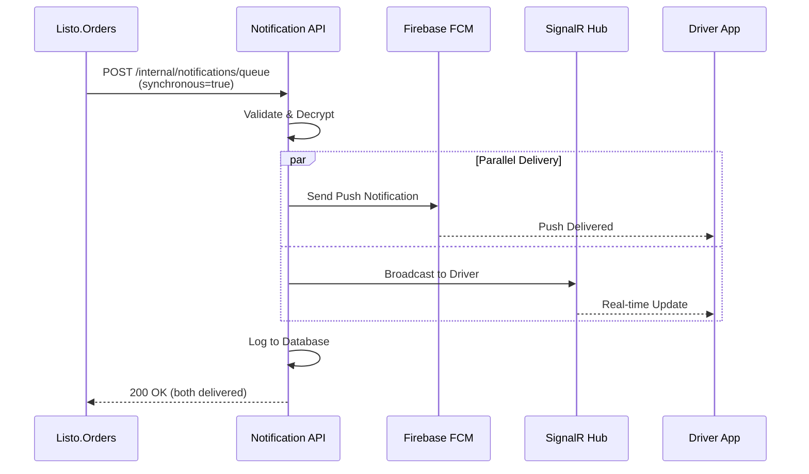
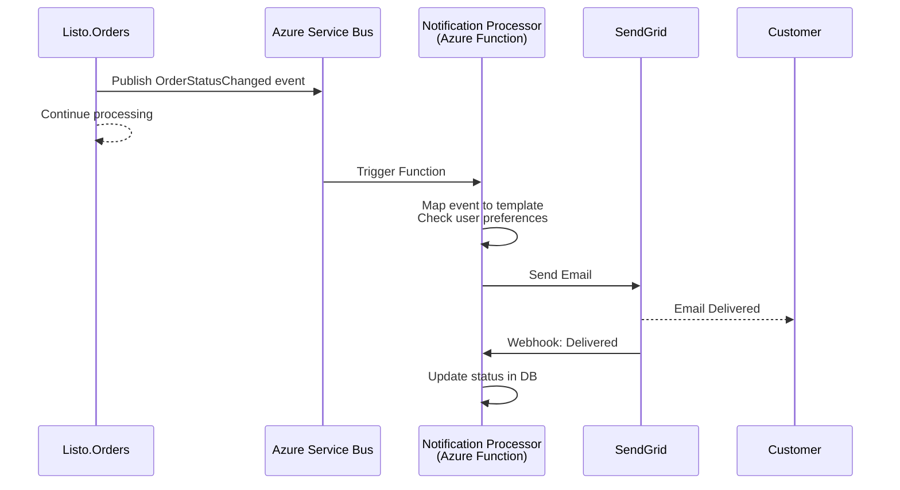

# Notification & Communication Service API Implementation Plan

This plan details the architecture, implementation steps, tools, and best practices for building a **shared Notification & Communication Service** for the ListoExpress ecosystem using **.NET 9**, **SQL Server**, **Azure Service Bus**, **Azure Functions**, and deploying as a container on **Azure**.

This service integrates with **Listo.Auth**, **Listo.Orders**, **Listo.RideSharing**, and other microservices to provide unified notification delivery across multiple channels (Push, SMS, Email, In-App Messaging).

**Related Documentation:**
- API Endpoints: [`notification_api_endpoints.md`](./notification_api_endpoints.md)
- Auth Service: [Listo.Auth Documentation](../Listo.Auth/docs/)
- Orders Service: [Listo.Orders Documentation](../Listo.Orders/docs/)
- RideSharing Service: [Listo.RideSharing Documentation](../Listo.RideSharing/)

---

## Table of Contents

1. [Requirements Analysis](#1-requirements-analysis)
2. [Technology Stack](#2-technology-stack)
3. [Service Integration & Architecture](#3-service-integration--architecture)
4. [Data Modeling & Database Schema](#4-data-modeling--database-schema)
5. [Authentication & Authorization](#5-authentication--authorization)
6. [Service-Specific Event Mappings](#6-service-specific-event-mappings)
7. [Cost Management & Rate Limiting](#7-cost-management--rate-limiting)
8. [Notification Delivery Strategy](#8-notification-delivery-strategy)
9. [Real-Time Messaging with SignalR](#9-real-time-messaging-with-signalr)
10. [API Implementation](#10-api-implementation)
11. [Validation & Error Handling](#11-validation--error-handling)
12. [File & Image Upload Handling](#12-file--image-upload-handling)
13. [Testing Strategy](#13-testing-strategy)
14. [Azure Functions Configuration](#14-azure-functions-configuration)
15. [Configuration Management](#15-configuration-management)
16. [Containerization](#16-containerization)
17. [Azure Deployment](#17-azure-deployment)
18. [Monitoring & Logging](#18-monitoring--logging)
19. [API Documentation](#19-api-documentation)
20. [CI/CD Pipeline](#20-cicd-pipeline)
21. [Security](#21-security)
22. [GDPR & Compliance](#22-gdpr--compliance)
23. [Clean Architecture Implementation](#23-clean-architecture-implementation)
24. [Maintenance & Future Enhancements](#24-maintenance--future-enhancements)

---

## 1. Requirements Analysis

### Core Requirements

- **Review API Spec:** Thoroughly review [`notification_api_endpoints.md`](./notification_api_endpoints.md) for endpoints, authentication, data models, and business logic.
- **Identify Resources:** Notifications (Push, SMS, Email, In-App), Devices, Templates, Preferences, Conversations, Analytics, Health.
- **Multi-Channel Support:** Email, SMS, Push Notifications, Real-time In-App Messaging.
- **Service Integration:** Integrate with Listo.Auth, Listo.Orders, Listo.RideSharing via REST APIs, Azure Service Bus, and event-driven patterns.

### Authentication & Authorization

- **Client Authentication:** JWT Bearer tokens issued by Listo.Auth
- **Service-to-Service:** Shared secrets stored in Azure Key Vault (X-Service-Secret header)
- **Roles:** Customer, Driver, Support, Admin (managed by Listo.Auth)

### Delivery Requirements

- **Synchronous:** Driver assignment alerts (push + SignalR) must be synchronous
- **Asynchronous:** All other notifications queued via Azure Service Bus
- **Retry Policy:** Exponential backoff with jitter, max 6 attempts, no dead-letter queues
- **Rate Limiting:** Per-user and per-service quotas with cost management

### Compliance

- **GDPR:** Data retention, audit trails, user data export and deletion
- **PII Encryption:** Encrypt email, phone numbers, device tokens at rest
- **Audit Logging:** Track all notification activities for compliance

### Default Configuration Values

- **Retention:**
  - Notification content: 90 days
  - In-app chat (Support): 180 days
  - In-app chat (Customer-Driver): 30 days
  - Audit logs: 13 months
  - Queue rows: Purged 30 days after completion
- **Retry Policy:**
  - Base delay: 5 seconds
  - Backoff factor: 2
  - Jitter: Enabled
  - Max attempts: 6
- **Rate Limits:**
  - Per-user per channel: 60/hour with burst of 20
  - Per-service daily caps: Email 50k, SMS 10k, Push 200k, In-app unlimited
  - Redis token bucket implementation
- **Budget Thresholds:**
  - Alert at 80% and 100% per month per service and channel
  - Block non-critical notifications beyond budget (admin override available)
- **Localization:**
  - Default locale: en-US
  - Template fallback strategy
- **Idempotency:**
  - X-Idempotency-Key required on create/send POSTs
  - Uniqueness window: 24 hours per serviceOrigin
- **Observability:**
  - OpenTelemetry tracing with W3C traceparent
  - X-Correlation-Id headers required

---

## 2. Technology Stack

### Backend Framework

- **.NET 9** (ASP.NET Core Web API)
- **NO MediatR** (per architectural guidelines - use direct service injection)

### Data Layer

- **Database:** Microsoft SQL Server (Dedicated Azure SQL Database)
- **ORM:** Entity Framework Core 9.0
- **Migration Tool:** EF Core Migrations

### Azure Services

- **Azure Service Bus:** Message queues and pub/sub topics
  - Queues: `listo-notifications-queue`, `listo-notifications-retry`, `listo-notifications-priority`
  - Topic: `listo-notifications-events` with subscriptions (auth, orders, ridesharing)
- **Azure Functions:** Background job processing
  - Scheduled notification runner
  - Retry processor
  - Cost and budget calculator
  - Data retention cleaner
- **Azure SignalR Service:** Real-time in-app messaging
- **Azure Key Vault:** Secrets management (provider credentials, service secrets)
- **Azure Container Apps / AKS:** Container hosting
- **Azure Application Insights:** Monitoring and logging
- **Azure Blob Storage:** File uploads for messaging

### Caching & Rate Limiting

- **Azure Cache for Redis:** Rate limiting (token bucket), presence, typing indicators

### External Providers

- **Push Notifications:** Firebase Cloud Messaging (FCM)
- **SMS Service:** Twilio
- **Email Service:** SendGrid or Azure Communication Services

### Development Tools

- **Validation:** FluentValidation
- **API Documentation:** Swashbuckle (Swagger/OpenAPI)
- **Testing:** xUnit, Moq, FluentAssertions, Testcontainers
- **Logging:** Serilog with structured logging
- **CI/CD:** GitHub Actions or Azure DevOps
- **Containerization:** Docker
- **IaC:** Bicep or Terraform

---

## 3. Service Integration & Architecture

### 3.1. Integration Patterns

The Listo.Notification service supports **three primary integration patterns** to accommodate different use cases:

#### Direct REST API Calls

**Use Case:** Synchronous operations requiring immediate feedback

**Authentication:**
- **Client Requests:** `Authorization: Bearer {jwt_token}` (issued by Listo.Auth)
- **Service-to-Service:** `X-Service-Secret: {shared_secret}` (from Azure Key Vault)

**Required Headers:**
```http
Authorization: Bearer {jwt_token}  # OR X-Service-Secret for services
Content-Type: application/json
X-Idempotency-Key: {unique_key}    # Required for POST operations
X-Correlation-Id: {trace_id}       # Required for tracing
traceparent: {w3c_trace_context}   # OpenTelemetry tracing
```

**Example:** Driver assignment push notification
```http
POST /api/v1/internal/notifications/queue
X-Service-Secret: {secret}
X-Idempotency-Key: orders-driver-assign-12345
X-Correlation-Id: trace-abc-123

{
  "userId": "driver-uuid-456",
  "serviceOrigin": "orders",
  "channel": "push",
  "templateKey": "driver_assignment",
  "priority": "high",
  "synchronous": true,
  "data": {
    "orderId": "ORD-001",
    "customerName": "John Doe",
    "pickupAddress": "123 Main St"
  },
  "encryptedEmail": null,
  "encryptedPhoneNumber": null,
  "encryptedFirebaseToken": "encrypted_fcm_token"
}
```

#### Azure Service Bus Integration

**Use Case:** Asynchronous, reliable message delivery with retry capabilities

**Queues:**
- `listo-notifications-queue`: Standard priority notifications
- `listo-notifications-priority`: High-priority time-sensitive notifications
- `listo-notifications-retry`: Failed notifications for retry processing

**Topic & Subscriptions:**
- Topic: `listo-notifications-events`
- Subscriptions:
  - `auth-notifications`: Email verification, password reset, 2FA
  - `orders-notifications`: Order confirmations, status updates
  - `ridesharing-notifications`: Ride bookings, driver assignments

**Message Envelope Format:**
```json
{
  "eventId": "evt-uuid-789",
  "occurredAt": "2024-01-15T10:30:00Z",
  "messageType": "NotificationRequested",
  "serviceOrigin": "orders",
  "userId": "user-uuid-123",
  "correlationId": "trace-abc-123",
  "idempotencyKey": "orders-status-update-456",
  "priority": "normal",
  "channels": ["email", "push"],
  "templateKey": "order_status_updated",
  "data": {
    "orderId": "ORD-001",
    "newStatus": "preparing",
    "estimatedTime": "30 minutes"
  },
  "metadata": {
    "locale": "en-US",
    "timezone": "America/New_York"
  }
}
```

**Application Properties (Service Bus):**
```json
{
  "ServiceOrigin": "orders",
  "MessageType": "NotificationRequested",
  "Priority": "normal",
  "CorrelationId": "trace-abc-123"
}
```

#### Event-Driven Architecture

**Use Case:** Loosely coupled microservice communication via domain events

**Pattern:**
1. Service publishes domain event to Service Bus topic
2. Listo.Notification subscribes to relevant events
3. Events are mapped to notification templates
4. Notifications are processed based on user preferences

**Example Event Flow:**
```
Listo.Orders → OrderStatusChanged event
     ↓
Service Bus Topic (listo-notifications-events)
     ↓
Listo.Notification Subscription (orders-notifications)
     ↓
Map to template: order_status_updated
     ↓
Check user preferences → Send via enabled channels
```

### 3.2. Service Origin Tracking

All notifications include `serviceOrigin` to enable:
- **Cost Attribution:** Track costs per service
- **Rate Limiting:** Apply service-specific quotas
- **Analytics:** Generate per-service reports
- **Compliance:** Audit trail scoped by service

**Valid Service Origins:**
- `auth`
- `orders`
- `ridesharing`
- `products`
- `system` (for admin/platform notifications)

### 3.3. Sequence Diagrams

#### Synchronous Driver Assignment (Critical Path)



#### Asynchronous Order Status Update



### 3.4. Idempotency & Correlation

**Idempotency:**
- **Header:** `X-Idempotency-Key` (required for all POST operations)
- **Uniqueness Window:** 24 hours per `serviceOrigin`
- **Behavior:** Duplicate requests return original response (200 OK)
- **Storage:** Redis cache with 24-hour TTL

**Correlation:**
- **Header:** `X-Correlation-Id` (required, auto-generated if missing)
- **Purpose:** End-to-end tracing across microservices
- **Format:** UUID v4 or W3C traceparent
- **Propagation:** Passed to all downstream calls (FCM, Twilio, SendGrid)

---

## 3. Solution Architecture

- **Project Structure:** Use Clean Architecture (Domain, Application, Infrastructure, API layers).
- **API Versioning:** Prefix all routes with `/api/v1`.
- **Configuration:** Use appsettings and environment variables for DB, service credentials, and secrets.

---

## 4. Data Modeling & Database Schema

### Overview

**Database:** Dedicated SQL Server instance (not shared with other services)
**Encryption:** PII encrypted at rest using AES-256-GCM with per-row IV
**Key Management:** Encryption keys stored in Azure Key Vault
**TDE:** Transparent Data Encryption enabled on SQL Server

### 4.1. Notifications Table

**Purpose:** Immutable audit log of all sent notifications

| Field              | Type           | Nullable | Description                               |
|--------------------|----------------|----------|-------------------------------------------|
| Id                 | GUID (PK)      | No       | Notification ID                           |
| UserId             | string         | Yes      | Target user (null for broadcast)          |
| ServiceOrigin      | string         | No       | auth, orders, ridesharing, products       |
| Channel            | string         | No       | push, sms, email, inApp                   |
| TemplateKey        | string         | No       | Reference to template                     |
| Status             | string         | No       | queued, sent, delivered, opened, failed   |
| Priority           | string         | No       | high, normal, low                         |
| ScheduledAt        | datetime       | Yes      | For scheduled notifications               |
| SentAt             | datetime       | Yes      | Actual send timestamp                     |
| ProviderMessageId  | string         | Yes      | External provider message ID              |
| ErrorCode          | string         | Yes      | Provider error code if failed             |
| ErrorMessage       | string         | Yes      | Error details                             |
| CorrelationId      | string         | No       | Tracing correlation ID                    |
| CreatedAt          | datetime       | No       | Record creation timestamp                 |
| UpdatedAt          | datetime       | No       | Last update timestamp                     |

**Indexes:**
- `IX_Notifications_UserId_CreatedAt` (UserId, CreatedAt DESC)
- `IX_Notifications_ServiceOrigin_CreatedAt` (ServiceOrigin, CreatedAt DESC)
- `IX_Notifications_Status_ScheduledAt` (Status, ScheduledAt) WHERE ScheduledAt IS NOT NULL
- `IX_Notifications_CorrelationId` (CorrelationId)

---

### 4.2. Devices Table

| Field           | Type           | Description                        |
|-----------------|----------------|------------------------------------|
| Id              | GUID (PK)      | Device ID                          |
| UserId          | string         | User owning the device             |
| DeviceToken     | string         | FCM/APNS token                     |
| Platform        | string         | android, ios                       |
| DeviceInfo      | JSON           | Model, OS version, app version     |
| Preferences     | JSON           | Notification preferences           |
| LastSeen        | datetime       | Last active timestamp              |
| Active          | bool           | Is device active                   |
| CreatedAt       | datetime       |                                    |
| UpdatedAt       | datetime       |                                    |

---

### 4.3. NotificationTemplates Table

| Field           | Type           | Description                        |
|-----------------|----------------|------------------------------------|
| Id              | GUID (PK)      | Template ID                        |
| Type            | string         | push, sms, email                   |
| Name            | string         | Template name                      |
| Title           | string         | (Push/Email) Title                 |
| Body/Message    | string         | Body/content                       |
| Subject         | string         | (Email) Subject                    |
| Variables       | JSON           | List of variables                  |
| Category        | string         | order_updates, security, etc.      |
| HtmlContent     | string         | (Email) HTML content               |
| TextContent     | string         | (Email) Text content               |
| ExpiryMinutes   | int            | (SMS) Expiry for OTPs              |
| CreatedAt       | datetime       |                                    |
| UpdatedAt       | datetime       |                                    |

---

### 4.4. InAppConversations Table

| Field           | Type           | Description                        |
|-----------------|----------------|------------------------------------|
| Id              | GUID (PK)      | Conversation ID                    |
| OrderId         | string         | Related order (nullable)           |
| Type            | string         | order_communication, support, etc. |
| Status          | string         | active, closed, archived           |
| CreatedAt       | datetime       |                                    |
| UpdatedAt       | datetime       |                                    |

---

### 4.5. InAppParticipants Table

| Field           | Type           | Description                        |
|-----------------|----------------|------------------------------------|
| Id              | GUID (PK)      | Participant ID                     |
| ConversationId  | GUID (FK)      | Conversation reference             |
| UserId          | string         | User in conversation               |
| UserType        | string         | customer, driver, support          |
| Name            | string         | Display name                       |

---

### 4.6. InAppMessages Table

| Field           | Type           | Description                        |
|-----------------|----------------|------------------------------------|
| Id              | GUID (PK)      | Message ID                         |
| ConversationId  | GUID (FK)      | Conversation reference             |
| SenderId        | string         | Sender user ID                     |
| Content         | string         | Message content                    |
| MessageType     | string         | text, image, file, location        |
| Metadata        | JSON           | Extra info (priority, etc.)        |
| SentAt          | datetime       |                                    |
| Edited          | bool           | Was message edited                 |
| ReplyToMessageId| GUID (FK)      | Reply to another message           |

---

### 4.7. MessageReads Table

| Field           | Type           | Description                        |
|-----------------|----------------|------------------------------------|
| Id              | GUID (PK)      | Read record ID                     |
| MessageId       | GUID (FK)      | Message reference                  |
| UserId          | string         | Who read                           |
| ReadAt          | datetime       | When read                          |

---

### 4.8. Preferences Table

| Field           | Type           | Description                        |
|-----------------|----------------|------------------------------------|
| Id              | GUID (PK)      | Preference ID                      |
| UserId          | string         | User reference                     |
| PushPreferences | JSON           | orderUpdates, promotions, etc.     |
| EmailPreferences| JSON           | orderConfirmations, newsletters    |
| SmsPreferences  | JSON           | orderUpdates, securityAlerts       |
| QuietHours      | JSON           | enabled, startTime, endTime, tz    |
| CreatedAt       | datetime       |                                    |
| UpdatedAt       | datetime       |                                    |

---

### 4.9. Analytics Tables

- **NotificationStats Table:** Aggregated stats for push, sms, email (sent, delivered, opened, etc.)
- **ConversationStats Table:** Messaging analytics (total, active, response time, etc.)

---

### 4.10. HealthChecks Table (Optional, for custom health metrics)

---

## 5. Authentication & Authorization

- **JWT Authentication:** Use Microsoft.AspNetCore.Authentication.JwtBearer.
- **Role-based Authorization:** Implement policies for Customer, Driver, Support, Admin.
- **Azure AD Integration:** For enterprise scenarios.

---

## 6. API Implementation

- **Controllers:** Scaffold controllers for each resource (Notifications, Devices, Messages, SMS, Email, Preferences, Analytics, Health).
- **Endpoints:** Implement all endpoints as per the spec, including:
  - Pagination, filtering, sorting (query params)
  - CRUD operations for templates, preferences, devices
  - Sending and scheduling notifications (push, sms, email)
  - In-app messaging (conversations, messages, participants)
  - File upload for messaging (integrate with Azure Blob Storage)
  - Analytics and health endpoints
- **Business Logic:** Place in Application layer/services.
- **Data Access:** Use EF Core in Infrastructure layer.

---

## 7. Validation & Error Handling

- **Request Validation:** Use DataAnnotations and/or FluentValidation.
- **Error Handling:** Implement global exception middleware for consistent error responses.
- **Response Formatting:** Standardize success/error responses as per API spec.

---

## 8. Notification Sending Integrations

- **Push:** Integrate with Firebase Cloud Messaging (FCM).
- **SMS:** Integrate with Twilio SDK.
- **Email:** Integrate with SendGrid or Azure Communication Services.
- **Scheduling:** Use background jobs (e.g., Hangfire, Azure Functions) for scheduled notifications.

---

## 9. File & Image Upload Handling

- **Accept Files:** Support multipart form data for messaging attachments.
- **Store Files:** Upload to Azure Blob Storage, save URLs in SQL Server.
- **Security:** Validate file types and sizes.

---

## 10. Testing

- **Unit Tests:** Use xUnit and Moq for services and controllers.
- **Integration Tests:** Use Testcontainers or a test SQL Server instance.
- **Test Coverage:** Ensure all endpoints and business logic are covered.

---

## 11. Containerization

- **Dockerfile:** Write a Dockerfile for .NET 9 API.
- **.dockerignore:** Exclude unnecessary files.
- **Configuration:** Use environment variables for secrets and connection strings.

---

## 12. Azure Deployment

- **Container Registry:** Push Docker image to Azure Container Registry.
- **Deployment:** Deploy to Azure Container Apps or AKS.
- **Networking:** Configure ingress, DNS, and SSL.
- **Scaling:** Set up autoscaling as needed.
- **Monitoring:** Enable Application Insights.

---

## 13. Monitoring & Logging

- **Logging:** Use Serilog for structured logs.
- **Monitoring:** Integrate Azure Application Insights.
- **Health Checks:** Implement `/api/v1/health` endpoint.

---

## 14. Documentation

- **Swagger/OpenAPI:** Use Swashbuckle to generate and expose API docs.
- **README:** Document setup, environment variables, and deployment steps.

---

## 15. CI/CD Pipeline

- **Build & Test:** Use GitHub Actions or Azure DevOps for build, test, and lint.
- **Container Build:** Build and push Docker image on merge to main.
- **Deploy:** Automate deployment to Azure.

---

## 16. Security

- **Secrets:** Store sensitive data in Azure Key Vault.
- **HTTPS:** Enforce HTTPS in production.
- **CORS:** Configure allowed origins.
- **Data Protection:** Encrypt sensitive data at rest and in transit.
- **Input Validation:** Prevent SQL injection, XSS, and validate file uploads.

---

## 17. Maintenance & Future Enhancements

- **Versioning:** Plan for future API versions.
- **Performance:** Monitor and optimize queries and indexes.
- **Scalability:** Design for horizontal scaling.
- **GDPR:** Ensure compliance with data privacy regulations.

---

**Summary:**  
This plan ensures a robust, secure, and scalable Notification & Communication Service API using modern .NET and Azure best practices, with SQL Server as the data store and full support for the requirements in `notification_api_endpoints.md`. The architecture supports push, SMS, email, in-app messaging, analytics, and user preferences, with integrations for FCM, Twilio, and SendGrid/Azure Communication