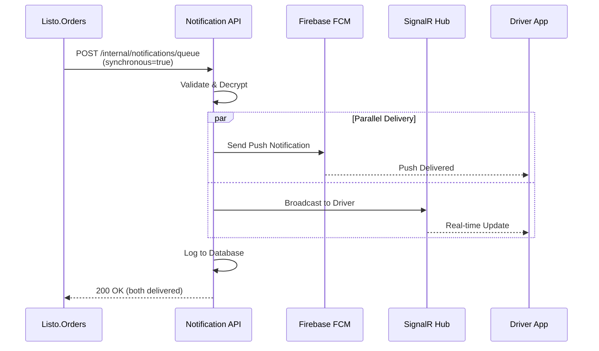
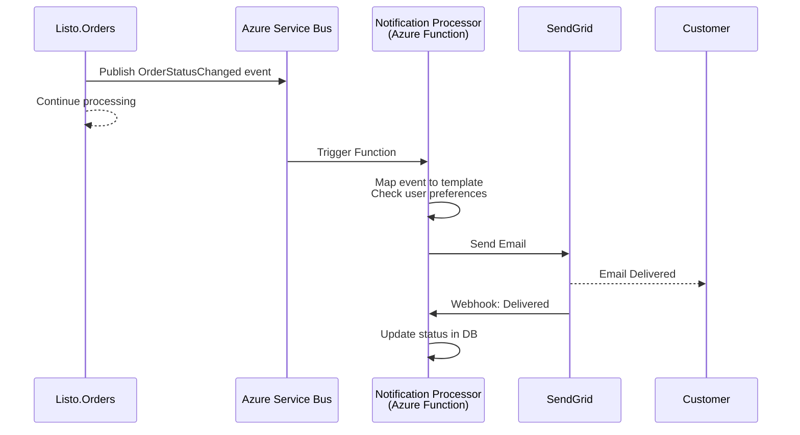
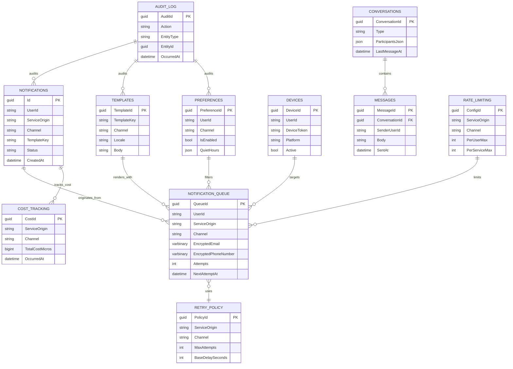

# Notification & Communication Service API Implementation Plan

This plan details the architecture, implementation steps, tools, and best practices for building a **shared Notification & Communication Service** for the ListoExpress ecosystem using **.NET 9**, **SQL Server**, **Azure Service Bus**, **Azure Functions**, and deploying as a container on **Azure**.

This service integrates with **Listo.Auth**, **Listo.Orders**, **Listo.RideSharing**, and other microservices to provide unified notification delivery across multiple channels (Push, SMS, Email, In-App Messaging).

**Related Documentation:**
- API Endpoints: [`notification_api_endpoints.md`](./notification_api_endpoints.md)
- Auth Service: [Listo.Auth Documentation](../Listo.Auth/docs/)
- Orders Service: [Listo.Orders Documentation](../Listo.Orders/docs/)
- RideSharing Service: [Listo.RideSharing Documentation](../Listo.RideSharing/)

---

## Table of Contents

1. [Requirements Analysis](#1-requirements-analysis)
2. [Technology Stack](#2-technology-stack)
3. [Service Integration & Architecture](#3-service-integration--architecture)
4. [Data Modeling & Database Schema](#4-data-modeling--database-schema)
5. [Authentication & Authorization](#5-authentication--authorization)
6. [Service-Specific Event Mappings](#6-service-specific-event-mappings)
7. [Cost Management & Rate Limiting](#7-cost-management--rate-limiting)
8. [Notification Delivery Strategy](#8-notification-delivery-strategy)
9. [Real-Time Messaging with SignalR](#9-real-time-messaging-with-signalr)
10. [API Implementation](#10-api-implementation)
11. [Validation & Error Handling](#11-validation--error-handling)
12. [File & Image Upload Handling](#12-file--image-upload-handling)
13. [Testing Strategy](#13-testing-strategy)
14. [Azure Functions Configuration](#14-azure-functions-configuration)
15. [Configuration Management](#15-configuration-management)
16. [Containerization](#16-containerization)
17. [Azure Deployment](#17-azure-deployment)
18. [Monitoring & Logging](#18-monitoring--logging)
19. [API Documentation](#19-api-documentation)
20. [CI/CD Pipeline](#20-cicd-pipeline)
21. [Security](#21-security)
22. [GDPR & Compliance](#22-gdpr--compliance)
23. [Clean Architecture Implementation](#23-clean-architecture-implementation)
24. [Maintenance & Future Enhancements](#24-maintenance--future-enhancements)

---

## 1. Requirements Analysis

### Core Requirements

- **Review API Spec:** Thoroughly review [`notification_api_endpoints.md`](./notification_api_endpoints.md) for endpoints, authentication, data models, and business logic.
- **Identify Resources:** Notifications (Push, SMS, Email, In-App), Devices, Templates, Preferences, Conversations, Analytics, Health.
- **Multi-Channel Support:** Email, SMS, Push Notifications, Real-time In-App Messaging.
- **Service Integration:** Integrate with Listo.Auth, Listo.Orders, Listo.RideSharing via REST APIs, Azure Service Bus, and event-driven patterns.

### Authentication & Authorization

- **Client Authentication:** JWT Bearer tokens issued by Listo.Auth
- **Service-to-Service:** Shared secrets stored in Azure Key Vault (X-Service-Secret header)
- **Roles:** Customer, Driver, Support, Admin (managed by Listo.Auth)

### Delivery Requirements

- **Synchronous:** Driver assignment alerts (push + SignalR) must be synchronous
- **Asynchronous:** All other notifications queued via Azure Service Bus
- **Retry Policy:** Exponential backoff with jitter, max 6 attempts, no dead-letter queues
- **Rate Limiting:** Per-user and per-service quotas with cost management

### Compliance

- **GDPR:** Data retention, audit trails, user data export and deletion
- **PII Encryption:** Encrypt email, phone numbers, device tokens at rest
- **Audit Logging:** Track all notification activities for compliance

### Default Configuration Values

- **Retention:**
  - Notification content: 90 days
  - In-app chat (Support): 180 days
  - In-app chat (Customer-Driver): 30 days
  - Audit logs: 13 months
  - Queue rows: Purged 30 days after completion
- **Retry Policy:**
  - Base delay: 5 seconds
  - Backoff factor: 2
  - Jitter: Enabled
  - Max attempts: 6
- **Rate Limits:**
  - Per-user per channel: 60/hour with burst of 20
  - Per-service daily caps: Email 50k, SMS 10k, Push 200k, In-app unlimited
  - Redis token bucket implementation
- **Budget Thresholds:**
  - Alert at 80% and 100% per month per service and channel
  - Block non-critical notifications beyond budget (admin override available)
- **Localization:**
  - Default locale: en-US
  - Template fallback strategy
- **Idempotency:**
  - X-Idempotency-Key required on create/send POSTs
  - Uniqueness window: 24 hours per serviceOrigin
- **Observability:**
  - OpenTelemetry tracing with W3C traceparent
  - X-Correlation-Id headers required

---

## 2. Technology Stack

### Backend Framework

- **.NET 9** (ASP.NET Core Web API)
- **NO MediatR** (per architectural guidelines - use direct service injection)

### Data Layer

- **Database:** Microsoft SQL Server (Dedicated Azure SQL Database)
- **ORM:** Entity Framework Core 9.0
- **Migration Tool:** EF Core Migrations

### Azure Services

- **Azure Service Bus:** Message queues and pub/sub topics
  - Queues: `listo-notifications-queue`, `listo-notifications-retry`, `listo-notifications-priority`
  - Topic: `listo-notifications-events` with subscriptions (auth, orders, ridesharing)
- **Azure Functions:** Background job processing
  - Scheduled notification runner
  - Retry processor
  - Cost and budget calculator
  - Data retention cleaner
- **Azure SignalR Service:** Real-time in-app messaging
- **Azure Key Vault:** Secrets management (provider credentials, service secrets)
- **Azure Container Apps / AKS:** Container hosting
- **Azure Application Insights:** Monitoring and logging
- **Azure Blob Storage:** File uploads for messaging

### Caching & Rate Limiting

- **Azure Cache for Redis:** Rate limiting (token bucket), presence, typing indicators

### External Providers

- **Push Notifications:** Firebase Cloud Messaging (FCM)
- **SMS Service:** Twilio
- **Email Service:** SendGrid or Azure Communication Services

### Development Tools

- **Validation:** FluentValidation
- **API Documentation:** Swashbuckle (Swagger/OpenAPI)
- **Testing:** xUnit, Moq, FluentAssertions, Testcontainers
- **Logging:** Serilog with structured logging
- **CI/CD:** GitHub Actions or Azure DevOps
- **Containerization:** Docker
- **IaC:** Bicep or Terraform

---

## 3. Service Integration & Architecture

### 3.1. Integration Patterns

The Listo.Notification service supports **three primary integration patterns** to accommodate different use cases:

#### Direct REST API Calls

**Use Case:** Synchronous operations requiring immediate feedback

**Authentication:**
- **Client Requests:** `Authorization: Bearer {jwt_token}` (issued by Listo.Auth)
- **Service-to-Service:** `X-Service-Secret: {shared_secret}` (from Azure Key Vault)

**Required Headers:**
```http
Authorization: Bearer {jwt_token}  # OR X-Service-Secret for services
Content-Type: application/json
X-Idempotency-Key: {unique_key}    # Required for POST operations
X-Correlation-Id: {trace_id}       # Required for tracing
traceparent: {w3c_trace_context}   # OpenTelemetry tracing
```

**Example:** Driver assignment push notification
```http
POST /api/v1/internal/notifications/queue
X-Service-Secret: {secret}
X-Idempotency-Key: orders-driver-assign-12345
X-Correlation-Id: trace-abc-123

{
  "userId": "driver-uuid-456",
  "serviceOrigin": "orders",
  "channel": "push",
  "templateKey": "driver_assignment",
  "priority": "high",
  "synchronous": true,
  "data": {
    "orderId": "ORD-001",
    "customerName": "John Doe",
    "pickupAddress": "123 Main St"
  },
  "encryptedEmail": null,
  "encryptedPhoneNumber": null,
  "encryptedFirebaseToken": "encrypted_fcm_token"
}
```

#### Azure Service Bus Integration

**Use Case:** Asynchronous, reliable message delivery with retry capabilities

**Queues:**
- `listo-notifications-queue`: Standard priority notifications
- `listo-notifications-priority`: High-priority time-sensitive notifications
- `listo-notifications-retry`: Failed notifications for retry processing

**Topic & Subscriptions:**
- Topic: `listo-notifications-events`
- Subscriptions:
  - `auth-notifications`: Email verification, password reset, 2FA
  - `orders-notifications`: Order confirmations, status updates
  - `ridesharing-notifications`: Ride bookings, driver assignments

**Message Envelope Format:**
```json
{
  "eventId": "evt-uuid-789",
  "occurredAt": "2024-01-15T10:30:00Z",
  "messageType": "NotificationRequested",
  "serviceOrigin": "orders",
  "userId": "user-uuid-123",
  "correlationId": "trace-abc-123",
  "idempotencyKey": "orders-status-update-456",
  "priority": "normal",
  "channels": ["email", "push"],
  "templateKey": "order_status_updated",
  "data": {
    "orderId": "ORD-001",
    "newStatus": "preparing",
    "estimatedTime": "30 minutes"
  },
  "metadata": {
    "locale": "en-US",
    "timezone": "America/New_York"
  }
}
```

**Application Properties (Service Bus):**
```json
{
  "ServiceOrigin": "orders",
  "MessageType": "NotificationRequested",
  "Priority": "normal",
  "CorrelationId": "trace-abc-123"
}
```

#### Event-Driven Architecture

**Use Case:** Loosely coupled microservice communication via domain events

**Pattern:**
1. Service publishes domain event to Service Bus topic
2. Listo.Notification subscribes to relevant events
3. Events are mapped to notification templates
4. Notifications are processed based on user preferences

**Example Event Flow:**
```
Listo.Orders → OrderStatusChanged event
     ↓
Service Bus Topic (listo-notifications-events)
     ↓
Listo.Notification Subscription (orders-notifications)
     ↓
Map to template: order_status_updated
     ↓
Check user preferences → Send via enabled channels
```

### 3.2. Service Origin Tracking

All notifications include `serviceOrigin` to enable:
- **Cost Attribution:** Track costs per service
- **Rate Limiting:** Apply service-specific quotas
- **Analytics:** Generate per-service reports
- **Compliance:** Audit trail scoped by service

**Valid Service Origins:**
- `auth`
- `orders`
- `ridesharing`
- `products`
- `system` (for admin/platform notifications)

### 3.3. Sequence Diagrams

#### Synchronous Driver Assignment (Critical Path)



#### Asynchronous Order Status Update



### 3.4. Idempotency & Correlation

**Idempotency:**
- **Header:** `X-Idempotency-Key` (required for all POST operations)
- **Uniqueness Window:** 24 hours per `serviceOrigin`
- **Behavior:** Duplicate requests return original response (200 OK)
- **Storage:** Redis cache with 24-hour TTL

**Correlation:**
- **Header:** `X-Correlation-Id` (required, auto-generated if missing)
- **Purpose:** End-to-end tracing across microservices
- **Format:** UUID v4 or W3C traceparent
- **Propagation:** Passed to all downstream calls (FCM, Twilio, SendGrid)

---

## 3. Solution Architecture

- **Project Structure:** Use Clean Architecture (Domain, Application, Infrastructure, API layers).
- **API Versioning:** Prefix all routes with `/api/v1`.
- **Configuration:** Use appsettings and environment variables for DB, service credentials, and secrets.

---

## 4. Data Modeling & Database Schema

### Overview

**Database:** Dedicated SQL Server instance (not shared with other services)
**Encryption:** PII encrypted at rest using AES-256-GCM with per-row IV
**Key Management:** Encryption keys stored in Azure Key Vault
**TDE:** Transparent Data Encryption enabled on SQL Server

### 4.1. Notifications Table

**Purpose:** Immutable audit log of all sent notifications

| Field              | Type           | Nullable | Description                               |
|--------------------|----------------|----------|-------------------------------------------|
| Id                 | GUID (PK)      | No       | Notification ID                           |
| UserId             | string         | Yes      | Target user (null for broadcast)          |
| ServiceOrigin      | string         | No       | auth, orders, ridesharing, products       |
| Channel            | string         | No       | push, sms, email, inApp                   |
| TemplateKey        | string         | No       | Reference to template                     |
| Status             | string         | No       | queued, sent, delivered, opened, failed   |
| Priority           | string         | No       | high, normal, low                         |
| ScheduledAt        | datetime       | Yes      | For scheduled notifications               |
| SentAt             | datetime       | Yes      | Actual send timestamp                     |
| ProviderMessageId  | string         | Yes      | External provider message ID              |
| ErrorCode          | string         | Yes      | Provider error code if failed             |
| ErrorMessage       | string         | Yes      | Error details                             |
| CorrelationId      | string         | No       | Tracing correlation ID                    |
| CreatedAt          | datetime       | No       | Record creation timestamp                 |
| UpdatedAt          | datetime       | No       | Last update timestamp                     |

**Indexes:**
- `IX_Notifications_UserId_CreatedAt` (UserId, CreatedAt DESC)
- `IX_Notifications_ServiceOrigin_CreatedAt` (ServiceOrigin, CreatedAt DESC)
- `IX_Notifications_Status_ScheduledAt` (Status, ScheduledAt) WHERE ScheduledAt IS NOT NULL
- `IX_Notifications_CorrelationId` (CorrelationId)

---

### 4.2. NotificationQueue Table

**Purpose:** Transient queue for notifications pending delivery with encrypted PII

| Field                    | Type           | Nullable | Description                               |
|--------------------------|----------------|----------|-------------------------------------------|
| QueueId                  | GUID (PK)      | No       | Queue record ID                           |
| UserId                   | string         | Yes      | Target user (null for broadcast)          |
| ServiceOrigin            | string         | No       | auth, orders, ridesharing, products       |
| Channel                  | string         | No       | push, sms, email, inApp                   |
| TemplateKey              | string         | No       | Template to use for rendering             |
| PayloadJson              | nvarchar(max)  | No       | Template variables and metadata as JSON   |
| EncryptedEmail           | varbinary(512) | Yes      | AES-256-GCM encrypted email               |
| EncryptedPhoneNumber     | varbinary(512) | Yes      | AES-256-GCM encrypted phone number        |
| EncryptedFirebaseToken   | varbinary(512) | Yes      | AES-256-GCM encrypted FCM token           |
| EmailHash                | varchar(64)    | Yes      | SHA-256 hash for deduplication            |
| PhoneHash                | varchar(64)    | Yes      | SHA-256 hash for deduplication            |
| PreferredLocale          | varchar(10)    | No       | e.g., en-US, es-MX                        |
| ScheduledAt              | datetime       | Yes      | For scheduled delivery                    |
| Attempts                 | int            | No       | Retry attempt count (default: 0)          |
| NextAttemptAt            | datetime       | Yes      | Calculated next retry time                |
| LastErrorCode            | string         | Yes      | Last failure error code                   |
| LastErrorMessage         | string         | Yes      | Last failure error message                |
| CorrelationId            | string         | No       | Tracing correlation ID                    |
| CreatedAt                | datetime       | No       | Queue entry creation timestamp            |

**Indexes:**
- `IX_NotificationQueue_ScheduledAt_Attempts` (ScheduledAt, Attempts) WHERE NextAttemptAt IS NOT NULL
- `IX_NotificationQueue_EmailHash` (EmailHash) WHERE EmailHash IS NOT NULL
- `IX_NotificationQueue_CreatedAt` (CreatedAt) for cleanup

**Encryption Notes:**
- Each row uses a unique IV (Initialization Vector) stored with encrypted data
- Encryption key from Azure Key Vault (key rotation supported)
- Hashes used for duplicate detection without decryption

**Cleanup:**
- Records purged 30 days after successful delivery or final failure

---

### 4.3. RetryPolicy Table

**Purpose:** Configurable retry policies per service origin and channel

| Field               | Type     | Nullable | Description                               |
|---------------------|----------|----------|-------------------------------------------|
| PolicyId            | GUID (PK)| No       | Policy ID                                 |
| ServiceOrigin       | string   | No       | auth, orders, ridesharing, products, *    |
| Channel             | string   | No       | push, sms, email, inApp, *                |
| MaxAttempts         | int      | No       | Maximum retry attempts (default: 6)       |
| BaseDelaySeconds    | int      | No       | Initial retry delay (default: 5)          |
| BackoffFactor       | decimal  | No       | Exponential backoff multiplier (default: 2.0) |
| JitterMs            | int      | No       | Random jitter in ms (default: 1000)       |
| TimeoutSeconds      | int      | No       | Per-attempt timeout (default: 30)         |
| Enabled             | bool     | No       | Is policy active (default: true)          |

**Unique Constraint:** (ServiceOrigin, Channel)

**Default Policies (Seeded):**
```sql
INSERT INTO RetryPolicy (PolicyId, ServiceOrigin, Channel, MaxAttempts, BaseDelaySeconds, BackoffFactor, JitterMs, TimeoutSeconds, Enabled)
VALUES
  (NEWID(), '*', '*', 6, 5, 2.0, 1000, 30, 1),              -- Default for all
  (NEWID(), 'orders', 'push', 3, 2, 2.0, 500, 15, 1),       -- Faster for driver assignment
  (NEWID(), 'auth', 'sms', 4, 3, 2.0, 500, 20, 1);          -- OTP/2FA retry policy
```

**Retry Calculation Logic:**
```
NextAttemptDelay = (BaseDelaySeconds * (BackoffFactor ^ Attempts)) + Random(0, JitterMs)
```

---

### 4.4. CostTracking Table

**Purpose:** Per-message cost tracking for budget management

| Field               | Type           | Nullable | Description                               |
|---------------------|----------------|----------|-------------------------------------------|
| CostId              | GUID (PK)      | No       | Cost record ID                            |
| ServiceOrigin       | string         | No       | auth, orders, ridesharing, products       |
| Channel             | string         | No       | push, sms, email, inApp                   |
| Provider            | string         | No       | fcm, twilio, sendgrid                     |
| UnitCostMicros      | bigint         | No       | Cost per unit in micros (1/1,000,000)     |
| Currency            | varchar(3)     | No       | USD, EUR, etc.                            |
| MessageId           | GUID           | Yes      | Reference to Notifications table          |
| UsageUnits          | int            | No       | Number of units (segments for SMS)        |
| TotalCostMicros     | bigint         | No       | UsageUnits * UnitCostMicros               |
| OccurredAt          | datetime       | No       | Cost incurred timestamp                   |

**Indexes:**
- `IX_CostTracking_ServiceOrigin_OccurredAt` (ServiceOrigin, OccurredAt DESC)
- `IX_CostTracking_Channel_OccurredAt` (Channel, OccurredAt DESC)

**Monthly Rollup View:**
```sql
CREATE VIEW CostMonthlySummary AS
SELECT 
    ServiceOrigin,
    Channel,
    YEAR(OccurredAt) AS Year,
    MONTH(OccurredAt) AS Month,
    Currency,
    SUM(TotalCostMicros) / 1000000.0 AS TotalCost,
    COUNT(*) AS MessageCount,
    AVG(TotalCostMicros) / 1000000.0 AS AvgCostPerMessage
FROM CostTracking
GROUP BY ServiceOrigin, Channel, YEAR(OccurredAt), MONTH(OccurredAt), Currency;
```

**Cost Examples:**
- FCM Push: $0 (free, but track for analytics)
- Twilio SMS (US): ~$0.0079/message → 7900 micros
- SendGrid Email: ~$0.00095/email → 950 micros

---

### 4.5. RateLimiting Table

**Purpose:** Configurable rate limits per service and user

| Field                    | Type     | Nullable | Description                               |
|--------------------------|----------|----------|-------------------------------------------|
| ConfigId                 | GUID (PK)| No       | Configuration ID                          |
| ServiceOrigin            | string   | No       | auth, orders, ridesharing, products, *    |
| Channel                  | string   | No       | push, sms, email, inApp, *                |
| PerUserWindowSeconds     | int      | No       | Time window for per-user limit (3600)     |
| PerUserMax               | int      | No       | Max per user in window (60)               |
| PerServiceWindowSeconds  | int      | No       | Time window for per-service (86400)       |
| PerServiceMax            | int      | No       | Max per service in window (50000)         |
| BurstSize                | int      | No       | Allowed burst above limit (20)            |
| Enabled                  | bool     | No       | Is limit enforced (default: true)         |

**Unique Constraint:** (ServiceOrigin, Channel)

**Default Limits (Seeded):**
```sql
INSERT INTO RateLimiting (ConfigId, ServiceOrigin, Channel, PerUserWindowSeconds, PerUserMax, PerServiceWindowSeconds, PerServiceMax, BurstSize, Enabled)
VALUES
  (NEWID(), '*', 'email', 3600, 60, 86400, 50000, 20, 1),
  (NEWID(), '*', 'sms', 3600, 60, 86400, 10000, 20, 1),
  (NEWID(), '*', 'push', 3600, 60, 86400, 200000, 20, 1),
  (NEWID(), '*', 'inApp', 3600, 1000, 86400, 999999999, 100, 1); -- Unlimited for in-app
```

**Implementation:** Redis token bucket pattern

---

### 4.6. AuditLog Table

**Purpose:** Immutable audit trail for compliance (GDPR, SOC 2)

| Field          | Type           | Nullable | Description                               |
|----------------|----------------|----------|-------------------------------------------|
| AuditId        | GUID (PK)      | No       | Audit record ID                           |
| Action         | string         | No       | created, updated, deleted, sent, delivered|
| EntityType     | string         | No       | notification, template, preference, user  |
| EntityId       | GUID           | No       | ID of the affected entity                 |
| UserId         | string         | Yes      | User who performed action (null=system)   |
| ServiceOrigin  | string         | Yes      | auth, orders, ridesharing, system         |
| ActorType      | string         | No       | user, service, system, admin              |
| IpAddress      | string         | Yes      | Source IP address                         |
| UserAgent      | string         | Yes      | Browser/client user agent                 |
| BeforeJson     | nvarchar(max)  | Yes      | Entity state before change (JSON)         |
| AfterJson      | nvarchar(max)  | Yes      | Entity state after change (JSON)          |
| OccurredAt     | datetime       | No       | Audit event timestamp (UTC)               |

**Indexes:**
- `IX_AuditLog_EntityType_EntityId` (EntityType, EntityId, OccurredAt DESC)
- `IX_AuditLog_UserId_OccurredAt` (UserId, OccurredAt DESC) WHERE UserId IS NOT NULL
- `IX_AuditLog_OccurredAt` (OccurredAt DESC)

**Retention:** 13 months (for compliance), then archived or deleted

---

### 4.7. Templates Table

**Purpose:** Notification templates with versioning and localization

| Field          | Type           | Nullable | Description                               |
|----------------|----------------|----------|-------------------------------------------|
| TemplateId     | GUID (PK)      | No       | Template ID                               |
| TemplateKey    | string         | No       | Unique key (e.g., order_confirmed)        |
| Channel        | string         | No       | push, sms, email, inApp                   |
| Locale         | varchar(10)    | No       | en-US, es-MX, fr-FR, etc.                 |
| Subject        | string         | Yes      | Email subject or push title               |
| Body           | nvarchar(max)  | No       | Template body with {{variables}}          |
| Variables      | nvarchar(max)  | No       | JSON array of expected variables          |
| Version        | int            | No       | Template version number                   |
| IsActive       | bool           | No       | Is template active (default: true)        |
| CreatedAt      | datetime       | No       | Template creation timestamp               |
| UpdatedAt      | datetime       | No       | Last update timestamp                     |

**Unique Constraint:** (TemplateKey, Channel, Locale, Version)

**Indexes:**
- `IX_Templates_TemplateKey_Channel_Locale` (TemplateKey, Channel, Locale) WHERE IsActive = 1

**Localization Fallback Strategy:**
1. Try exact locale match (e.g., en-US)
2. Try language match (e.g., en)
3. Fall back to en-US (default)

**Example Template:**
```json
{
  "templateKey": "order_confirmed",
  "channel": "email",
  "locale": "en-US",
  "subject": "Order Confirmed - {{orderId}}",
  "body": "Hi {{customerName}}, your order {{orderId}} has been confirmed! Expected delivery: {{deliveryTime}}.",
  "variables": ["customerName", "orderId", "deliveryTime"],
  "version": 1,
  "isActive": true
}
```

---

### 4.8. Preferences Table

**Purpose:** User notification preferences and quiet hours

| Field          | Type           | Nullable | Description                               |
|----------------|----------------|----------|-------------------------------------------|
| PreferenceId   | GUID (PK)      | No       | Preference ID                             |
| UserId         | string         | No       | User reference (from Listo.Auth)          |
| Channel        | string         | No       | push, sms, email, inApp, *                |
| IsEnabled      | bool           | No       | Is channel enabled (default: true)        |
| QuietHours     | nvarchar(max)  | Yes      | JSON: {enabled, startTime, endTime, tz}   |
| Topics         | nvarchar(max)  | Yes      | JSON array of enabled topics              |
| Locale         | varchar(10)    | No       | Preferred locale (default: en-US)         |
| UpdatedAt      | datetime       | No       | Last update timestamp                     |

**Unique Constraint:** (UserId, Channel)

**Indexes:**
- `IX_Preferences_UserId` (UserId)

**Default Preferences (created on user registration):**
```json
{
  "userId": "user-uuid-123",
  "channel": "*",
  "isEnabled": true,
  "quietHours": {
    "enabled": false,
    "startTime": "22:00",
    "endTime": "08:00",
    "timezone": "America/New_York"
  },
  "topics": ["order_updates", "security_alerts"],
  "locale": "en-US"
}
```

---

### 4.9. Conversations Table (In-App Messaging)

**Purpose:** In-app messaging conversations (Customer↔Support, Customer↔Driver)

| Field            | Type           | Nullable | Description                               |
|------------------|----------------|----------|-------------------------------------------|
| ConversationId   | GUID (PK)      | No       | Conversation ID                           |
| Type             | string         | No       | customer_support, customer_driver         |
| ParticipantsJson | nvarchar(max)  | No       | JSON array of participant user IDs        |
| ServiceOrigin    | string         | No       | orders, ridesharing                       |
| CreatedAt        | datetime       | No       | Conversation creation timestamp           |
| LastMessageAt    | datetime       | Yes      | Timestamp of most recent message          |

**Indexes:**
- `IX_Conversations_LastMessageAt` (LastMessageAt DESC)
- Full-text index on ParticipantsJson for user lookup

**Retention:**
- Customer↔Support: 180 days after last message
- Customer↔Driver: 30 days after last message

---

### 4.10. Messages Table (In-App Messaging)

**Purpose:** Individual messages within conversations

| Field            | Type           | Nullable | Description                               |
|------------------|----------------|----------|-------------------------------------------|
| MessageId        | GUID (PK)      | No       | Message ID                                |
| ConversationId   | GUID (FK)      | No       | Parent conversation                       |
| SenderUserId     | string         | No       | User ID of sender                         |
| RecipientUserId  | string         | Yes      | Specific recipient (null=all participants)|
| Body             | nvarchar(max)  | No       | Message content (text, markdown)          |
| AttachmentsJson  | nvarchar(max)  | Yes      | JSON array of file URLs                   |
| Status           | string         | No       | sent, delivered, read, failed             |
| SentAt           | datetime       | No       | Message sent timestamp                    |
| ReadAt           | datetime       | Yes      | Message read timestamp                    |

**Indexes:**
- `IX_Messages_ConversationId_SentAt` (ConversationId, SentAt DESC)
- `IX_Messages_RecipientUserId_Status` (RecipientUserId, Status) WHERE RecipientUserId IS NOT NULL

**Foreign Key:** ConversationId → Conversations.ConversationId (ON DELETE CASCADE)

---

### 4.11. Devices Table

**Purpose:** User devices for push notification delivery

| Field          | Type           | Nullable | Description                               |
|----------------|----------------|----------|-------------------------------------------|
| DeviceId       | GUID (PK)      | No       | Device ID                                 |
| UserId         | string         | No       | User owning the device                    |
| DeviceToken    | string         | No       | FCM/APNS token (hashed for security)      |
| Platform       | string         | No       | android, ios, web                         |
| DeviceInfo     | nvarchar(max)  | Yes      | JSON: model, osVersion, appVersion        |
| LastSeen       | datetime       | No       | Last active timestamp                     |
| Active         | bool           | No       | Is device active (default: true)          |
| CreatedAt      | datetime       | No       | Device registration timestamp             |
| UpdatedAt      | datetime       | No       | Last update timestamp                     |

**Unique Constraint:** (DeviceToken) to prevent duplicates

**Indexes:**
- `IX_Devices_UserId_Active` (UserId, Active)
- `IX_Devices_LastSeen` (LastSeen) for cleanup

**Cleanup:** Remove devices inactive for > 90 days

---

### 4.12. Entity Relationship Diagram (ERD)



---

### 4.13. Migration Strategy

**Phase 1: Core Tables**
1. Notifications, NotificationQueue, Templates, Preferences, Devices
2. Seed default RetryPolicy and RateLimiting configurations

**Phase 2: Supporting Tables**
3. CostTracking, AuditLog
4. Create monthly rollup views

**Phase 3: Messaging Tables**
5. Conversations, Messages
6. Add full-text indexes

**Phase 4: Optimization**
7. Add composite indexes based on query patterns
8. Partition AuditLog by OccurredAt (monthly partitions)
9. Create archived tables for retention compliance

**EF Core Migrations:**
```bash
dotnet ef migrations add InitialCreate --project src/Listo.Notification.Infrastructure
dotnet ef database update --project src/Listo.Notification.Infrastructure
```

**Rollback Strategy:**
- All migrations reversible with DOWN scripts
- Database backups before each migration
- Blue-green deployment for zero-downtime migrations

---

## 5. Authentication & Authorization

### 5.1. Client Authentication (User Requests)

**Method:** JWT Bearer Token Authentication

**Token Issuer:** Listo.Auth service

**Configuration:**
```csharp
// Program.cs or Startup.cs
services.AddAuthentication(JwtBearerDefaults.AuthenticationScheme)
    .AddJwtBearer(options =>
    {
        options.Authority = configuration["Auth:Authority"]; // Listo.Auth URL
        options.Audience = "listo-notification-api";
        options.TokenValidationParameters = new TokenValidationParameters
        {
            ValidateIssuer = true,
            ValidateAudience = true,
            ValidateLifetime = true,
            ValidateIssuerSigningKey = true,
            ClockSkew = TimeSpan.FromMinutes(5)
        };
    });
```

**JWT Claims Expected:**
- `sub`: User ID (maps to UserId in our tables)
- `role`: User roles (Customer, Driver, Support, Admin)
- `permissions`: Granular permissions array
- `email`: User email (for audit logging)
- `name`: User display name

**Usage:**
```csharp
[Authorize] // Requires any authenticated user
[Authorize(Roles = "Admin")] // Requires Admin role
[Authorize(Policy = "ManageTemplates")] // Requires specific policy
```

---

### 5.2. Service-to-Service Authentication

**Method:** Shared Secret Header (`X-Service-Secret`)

**Secret Storage:** Azure Key Vault

**Secret Names (per service):**
- `listo-auth-service-secret`
- `listo-orders-service-secret`
- `listo-ridesharing-service-secret`
- `listo-products-service-secret`

**Implementation:**
```csharp
// Middleware: ServiceSecretAuthenticationMiddleware.cs
public class ServiceSecretAuthenticationMiddleware
{
    private readonly RequestDelegate _next;
    private readonly IConfiguration _configuration;
    private readonly Dictionary<string, string> _serviceSecrets;

    public ServiceSecretAuthenticationMiddleware(
        RequestDelegate next,
        IConfiguration configuration,
        IKeyVaultService keyVaultService)
    {
        _next = next;
        _configuration = configuration;
        
        // Load secrets from Key Vault on startup
        _serviceSecrets = new Dictionary<string, string>
        {
            ["auth"] = keyVaultService.GetSecret("listo-auth-service-secret"),
            ["orders"] = keyVaultService.GetSecret("listo-orders-service-secret"),
            ["ridesharing"] = keyVaultService.GetSecret("listo-ridesharing-service-secret"),
            ["products"] = keyVaultService.GetSecret("listo-products-service-secret")
        };
    }

    public async Task InvokeAsync(HttpContext context)
    {
        // Only check secret for internal endpoints
        if (context.Request.Path.StartsWithSegments("/api/v1/internal"))
        {
            if (!context.Request.Headers.TryGetValue("X-Service-Secret", out var secretHeader))
            {
                context.Response.StatusCode = 401;
                await context.Response.WriteAsJsonAsync(new
                {
                    error = new
                    {
                        code = "MISSING_SERVICE_SECRET",
                        message = "X-Service-Secret header is required for internal endpoints"
                    }
                });
                return;
            }

            var providedSecret = secretHeader.ToString();
            var isValid = _serviceSecrets.Values.Any(secret => 
                CryptographicOperations.FixedTimeEquals(
                    Encoding.UTF8.GetBytes(secret),
                    Encoding.UTF8.GetBytes(providedSecret)
                ));

            if (!isValid)
            {
                context.Response.StatusCode = 403;
                await context.Response.WriteAsJsonAsync(new
                {
                    error = new
                    {
                        code = "INVALID_SERVICE_SECRET",
                        message = "Invalid service secret provided"
                    }
                });
                return;
            }

            // Add service origin to context for auditing
            var serviceOrigin = _serviceSecrets.FirstOrDefault(x => 
                CryptographicOperations.FixedTimeEquals(
                    Encoding.UTF8.GetBytes(x.Value),
                    Encoding.UTF8.GetBytes(providedSecret)
                )).Key;
            
            context.Items["ServiceOrigin"] = serviceOrigin;
        }

        await _next(context);
    }
}
```

**Secret Rotation Strategy:**
1. Generate new secret in Key Vault with versioning
2. Update calling services to use new secret
3. Configure grace period (7 days) where both old and new secrets are valid
4. After grace period, remove old secret from validation
5. Automated rotation every 90 days via Azure Function

---

### 5.3. Required Headers

**For Client Requests:**
```http
Authorization: Bearer {jwt_token}
Content-Type: application/json
X-Correlation-Id: {uuid}  # Required for tracing
X-Idempotency-Key: {unique_key}  # Required for POST operations
```

**For Service-to-Service Requests:**
```http
X-Service-Secret: {shared_secret}
Content-Type: application/json
X-Correlation-Id: {uuid}  # Required for tracing
X-Idempotency-Key: {unique_key}  # Required for POST operations
traceparent: {w3c_trace_context}  # OpenTelemetry tracing
```

---

### 5.4. Role-Based Authorization

**Roles Defined by Listo.Auth:**
- **Customer:** Can view own notifications and preferences
- **Driver:** Can view own notifications and preferences
- **Support:** Can view all notifications, manage support conversations
- **Admin:** Full access to all features, templates, analytics

**Authorization Policies:**
```csharp
// Program.cs
services.AddAuthorization(options =>
{
    // Customer policies
    options.AddPolicy("ViewOwnNotifications", policy =>
        policy.RequireAuthenticatedUser()
              .RequireAssertion(context => 
                  context.User.HasClaim("sub", context.Resource.ToString())));

    // Admin policies
    options.AddPolicy("ManageTemplates", policy =>
        policy.RequireRole("Admin"));

    options.AddPolicy("ViewAnalytics", policy =>
        policy.RequireRole("Admin", "Support"));

    options.AddPolicy("ManageCostBudgets", policy =>
        policy.RequireRole("Admin"));

    // Support policies
    options.AddPolicy("AccessSupportConversations", policy =>
        policy.RequireRole("Support", "Admin"));
});
```

**Controller Usage:**
```csharp
[ApiController]
[Route("api/v1/notifications")]
[Authorize]
public class NotificationsController : ControllerBase
{
    [HttpGet]
    [Authorize(Policy = "ViewOwnNotifications")]
    public async Task<IActionResult> GetMyNotifications()
    {
        var userId = User.FindFirst("sub")?.Value;
        // ...
    }

    [HttpPost("templates")]
    [Authorize(Policy = "ManageTemplates")]
    public async Task<IActionResult> CreateTemplate([FromBody] TemplateDto template)
    {
        // ...
    }
}
```

---

### 5.5. HTTPS & Transport Security

**Enforcement:**
```csharp
// Program.cs
app.UseHttpsRedirection();
app.UseHsts(); // HTTP Strict Transport Security

// Add HSTS configuration
services.AddHsts(options =>
{
    options.MaxAge = TimeSpan.FromDays(365);
    options.IncludeSubDomains = true;
    options.Preload = true;
});
```

**Certificate Management:**
- Use Azure App Service managed certificates
- Automatic renewal enabled
- TLS 1.2 minimum (TLS 1.3 preferred)

---

### 5.6. Input Validation & Request Limits

**Request Size Limits:**
```csharp
// Program.cs
services.Configure<KestrelServerOptions>(options =>
{
    options.Limits.MaxRequestBodySize = 10 * 1024 * 1024; // 10 MB max
    options.Limits.MaxRequestHeadersTotalSize = 32 * 1024; // 32 KB
    options.Limits.MaxRequestHeaderCount = 100;
});

services.Configure<FormOptions>(options =>
{
    options.MultipartBodyLengthLimit = 10 * 1024 * 1024; // 10 MB for file uploads
});
```

**Input Validation:**
- Use FluentValidation for request DTOs
- Validate all user inputs before processing
- Sanitize data for XSS prevention
- Use parameterized queries (EF Core handles this)

**Example Validator:**
```csharp
public class SendNotificationRequestValidator : AbstractValidator<SendNotificationRequest>
{
    public SendNotificationRequestValidator()
    {
        RuleFor(x => x.UserId)
            .NotEmpty()
            .Must(BeValidGuid).WithMessage("UserId must be a valid GUID");

        RuleFor(x => x.Channel)
            .NotEmpty()
            .Must(x => new[] { "push", "sms", "email", "inApp" }.Contains(x))
            .WithMessage("Channel must be push, sms, email, or inApp");

        RuleFor(x => x.TemplateKey)
            .NotEmpty()
            .MaximumLength(100)
            .Matches("^[a-z0-9_]+$").WithMessage("TemplateKey must be lowercase alphanumeric with underscores");
    }

    private bool BeValidGuid(string value) => Guid.TryParse(value, out _);
}
```

---

### 5.7. CORS Configuration

**Policy:**
```csharp
// Program.cs
services.AddCors(options =>
{
    options.AddPolicy("ListoFrontends", builder =>
    {
        builder
            .WithOrigins(
                configuration["Cors:AllowedOrigins"].Split(",") // From appsettings
            )
            .AllowAnyMethod()
            .AllowAnyHeader()
            .WithExposedHeaders("X-Correlation-Id", "X-RateLimit-Remaining")
            .AllowCredentials(); // For SignalR
    });
});

app.UseCors("ListoFrontends");
```

**appsettings.json:**
```json
{
  "Cors": {
    "AllowedOrigins": "https://app.listoexpress.com,https://admin.listoexpress.com,https://driver.listoexpress.com"
  }
}
```

---

### 5.8. Security Headers

**Middleware:**
```csharp
app.Use(async (context, next) =>
{
    context.Response.Headers.Add("X-Content-Type-Options", "nosniff");
    context.Response.Headers.Add("X-Frame-Options", "DENY");
    context.Response.Headers.Add("X-XSS-Protection", "1; mode=block");
    context.Response.Headers.Add("Referrer-Policy", "strict-origin-when-cross-origin");
    context.Response.Headers.Add("Content-Security-Policy", 
        "default-src 'self'; script-src 'self'; style-src 'self' 'unsafe-inline'");
    
    await next();
});
```

---

### 5.9. Authentication Flow Examples

**Client Request Flow:**
```
1. Client → Listo.Auth: POST /auth/login
2. Listo.Auth → Client: {accessToken, refreshToken}
3. Client → Listo.Notification: GET /api/v1/notifications
   Headers: Authorization: Bearer {accessToken}
4. Listo.Notification validates JWT with Listo.Auth's public key
5. Listo.Notification → Client: {notifications}
```

**Service-to-Service Flow:**
```
1. Listo.Orders → Azure Key Vault: Get listo-orders-service-secret
2. Listo.Orders → Listo.Notification: POST /api/v1/internal/notifications/queue
   Headers: X-Service-Secret: {secret}, X-Correlation-Id: {uuid}
3. Listo.Notification validates secret against Key Vault secrets
4. Listo.Notification → Listo.Orders: 200 OK {notificationId}
```

---

### 5.10. Security Checklist

- [ ] JWT validation configured with correct issuer and audience
- [ ] Service secret middleware validates all `/internal` endpoints
- [ ] Secrets stored in Azure Key Vault (never in code or config files)
- [ ] Secret rotation policy implemented (90-day cycle)
- [ ] HTTPS enforced with HSTS enabled
- [ ] CORS configured with explicit allowed origins
- [ ] Request size limits enforced (10 MB max)
- [ ] Input validation with FluentValidation on all DTOs
- [ ] Security headers added (XSS, Frame Options, CSP)
- [ ] Rate limiting implemented (see Section 7)
- [ ] Correlation IDs required and propagated
- [ ] Audit logging for all sensitive operations

---

## 6. Service-Specific Event Mappings

This section defines the canonical events published by each Listo service and how they map to notification templates and delivery channels.

### 6.1. Listo.Auth Service Events

#### 6.1.1. EmailVerificationRequested

**Channels:** Email  
**Template Key:** `email_verification_requested`  
**Priority:** High  
**Delivery:** Asynchronous  
**Timeout:** 30 seconds

**Event Payload:**
```json
{
  "eventId": "evt-auth-001",
  "occurredAt": "2024-01-15T10:30:00Z",
  "messageType": "EmailVerificationRequested",
  "serviceOrigin": "auth",
  "userId": "user-uuid-123",
  "correlationId": "trace-abc-123",
  "idempotencyKey": "auth-email-verify-user-uuid-123",
  "priority": "high",
  "channels": ["email"],
  "templateKey": "email_verification_requested",
  "data": {
    "email": "user@example.com",
    "verificationCode": "ABC123XYZ",
    "verificationLink": "https://app.listoexpress.com/verify?token=xyz",
    "expiryMinutes": 60,
    "userName": "John Doe"
  },
  "metadata": {
    "locale": "en-US",
    "timezone": "America/New_York"
  }
}
```

**Template Variables:** `email`, `verificationCode`, `verificationLink`, `expiryMinutes`, `userName`

**Required Headers:**
- `X-Service-Secret`
- `X-Correlation-Id`
- `X-Idempotency-Key`

---

#### 6.1.2. MobileVerificationRequested

**Channels:** SMS  
**Template Key:** `mobile_verification_requested`  
**Priority:** High  
**Delivery:** Asynchronous  
**Timeout:** 20 seconds

**Event Payload:**
```json
{
  "eventId": "evt-auth-002",
  "occurredAt": "2024-01-15T10:30:00Z",
  "messageType": "MobileVerificationRequested",
  "serviceOrigin": "auth",
  "userId": "user-uuid-123",
  "correlationId": "trace-abc-124",
  "idempotencyKey": "auth-mobile-verify-user-uuid-123",
  "priority": "high",
  "channels": ["sms"],
  "templateKey": "mobile_verification_requested",
  "data": {
    "phoneNumber": "+1234567890",
    "otpCode": "123456",
    "expiryMinutes": 10,
    "appName": "ListoExpress"
  }
}
```

**Template Variables:** `phoneNumber`, `otpCode`, `expiryMinutes`, `appName`

---

#### 6.1.3. PasswordResetRequested

**Channels:** Email, SMS  
**Template Key:** `password_reset_requested`  
**Priority:** High  
**Delivery:** Asynchronous  
**Timeout:** 30 seconds

**Event Payload:**
```json
{
  "eventId": "evt-auth-003",
  "occurredAt": "2024-01-15T10:30:00Z",
  "messageType": "PasswordResetRequested",
  "serviceOrigin": "auth",
  "userId": "user-uuid-123",
  "correlationId": "trace-abc-125",
  "idempotencyKey": "auth-password-reset-user-uuid-123",
  "priority": "high",
  "channels": ["email", "sms"],
  "templateKey": "password_reset_requested",
  "data": {
    "email": "user@example.com",
    "phoneNumber": "+1234567890",
    "resetCode": "789456",
    "resetLink": "https://app.listoexpress.com/reset-password?token=xyz",
    "expiryMinutes": 15,
    "userName": "John Doe",
    "ipAddress": "192.168.1.1"
  }
}
```

**Template Variables:** `email`, `phoneNumber`, `resetCode`, `resetLink`, `expiryMinutes`, `userName`, `ipAddress`

---

#### 6.1.4. TwoFactorCodeIssued

**Channels:** SMS, Email  
**Template Key:** `two_factor_code_issued`  
**Priority:** High  
**Delivery:** Asynchronous  
**Timeout:** 20 seconds

**Event Payload:**
```json
{
  "eventId": "evt-auth-004",
  "occurredAt": "2024-01-15T10:30:00Z",
  "messageType": "TwoFactorCodeIssued",
  "serviceOrigin": "auth",
  "userId": "user-uuid-123",
  "correlationId": "trace-abc-126",
  "idempotencyKey": "auth-2fa-code-user-uuid-123",
  "priority": "high",
  "channels": ["sms", "email"],
  "templateKey": "two_factor_code_issued",
  "data": {
    "twoFactorCode": "654321",
    "expiryMinutes": 5,
    "deviceInfo": "Chrome on Windows",
    "ipAddress": "192.168.1.1"
  }
}
```

**Template Variables:** `twoFactorCode`, `expiryMinutes`, `deviceInfo`, `ipAddress`

---

#### 6.1.5. SuspiciousLoginDetected

**Channels:** Email, Push  
**Template Key:** `suspicious_login_detected`  
**Priority:** High  
**Delivery:** Asynchronous  
**Timeout:** 30 seconds

**Event Payload:**
```json
{
  "eventId": "evt-auth-005",
  "occurredAt": "2024-01-15T10:30:00Z",
  "messageType": "SuspiciousLoginDetected",
  "serviceOrigin": "auth",
  "userId": "user-uuid-123",
  "correlationId": "trace-abc-127",
  "idempotencyKey": "auth-suspicious-login-user-uuid-123-1705315800",
  "priority": "high",
  "channels": ["email", "push"],
  "templateKey": "suspicious_login_detected",
  "data": {
    "userName": "John Doe",
    "loginTime": "2024-01-15T10:30:00Z",
    "deviceInfo": "Unknown Device - Chrome on Linux",
    "ipAddress": "203.0.113.42",
    "location": "Unknown Location",
    "actionLink": "https://app.listoexpress.com/security/review"
  }
}
```

**Template Variables:** `userName`, `loginTime`, `deviceInfo`, `ipAddress`, `location`, `actionLink`

---

### 6.2. Listo.Orders Service Events

#### 6.2.1. OrderConfirmed

**Channels:** Email, Push  
**Template Key:** `order_confirmed`  
**Priority:** Normal  
**Delivery:** Asynchronous  
**Timeout:** 30 seconds

**Event Payload:**
```json
{
  "eventId": "evt-orders-001",
  "occurredAt": "2024-01-15T10:30:00Z",
  "messageType": "OrderConfirmed",
  "serviceOrigin": "orders",
  "userId": "customer-uuid-456",
  "correlationId": "trace-order-001",
  "idempotencyKey": "orders-confirmed-ORD-001",
  "priority": "normal",
  "channels": ["email", "push"],
  "templateKey": "order_confirmed",
  "data": {
    "orderId": "ORD-001",
    "orderNumber": "ORD-20240115-001",
    "customerName": "Jane Smith",
    "merchantName": "Pizza Palace",
    "totalAmount": "$28.98",
    "estimatedDeliveryTime": "6:30 PM",
    "deliveryAddress": "123 Main St, Apt 4B",
    "orderDetailsLink": "https://app.listoexpress.com/orders/ORD-001"
  }
}
```

**Template Variables:** `orderId`, `orderNumber`, `customerName`, `merchantName`, `totalAmount`, `estimatedDeliveryTime`, `deliveryAddress`, `orderDetailsLink`

---

#### 6.2.2. OrderStatusUpdated

**Channels:** Push, SMS (optional)  
**Template Key:** `order_status_updated`  
**Priority:** Normal  
**Delivery:** Asynchronous  
**Timeout:** 30 seconds

**Event Payload:**
```json
{
  "eventId": "evt-orders-002",
  "occurredAt": "2024-01-15T10:45:00Z",
  "messageType": "OrderStatusUpdated",
  "serviceOrigin": "orders",
  "userId": "customer-uuid-456",
  "correlationId": "trace-order-001",
  "idempotencyKey": "orders-status-ORD-001-preparing",
  "priority": "normal",
  "channels": ["push"],
  "templateKey": "order_status_updated",
  "data": {
    "orderId": "ORD-001",
    "orderNumber": "ORD-20240115-001",
    "previousStatus": "accepted",
    "newStatus": "preparing",
    "statusMessage": "Your order is being prepared",
    "estimatedDeliveryTime": "6:30 PM"
  }
}
```

**Template Variables:** `orderId`, `orderNumber`, `previousStatus`, `newStatus`, `statusMessage`, `estimatedDeliveryTime`

---

#### 6.2.3. DriverAssigned (SYNCHRONOUS)

**Channels:** Push  
**Template Key:** `driver_assigned`  
**Priority:** High  
**Delivery:** **SYNCHRONOUS** (< 2 seconds)  
**Timeout:** 15 seconds

**⚠️ CRITICAL PATH:** This event MUST be delivered synchronously via direct REST API call with `synchronous: true`

**Event Payload:**
```json
{
  "eventId": "evt-orders-003",
  "occurredAt": "2024-01-15T10:50:00Z",
  "messageType": "DriverAssigned",
  "serviceOrigin": "orders",
  "userId": "driver-uuid-789",
  "correlationId": "trace-order-001",
  "idempotencyKey": "orders-driver-assigned-ORD-001-driver-789",
  "priority": "high",
  "channels": ["push"],
  "templateKey": "driver_assigned",
  "synchronous": true,
  "data": {
    "orderId": "ORD-001",
    "orderNumber": "ORD-20240115-001",
    "customerName": "Jane Smith",
    "pickupAddress": "Pizza Palace, 456 Business Ave",
    "deliveryAddress": "123 Main St, Apt 4B",
    "estimatedPickupTime": "6:15 PM",
    "estimatedDeliveryTime": "6:30 PM",
    "orderTotal": "$28.98",
    "deliveryFee": "$5.99",
    "orderDetailsLink": "listo://orders/ORD-001"
  }
}
```

**Template Variables:** `orderId`, `orderNumber`, `customerName`, `pickupAddress`, `deliveryAddress`, `estimatedPickupTime`, `estimatedDeliveryTime`, `orderTotal`, `deliveryFee`, `orderDetailsLink`

**Implementation Note:** Must use `POST /api/v1/internal/notifications/queue` with `synchronous: true` flag. API will send FCM push + SignalR broadcast in parallel before returning.

---

#### 6.2.4. DeliveryCompleted

**Channels:** Email, Push  
**Template Key:** `delivery_completed`  
**Priority:** Normal  
**Delivery:** Asynchronous  
**Timeout:** 30 seconds

**Event Payload:**
```json
{
  "eventId": "evt-orders-004",
  "occurredAt": "2024-01-15T18:28:00Z",
  "messageType": "DeliveryCompleted",
  "serviceOrigin": "orders",
  "userId": "customer-uuid-456",
  "correlationId": "trace-order-001",
  "idempotencyKey": "orders-delivered-ORD-001",
  "priority": "normal",
  "channels": ["email", "push"],
  "templateKey": "delivery_completed",
  "data": {
    "orderId": "ORD-001",
    "orderNumber": "ORD-20240115-001",
    "deliveredAt": "6:28 PM",
    "driverName": "Alex Driver",
    "ratingLink": "https://app.listoexpress.com/orders/ORD-001/rate",
    "receiptLink": "https://app.listoexpress.com/orders/ORD-001/receipt"
  }
}
```

**Template Variables:** `orderId`, `orderNumber`, `deliveredAt`, `driverName`, `ratingLink`, `receiptLink`

---

### 6.3. Listo.RideSharing Service Events

#### 6.3.1. RideBooked

**Channels:** Push, Email  
**Template Key:** `ride_booked`  
**Priority:** Normal  
**Delivery:** Asynchronous  
**Timeout:** 30 seconds

**Event Payload:**
```json
{
  "eventId": "evt-ridesharing-001",
  "occurredAt": "2024-01-15T10:30:00Z",
  "messageType": "RideBooked",
  "serviceOrigin": "ridesharing",
  "userId": "passenger-uuid-111",
  "correlationId": "trace-ride-001",
  "idempotencyKey": "ridesharing-booked-RIDE-001",
  "priority": "normal",
  "channels": ["push", "email"],
  "templateKey": "ride_booked",
  "data": {
    "rideId": "RIDE-001",
    "passengerName": "Bob Passenger",
    "rideType": "Economy",
    "pickupAddress": "123 Main St",
    "dropoffAddress": "456 Pine St",
    "scheduledTime": "3:00 PM",
    "estimatedFare": "$12.50",
    "rideDetailsLink": "https://app.listoexpress.com/rides/RIDE-001"
  }
}
```

**Template Variables:** `rideId`, `passengerName`, `rideType`, `pickupAddress`, `dropoffAddress`, `scheduledTime`, `estimatedFare`, `rideDetailsLink`

---

#### 6.3.2. DriverAssigned (SYNCHRONOUS)

**Channels:** Push  
**Template Key:** `ridesharing_driver_assigned`  
**Priority:** High  
**Delivery:** **SYNCHRONOUS** (< 2 seconds)  
**Timeout:** 15 seconds

**⚠️ CRITICAL PATH:** Must be delivered synchronously to both driver and passenger

**Event Payload (to Driver):**
```json
{
  "eventId": "evt-ridesharing-002",
  "occurredAt": "2024-01-15T10:32:00Z",
  "messageType": "DriverAssigned",
  "serviceOrigin": "ridesharing",
  "userId": "driver-uuid-222",
  "correlationId": "trace-ride-001",
  "idempotencyKey": "ridesharing-driver-assigned-RIDE-001-driver-222",
  "priority": "high",
  "channels": ["push"],
  "templateKey": "ridesharing_driver_assigned",
  "synchronous": true,
  "data": {
    "rideId": "RIDE-001",
    "passengerName": "Bob Passenger",
    "passengerRating": "4.8",
    "pickupAddress": "123 Main St",
    "dropoffAddress": "456 Pine St",
    "estimatedPickupTime": "2:45 PM",
    "estimatedFare": "$12.50",
    "rideDetailsLink": "listo://rides/RIDE-001"
  }
}
```

**Event Payload (to Passenger):**
```json
{
  "eventId": "evt-ridesharing-003",
  "occurredAt": "2024-01-15T10:32:00Z",
  "messageType": "DriverAssignedToPassenger",
  "serviceOrigin": "ridesharing",
  "userId": "passenger-uuid-111",
  "correlationId": "trace-ride-001",
  "idempotencyKey": "ridesharing-driver-assigned-passenger-RIDE-001",
  "priority": "high",
  "channels": ["push"],
  "templateKey": "driver_assigned_to_passenger",
  "synchronous": false,
  "data": {
    "rideId": "RIDE-001",
    "driverName": "Alex Driver",
    "driverRating": "4.9",
    "vehicleType": "Toyota Prius",
    "vehicleColor": "Silver",
    "licensePlate": "ABC123",
    "estimatedArrival": "5 minutes",
    "driverPhotoUrl": "https://cdn.listoexpress.com/drivers/222.jpg"
  }
}
```

**Template Variables (Driver):** `rideId`, `passengerName`, `passengerRating`, `pickupAddress`, `dropoffAddress`, `estimatedPickupTime`, `estimatedFare`, `rideDetailsLink`

**Template Variables (Passenger):** `rideId`, `driverName`, `driverRating`, `vehicleType`, `vehicleColor`, `licensePlate`, `estimatedArrival`, `driverPhotoUrl`

---

#### 6.3.3. DriverArriving

**Channels:** Push  
**Template Key:** `driver_arriving`  
**Priority:** High  
**Delivery:** Asynchronous  
**Timeout:** 20 seconds

**Event Payload:**
```json
{
  "eventId": "evt-ridesharing-004",
  "occurredAt": "2024-01-15T10:40:00Z",
  "messageType": "DriverArriving",
  "serviceOrigin": "ridesharing",
  "userId": "passenger-uuid-111",
  "correlationId": "trace-ride-001",
  "idempotencyKey": "ridesharing-arriving-RIDE-001",
  "priority": "high",
  "channels": ["push"],
  "templateKey": "driver_arriving",
  "data": {
    "rideId": "RIDE-001",
    "driverName": "Alex Driver",
    "estimatedArrival": "2 minutes",
    "vehicleType": "Toyota Prius",
    "licensePlate": "ABC123"
  }
}
```

**Template Variables:** `rideId`, `driverName`, `estimatedArrival`, `vehicleType`, `licensePlate`

---

#### 6.3.4. RideCompleted

**Channels:** Email, Push  
**Template Key:** `ride_completed`  
**Priority:** Normal  
**Delivery:** Asynchronous  
**Timeout:** 30 seconds

**Event Payload:**
```json
{
  "eventId": "evt-ridesharing-005",
  "occurredAt": "2024-01-15T11:15:00Z",
  "messageType": "RideCompleted",
  "serviceOrigin": "ridesharing",
  "userId": "passenger-uuid-111",
  "correlationId": "trace-ride-001",
  "idempotencyKey": "ridesharing-completed-RIDE-001",
  "priority": "normal",
  "channels": ["email", "push"],
  "templateKey": "ride_completed",
  "data": {
    "rideId": "RIDE-001",
    "completedAt": "11:15 AM",
    "driverName": "Alex Driver",
    "finalFare": "$14.00",
    "distance": "5.2 miles",
    "duration": "15 minutes",
    "ratingLink": "https://app.listoexpress.com/rides/RIDE-001/rate",
    "receiptLink": "https://app.listoexpress.com/rides/RIDE-001/receipt"
  }
}
```

**Template Variables:** `rideId`, `completedAt`, `driverName`, `finalFare`, `distance`, `duration`, `ratingLink`, `receiptLink`

---

### 6.4. Event Publishing Guidelines

#### Service Bus Topic Publishing

**Topic:** `listo-notifications-events`

**Application Properties:**
```json
{
  "ServiceOrigin": "orders",
  "MessageType": "OrderConfirmed",
  "Priority": "normal",
  "CorrelationId": "trace-order-001",
  "ContentType": "application/json"
}
```

**Subscription Filters:**
- `auth-notifications`: `ServiceOrigin = 'auth'`
- `orders-notifications`: `ServiceOrigin = 'orders'`
- `ridesharing-notifications`: `ServiceOrigin = 'ridesharing'`

#### Direct REST API (Synchronous Only)

**Endpoint:** `POST /api/v1/internal/notifications/queue`

**When to Use:**
- Driver assignment alerts (orders and ridesharing)
- Any notification requiring sub-2-second delivery confirmation

**Example Request:**
```http
POST /api/v1/internal/notifications/queue
Host: notification-api.listoexpress.com
X-Service-Secret: {secret}
X-Correlation-Id: trace-order-001
X-Idempotency-Key: orders-driver-assigned-ORD-001
Content-Type: application/json

{
  "userId": "driver-uuid-789",
  "serviceOrigin": "orders",
  "channel": "push",
  "templateKey": "driver_assigned",
  "priority": "high",
  "synchronous": true,
  "data": { ... },
  "encryptedFirebaseToken": "encrypted_token_here"
}
```

**Response (Success):**
```json
{
  "notificationId": "notif-uuid-999",
  "status": "delivered",
  "channels": {
    "push": {
      "delivered": true,
      "providerMessageId": "fcm-msg-123",
      "deliveredAt": "2024-01-15T10:50:01.234Z"
    },
    "signalr": {
      "broadcast": true,
      "deliveredAt": "2024-01-15T10:50:01.156Z"
    }
  },
  "processingTimeMs": 1234
}
```

---

### 6.5. Event Mapping Summary Table

| Service | Event | Channels | Priority | Sync/Async | Template Key |
|---------|-------|----------|----------|------------|-------------|
| **Auth** | EmailVerificationRequested | Email | High | Async | `email_verification_requested` |
| **Auth** | MobileVerificationRequested | SMS | High | Async | `mobile_verification_requested` |
| **Auth** | PasswordResetRequested | Email, SMS | High | Async | `password_reset_requested` |
| **Auth** | TwoFactorCodeIssued | SMS, Email | High | Async | `two_factor_code_issued` |
| **Auth** | SuspiciousLoginDetected | Email, Push | High | Async | `suspicious_login_detected` |
| **Orders** | OrderConfirmed | Email, Push | Normal | Async | `order_confirmed` |
| **Orders** | OrderStatusUpdated | Push | Normal | Async | `order_status_updated` |
| **Orders** | **DriverAssigned** | **Push** | **High** | **Sync** | `driver_assigned` |
| **Orders** | DeliveryCompleted | Email, Push | Normal | Async | `delivery_completed` |
| **RideSharing** | RideBooked | Push, Email | Normal | Async | `ride_booked` |
| **RideSharing** | **DriverAssigned** | **Push** | **High** | **Sync** | `ridesharing_driver_assigned` |
| **RideSharing** | DriverArriving | Push | High | Async | `driver_arriving` |
| **RideSharing** | RideCompleted | Email, Push | Normal | Async | `ride_completed` |

**Total Events:** 13 (2 synchronous, 11 asynchronous)

---

## 7. API Implementation

This section outlines the API layer structure, controller design, endpoint implementations, and integration with the application and infrastructure layers.

### 7.1. Project Structure

```
Listo.Notification/
├── Listo.Notification.API/
│   ├── Controllers/
│   │   ├── NotificationsController.cs
│   │   ├── DevicesController.cs
│   │   ├── MessagesController.cs
│   │   ├── ConversationsController.cs
│   │   ├── PreferencesController.cs
│   │   ├── TemplatesController.cs
│   │   ├── AnalyticsController.cs
│   │   ├── HealthController.cs
│   │   └── Internal/
│   │       ├── InternalNotificationsController.cs
│   │       └── ServiceBusWebhooksController.cs
│   ├── Middleware/
│   │   ├── ExceptionHandlingMiddleware.cs
│   │   ├── ServiceAuthenticationMiddleware.cs
│   │   └── RequestLoggingMiddleware.cs
│   ├── Filters/
│   │   ├── ValidateModelStateAttribute.cs
│   │   └── ApiKeyAuthorizationAttribute.cs
│   ├── Extensions/
│   │   ├── ServiceCollectionExtensions.cs
│   │   └── ApplicationBuilderExtensions.cs
│   ├── Models/
│   │   ├── Requests/
│   │   ├── Responses/
│   │   └── DTOs/
│   ├── Program.cs
│   └── appsettings.json
│
├── Listo.Notification.Application/
│   ├── Services/
│   │   ├── NotificationService.cs
│   │   ├── DeviceService.cs
│   │   ├── MessageService.cs
│   │   ├── TemplateService.cs
│   │   ├── AnalyticsService.cs
│   │   └── Interfaces/
│   ├── Commands/
│   ├── Queries/
│   ├── Validators/
│   └── Mappings/
│
└── Listo.Notification.Infrastructure/
    ├── Data/
    │   ├── NotificationDbContext.cs
    │   └── Repositories/
    ├── Providers/
    │   ├── FcmPushProvider.cs
    │   ├── TwilioSmsProvider.cs
    │   ├── SendGridEmailProvider.cs
    │   └── SignalRProvider.cs
    ├── ServiceBus/
    │   ├── ServiceBusProcessor.cs
    │   └── ServiceBusPublisher.cs
    └── Storage/
        └── AzureBlobStorageService.cs
```

---

### 7.2. Controller Design Patterns

#### Base Controller

```csharp
using Microsoft.AspNetCore.Mvc;
using Listo.Notification.Application.Common;

namespace Listo.Notification.API.Controllers;

[ApiController]
[Route("api/v1/[controller]")]
[Produces("application/json")]
public abstract class ApiControllerBase : ControllerBase
{
    protected IActionResult ApiResponse<T>(Result<T> result)
    {
        if (result.IsSuccess)
        {
            return Ok(new ApiSuccessResponse<T>
            {
                Success = true,
                Data = result.Value,
                Message = result.Message
            });
        }

        return result.ErrorType switch
        {
            ErrorType.NotFound => NotFound(new ApiErrorResponse
            {
                Success = false,
                Error = result.Error,
                Message = result.Message
            }),
            ErrorType.Validation => BadRequest(new ApiErrorResponse
            {
                Success = false,
                Error = result.Error,
                Message = result.Message,
                ValidationErrors = result.ValidationErrors
            }),
            ErrorType.Unauthorized => Unauthorized(new ApiErrorResponse
            {
                Success = false,
                Error = "Unauthorized",
                Message = result.Message
            }),
            _ => StatusCode(500, new ApiErrorResponse
            {
                Success = false,
                Error = "InternalServerError",
                Message = result.Message
            })
        };
    }

    protected IActionResult ApiResponse(Result result)
    {
        if (result.IsSuccess)
        {
            return Ok(new ApiSuccessResponse
            {
                Success = true,
                Message = result.Message
            });
        }

        return BadRequest(new ApiErrorResponse
        {
            Success = false,
            Error = result.Error,
            Message = result.Message
        });
    }
}
```

---

### 7.3. NotificationsController Implementation

```csharp
using Microsoft.AspNetCore.Authorization;
using Microsoft.AspNetCore.Mvc;
using Listo.Notification.Application.Services.Interfaces;
using Listo.Notification.API.Models.Requests;

namespace Listo.Notification.API.Controllers;

[Authorize]
public class NotificationsController : ApiControllerBase
{
    private readonly INotificationService _notificationService;
    private readonly ILogger<NotificationsController> _logger;

    public NotificationsController(
        INotificationService notificationService,
        ILogger<NotificationsController> logger)
    {
        _notificationService = notificationService;
        _logger = logger;
    }

    /// <summary>
    /// Get user notifications with pagination and filtering
    /// </summary>
    [HttpGet]
    [ProducesResponseType(typeof(PaginatedResponse<NotificationDto>), 200)]
    public async Task<IActionResult> GetNotifications(
        [FromQuery] NotificationQueryParameters parameters)
    {
        var userId = User.GetUserId();
        var result = await _notificationService.GetUserNotificationsAsync(
            userId, parameters);
        return ApiResponse(result);
    }

    /// <summary>
    /// Get notification by ID
    /// </summary>
    [HttpGet("{id}")]
    [ProducesResponseType(typeof(NotificationDto), 200)]
    [ProducesResponseType(404)]
    public async Task<IActionResult> GetNotification(Guid id)
    {
        var userId = User.GetUserId();
        var result = await _notificationService.GetNotificationByIdAsync(
            userId, id);
        return ApiResponse(result);
    }

    /// <summary>
    /// Send a notification to a user
    /// </summary>
    [HttpPost]
    [Authorize(Roles = "Admin,System")]
    [ProducesResponseType(typeof(NotificationDto), 201)]
    [ProducesResponseType(400)]
    public async Task<IActionResult> SendNotification(
        [FromBody] SendNotificationRequest request)
    {
        var result = await _notificationService.SendNotificationAsync(request);
        
        if (result.IsSuccess)
        {
            return CreatedAtAction(
                nameof(GetNotification),
                new { id = result.Value.Id },
                result.Value);
        }
        
        return ApiResponse(result);
    }

    /// <summary>
    /// Mark notification as read
    /// </summary>
    [HttpPatch("{id}/read")]
    [ProducesResponseType(204)]
    [ProducesResponseType(404)]
    public async Task<IActionResult> MarkAsRead(Guid id)
    {
        var userId = User.GetUserId();
        var result = await _notificationService.MarkAsReadAsync(userId, id);
        
        if (result.IsSuccess)
            return NoContent();
        
        return ApiResponse(result);
    }

    /// <summary>
    /// Mark all notifications as read
    /// </summary>
    [HttpPost("read-all")]
    [ProducesResponseType(204)]
    public async Task<IActionResult> MarkAllAsRead()
    {
        var userId = User.GetUserId();
        await _notificationService.MarkAllAsReadAsync(userId);
        return NoContent();
    }

    /// <summary>
    /// Delete notification
    /// </summary>
    [HttpDelete("{id}")]
    [ProducesResponseType(204)]
    [ProducesResponseType(404)]
    public async Task<IActionResult> DeleteNotification(Guid id)
    {
        var userId = User.GetUserId();
        var result = await _notificationService.DeleteNotificationAsync(
            userId, id);
        
        if (result.IsSuccess)
            return NoContent();
        
        return ApiResponse(result);
    }

    /// <summary>
    /// Get unread notification count
    /// </summary>
    [HttpGet("unread/count")]
    [ProducesResponseType(typeof(int), 200)]
    public async Task<IActionResult> GetUnreadCount()
    {
        var userId = User.GetUserId();
        var count = await _notificationService.GetUnreadCountAsync(userId);
        return Ok(new { count });
    }
}
```

---

### 7.4. Internal NotificationsController (Service-to-Service)

```csharp
using Microsoft.AspNetCore.Mvc;
using Listo.Notification.API.Filters;
using Listo.Notification.Application.Services.Interfaces;
using Listo.Notification.API.Models.Requests;

namespace Listo.Notification.API.Controllers.Internal;

[Route("api/v1/internal/notifications")]
[ServiceKeyAuthorization]
public class InternalNotificationsController : ApiControllerBase
{
    private readonly INotificationService _notificationService;
    private readonly ILogger<InternalNotificationsController> _logger;

    public InternalNotificationsController(
        INotificationService notificationService,
        ILogger<InternalNotificationsController> logger)
    {
        _notificationService = notificationService;
        _logger = logger;
    }

    /// <summary>
    /// Queue notification for processing (used by other services)
    /// </summary>
    [HttpPost("queue")]
    [ProducesResponseType(typeof(QueueNotificationResponse), 200)]
    [ProducesResponseType(typeof(QueueNotificationResponse), 202)]
    public async Task<IActionResult> QueueNotification(
        [FromBody] QueueNotificationRequest request,
        [FromHeader(Name = "X-Service-Secret")] string serviceSecret,
        [FromHeader(Name = "X-Correlation-Id")] string correlationId,
        [FromHeader(Name = "X-Idempotency-Key")] string idempotencyKey)
    {
        // For synchronous requests, process immediately and return delivery status
        if (request.Synchronous)
        {
            var result = await _notificationService
                .ProcessNotificationSynchronouslyAsync(
                    request, correlationId, idempotencyKey);
            
            return Ok(new QueueNotificationResponse
            {
                NotificationId = result.NotificationId,
                Status = result.Status,
                Channels = result.ChannelResults,
                ProcessingTimeMs = result.ProcessingTimeMs
            });
        }

        // For async requests, queue and return immediately
        var notificationId = await _notificationService
            .QueueNotificationAsync(request, correlationId, idempotencyKey);
        
        return Accepted(new QueueNotificationResponse
        {
            NotificationId = notificationId,
            Status = "queued",
            Message = "Notification queued for processing"
        });
    }

    /// <summary>
    /// Batch queue notifications (for bulk operations)
    /// </summary>
    [HttpPost("queue/batch")]
    [ProducesResponseType(typeof(BatchQueueResponse), 202)]
    public async Task<IActionResult> QueueNotificationBatch(
        [FromBody] QueueNotificationBatchRequest request,
        [FromHeader(Name = "X-Service-Secret")] string serviceSecret,
        [FromHeader(Name = "X-Correlation-Id")] string correlationId)
    {
        var result = await _notificationService
            .QueueNotificationBatchAsync(request, correlationId);
        
        return Accepted(new BatchQueueResponse
        {
            BatchId = result.BatchId,
            TotalQueued = result.TotalQueued,
            Status = "queued"
        });
    }
}
```

---

### 7.5. DevicesController Implementation

```csharp
using Microsoft.AspNetCore.Authorization;
using Microsoft.AspNetCore.Mvc;
using Listo.Notification.Application.Services.Interfaces;
using Listo.Notification.API.Models.Requests;

namespace Listo.Notification.API.Controllers;

[Authorize]
public class DevicesController : ApiControllerBase
{
    private readonly IDeviceService _deviceService;

    public DevicesController(IDeviceService deviceService)
    {
        _deviceService = deviceService;
    }

    /// <summary>
    /// Register or update a device for push notifications
    /// </summary>
    [HttpPost]
    [ProducesResponseType(typeof(DeviceDto), 200)]
    [ProducesResponseType(typeof(DeviceDto), 201)]
    public async Task<IActionResult> RegisterDevice(
        [FromBody] RegisterDeviceRequest request)
    {
        var userId = User.GetUserId();
        var result = await _deviceService.RegisterDeviceAsync(userId, request);
        
        if (result.IsSuccess)
        {
            return result.IsNewDevice
                ? CreatedAtAction(nameof(GetDevice), 
                    new { id = result.Value.Id }, result.Value)
                : Ok(result.Value);
        }
        
        return ApiResponse(result);
    }

    /// <summary>
    /// Get user's registered devices
    /// </summary>
    [HttpGet]
    [ProducesResponseType(typeof(List<DeviceDto>), 200)]
    public async Task<IActionResult> GetDevices()
    {
        var userId = User.GetUserId();
        var result = await _deviceService.GetUserDevicesAsync(userId);
        return ApiResponse(result);
    }

    /// <summary>
    /// Get device by ID
    /// </summary>
    [HttpGet("{id}")]
    [ProducesResponseType(typeof(DeviceDto), 200)]
    [ProducesResponseType(404)]
    public async Task<IActionResult> GetDevice(Guid id)
    {
        var userId = User.GetUserId();
        var result = await _deviceService.GetDeviceByIdAsync(userId, id);
        return ApiResponse(result);
    }

    /// <summary>
    /// Unregister device
    /// </summary>
    [HttpDelete("{id}")]
    [ProducesResponseType(204)]
    [ProducesResponseType(404)]
    public async Task<IActionResult> UnregisterDevice(Guid id)
    {
        var userId = User.GetUserId();
        var result = await _deviceService.UnregisterDeviceAsync(userId, id);
        
        if (result.IsSuccess)
            return NoContent();
        
        return ApiResponse(result);
    }

    /// <summary>
    /// Update device token (for token refresh scenarios)
    /// </summary>
    [HttpPatch("{id}/token")]
    [ProducesResponseType(204)]
    [ProducesResponseType(404)]
    public async Task<IActionResult> UpdateDeviceToken(
        Guid id,
        [FromBody] UpdateDeviceTokenRequest request)
    {
        var userId = User.GetUserId();
        var result = await _deviceService.UpdateDeviceTokenAsync(
            userId, id, request.NewToken);
        
        if (result.IsSuccess)
            return NoContent();
        
        return ApiResponse(result);
    }
}
```

---

### 7.6. ConversationsController Implementation

```csharp
using Microsoft.AspNetCore.Authorization;
using Microsoft.AspNetCore.Mvc;
using Listo.Notification.Application.Services.Interfaces;
using Listo.Notification.API.Models.Requests;

namespace Listo.Notification.API.Controllers;

[Authorize]
public class ConversationsController : ApiControllerBase
{
    private readonly IMessageService _messageService;
    private readonly IBlobStorageService _blobStorageService;

    public ConversationsController(
        IMessageService messageService,
        IBlobStorageService blobStorageService)
    {
        _messageService = messageService;
        _blobStorageService = blobStorageService;
    }

    /// <summary>
    /// Get user conversations with pagination
    /// </summary>
    [HttpGet]
    [ProducesResponseType(typeof(PaginatedResponse<ConversationDto>), 200)]
    public async Task<IActionResult> GetConversations(
        [FromQuery] PaginationParameters parameters)
    {
        var userId = User.GetUserId();
        var result = await _messageService.GetConversationsAsync(
            userId, parameters);
        return ApiResponse(result);
    }

    /// <summary>
    /// Get conversation by ID
    /// </summary>
    [HttpGet("{id}")]
    [ProducesResponseType(typeof(ConversationDto), 200)]
    [ProducesResponseType(404)]
    public async Task<IActionResult> GetConversation(Guid id)
    {
        var userId = User.GetUserId();
        var result = await _messageService.GetConversationByIdAsync(
            userId, id);
        return ApiResponse(result);
    }

    /// <summary>
    /// Create new conversation
    /// </summary>
    [HttpPost]
    [ProducesResponseType(typeof(ConversationDto), 201)]
    public async Task<IActionResult> CreateConversation(
        [FromBody] CreateConversationRequest request)
    {
        var userId = User.GetUserId();
        var result = await _messageService.CreateConversationAsync(
            userId, request);
        
        if (result.IsSuccess)
        {
            return CreatedAtAction(
                nameof(GetConversation),
                new { id = result.Value.Id },
                result.Value);
        }
        
        return ApiResponse(result);
    }

    /// <summary>
    /// Get messages in conversation
    /// </summary>
    [HttpGet("{id}/messages")]
    [ProducesResponseType(typeof(PaginatedResponse<MessageDto>), 200)]
    public async Task<IActionResult> GetMessages(
        Guid id,
        [FromQuery] PaginationParameters parameters)
    {
        var userId = User.GetUserId();
        var result = await _messageService.GetConversationMessagesAsync(
            userId, id, parameters);
        return ApiResponse(result);
    }

    /// <summary>
    /// Send message with optional file attachment
    /// </summary>
    [HttpPost("{id}/messages")]
    [ProducesResponseType(typeof(MessageDto), 201)]
    [Consumes("multipart/form-data")]
    public async Task<IActionResult> SendMessage(
        Guid id,
        [FromForm] SendMessageRequest request)
    {
        var userId = User.GetUserId();
        
        // Handle file upload if present
        string? fileUrl = null;
        if (request.File != null)
        {
            var uploadResult = await _blobStorageService.UploadFileAsync(
                request.File,
                $"messages/{id}",
                userId);
            
            if (!uploadResult.IsSuccess)
                return ApiResponse(uploadResult);
            
            fileUrl = uploadResult.Value.Url;
        }

        var result = await _messageService.SendMessageAsync(
            userId, id, request.Content, fileUrl);
        
        if (result.IsSuccess)
        {
            return CreatedAtAction(
                nameof(GetMessage),
                new { conversationId = id, messageId = result.Value.Id },
                result.Value);
        }
        
        return ApiResponse(result);
    }

    /// <summary>
    /// Get message by ID
    /// </summary>
    [HttpGet("{conversationId}/messages/{messageId}")]
    [ProducesResponseType(typeof(MessageDto), 200)]
    [ProducesResponseType(404)]
    public async Task<IActionResult> GetMessage(
        Guid conversationId,
        Guid messageId)
    {
        var userId = User.GetUserId();
        var result = await _messageService.GetMessageByIdAsync(
            userId, conversationId, messageId);
        return ApiResponse(result);
    }

    /// <summary>
    /// Mark conversation as read
    /// </summary>
    [HttpPatch("{id}/read")]
    [ProducesResponseType(204)]
    public async Task<IActionResult> MarkAsRead(Guid id)
    {
        var userId = User.GetUserId();
        await _messageService.MarkConversationAsReadAsync(userId, id);
        return NoContent();
    }
}
```

---

### 7.7. PreferencesController Implementation

```csharp
using Microsoft.AspNetCore.Authorization;
using Microsoft.AspNetCore.Mvc;
using Listo.Notification.Application.Services.Interfaces;
using Listo.Notification.API.Models.Requests;

namespace Listo.Notification.API.Controllers;

[Authorize]
public class PreferencesController : ApiControllerBase
{
    private readonly IPreferencesService _preferencesService;

    public PreferencesController(IPreferencesService preferencesService)
    {
        _preferencesService = preferencesService;
    }

    /// <summary>
    /// Get user notification preferences
    /// </summary>
    [HttpGet]
    [ProducesResponseType(typeof(UserPreferencesDto), 200)]
    public async Task<IActionResult> GetPreferences()
    {
        var userId = User.GetUserId();
        var result = await _preferencesService.GetPreferencesAsync(userId);
        return ApiResponse(result);
    }

    /// <summary>
    /// Update notification preferences
    /// </summary>
    [HttpPut]
    [ProducesResponseType(typeof(UserPreferencesDto), 200)]
    public async Task<IActionResult> UpdatePreferences(
        [FromBody] UpdatePreferencesRequest request)
    {
        var userId = User.GetUserId();
        var result = await _preferencesService.UpdatePreferencesAsync(
            userId, request);
        return ApiResponse(result);
    }

    /// <summary>
    /// Update channel preference (enable/disable specific channel)
    /// </summary>
    [HttpPatch("channels/{channel}")]
    [ProducesResponseType(204)]
    public async Task<IActionResult> UpdateChannelPreference(
        string channel,
        [FromBody] UpdateChannelPreferenceRequest request)
    {
        var userId = User.GetUserId();
        var result = await _preferencesService.UpdateChannelPreferenceAsync(
            userId, channel, request.Enabled);
        
        if (result.IsSuccess)
            return NoContent();
        
        return ApiResponse(result);
    }
}
```

---

### 7.8. AnalyticsController Implementation

```csharp
using Microsoft.AspNetCore.Authorization;
using Microsoft.AspNetCore.Mvc;
using Listo.Notification.Application.Services.Interfaces;
using Listo.Notification.API.Models.Requests;

namespace Listo.Notification.API.Controllers;

[Authorize(Roles = "Admin")]
public class AnalyticsController : ApiControllerBase
{
    private readonly IAnalyticsService _analyticsService;

    public AnalyticsController(IAnalyticsService analyticsService)
    {
        _analyticsService = analyticsService;
    }

    /// <summary>
    /// Get notification delivery metrics
    /// </summary>
    [HttpGet("metrics")]
    [ProducesResponseType(typeof(NotificationMetricsDto), 200)]
    public async Task<IActionResult> GetMetrics(
        [FromQuery] MetricsQueryParameters parameters)
    {
        var result = await _analyticsService.GetMetricsAsync(parameters);
        return ApiResponse(result);
    }

    /// <summary>
    /// Get delivery statistics by channel
    /// </summary>
    [HttpGet("stats/channels")]
    [ProducesResponseType(typeof(ChannelStatsDto), 200)]
    public async Task<IActionResult> GetChannelStats(
        [FromQuery] DateRangeParameters parameters)
    {
        var result = await _analyticsService.GetChannelStatsAsync(parameters);
        return ApiResponse(result);
    }

    /// <summary>
    /// Get user engagement metrics
    /// </summary>
    [HttpGet("engagement")]
    [ProducesResponseType(typeof(EngagementMetricsDto), 200)]
    public async Task<IActionResult> GetEngagementMetrics(
        [FromQuery] DateRangeParameters parameters)
    {
        var result = await _analyticsService
            .GetEngagementMetricsAsync(parameters);
        return ApiResponse(result);
    }
}
```

---

### 7.9. HealthController Implementation

```csharp
using Microsoft.AspNetCore.Mvc;
using Microsoft.Extensions.Diagnostics.HealthChecks;

namespace Listo.Notification.API.Controllers;

[Route("api/v1/[controller]")]
public class HealthController : ControllerBase
{
    private readonly HealthCheckService _healthCheckService;

    public HealthController(HealthCheckService healthCheckService)
    {
        _healthCheckService = healthCheckService;
    }

    /// <summary>
    /// Basic health check endpoint
    /// </summary>
    [HttpGet]
    [ProducesResponseType(200)]
    [ProducesResponseType(503)]
    public IActionResult Get()
    {
        return Ok(new
        {
            status = "healthy",
            timestamp = DateTime.UtcNow
        });
    }

    /// <summary>
    /// Detailed health check with dependency status
    /// </summary>
    [HttpGet("detailed")]
    [ProducesResponseType(typeof(HealthReport), 200)]
    [ProducesResponseType(503)]
    public async Task<IActionResult> GetDetailed()
    {
        var report = await _healthCheckService.CheckHealthAsync();
        
        var response = new
        {
            status = report.Status.ToString(),
            totalDuration = report.TotalDuration.TotalMilliseconds,
            checks = report.Entries.Select(e => new
            {
                name = e.Key,
                status = e.Value.Status.ToString(),
                duration = e.Value.Duration.TotalMilliseconds,
                description = e.Value.Description,
                data = e.Value.Data
            })
        };

        return report.Status == HealthStatus.Healthy
            ? Ok(response)
            : StatusCode(503, response);
    }
}
```

---

### 7.10. Application Layer Service Example

```csharp
using Listo.Notification.Application.Services.Interfaces;
using Listo.Notification.Domain.Entities;
using Listo.Notification.Infrastructure.Data;
using Microsoft.EntityFrameworkCore;

namespace Listo.Notification.Application.Services;

public class NotificationService : INotificationService
{
    private readonly NotificationDbContext _context;
    private readonly IFcmPushProvider _fcmProvider;
    private readonly ISignalRProvider _signalRProvider;
    private readonly ITemplateService _templateService;
    private readonly ILogger<NotificationService> _logger;

    public NotificationService(
        NotificationDbContext context,
        IFcmPushProvider fcmProvider,
        ISignalRProvider signalRProvider,
        ITemplateService templateService,
        ILogger<NotificationService> logger)
    {
        _context = context;
        _fcmProvider = fcmProvider;
        _signalRProvider = signalRProvider;
        _templateService = templateService;
        _logger = logger;
    }

    public async Task<Result<PaginatedResponse<NotificationDto>>> 
        GetUserNotificationsAsync(
            Guid userId,
            NotificationQueryParameters parameters)
    {
        var query = _context.Notifications
            .AsNoTracking()
            .Where(n => n.UserId == userId);

        // Apply filters
        if (parameters.IsRead.HasValue)
            query = query.Where(n => n.IsRead == parameters.IsRead.Value);

        if (parameters.Priority.HasValue)
            query = query.Where(n => n.Priority == parameters.Priority.Value);

        if (parameters.Channel != null)
            query = query.Where(n => n.Channel == parameters.Channel);

        // Total count before pagination
        var totalCount = await query.CountAsync();

        // Apply sorting
        query = parameters.SortBy?.ToLower() switch
        {
            "createdat" => parameters.IsDescending
                ? query.OrderByDescending(n => n.CreatedAt)
                : query.OrderBy(n => n.CreatedAt),
            "priority" => parameters.IsDescending
                ? query.OrderByDescending(n => n.Priority)
                : query.OrderBy(n => n.Priority),
            _ => query.OrderByDescending(n => n.CreatedAt)
        };

        // Apply pagination
        var notifications = await query
            .Skip((parameters.Page - 1) * parameters.PageSize)
            .Take(parameters.PageSize)
            .Select(n => new NotificationDto
            {
                Id = n.Id,
                UserId = n.UserId,
                Title = n.Title,
                Body = n.Body,
                Channel = n.Channel,
                Priority = n.Priority,
                IsRead = n.IsRead,
                CreatedAt = n.CreatedAt,
                ReadAt = n.ReadAt,
                Data = n.Data
            })
            .ToListAsync();

        return Result<PaginatedResponse<NotificationDto>>.Success(
            new PaginatedResponse<NotificationDto>
            {
                Items = notifications,
                Page = parameters.Page,
                PageSize = parameters.PageSize,
                TotalCount = totalCount,
                TotalPages = (int)Math.Ceiling(totalCount / (double)parameters.PageSize)
            });
    }

    public async Task<SynchronousDeliveryResult> 
        ProcessNotificationSynchronouslyAsync(
            QueueNotificationRequest request,
            string correlationId,
            string idempotencyKey)
    {
        var stopwatch = Stopwatch.StartNew();
        var channelResults = new Dictionary<string, ChannelDeliveryResult>();

        try
        {
            // Render template
            var template = await _templateService
                .GetTemplateAsync(request.TemplateKey);
            var renderedContent = _templateService.RenderTemplate(
                template, request.Data);

            // Create notification record
            var notification = new Domain.Entities.Notification
            {
                Id = Guid.NewGuid(),
                UserId = request.UserId,
                Title = renderedContent.Title,
                Body = renderedContent.Body,
                Channel = request.Channel,
                Priority = request.Priority,
                CorrelationId = correlationId,
                IdempotencyKey = idempotencyKey,
                CreatedAt = DateTime.UtcNow
            };

            await _context.Notifications.AddAsync(notification);
            await _context.SaveChangesAsync();

            // Send via channels in parallel
            var tasks = new List<Task<ChannelDeliveryResult>>();

            if (request.Channel == "push")
            {
                tasks.Add(SendPushNotificationAsync(
                    notification, request.EncryptedFirebaseToken));
            }

            // Always broadcast via SignalR for real-time updates
            tasks.Add(BroadcastViaSignalRAsync(notification));

            var results = await Task.WhenAll(tasks);

            foreach (var result in results)
            {
                channelResults[result.Channel] = result;
            }

            stopwatch.Stop();

            return new SynchronousDeliveryResult
            {
                NotificationId = notification.Id,
                Status = channelResults.All(r => r.Value.Delivered)
                    ? "delivered"
                    : "partial",
                ChannelResults = channelResults,
                ProcessingTimeMs = (int)stopwatch.ElapsedMilliseconds
            };
        }
        catch (Exception ex)
        {
            _logger.LogError(ex, 
                "Error processing synchronous notification. CorrelationId: {CorrelationId}",
                correlationId);
            throw;
        }
    }

    private async Task<ChannelDeliveryResult> SendPushNotificationAsync(
        Domain.Entities.Notification notification,
        string encryptedToken)
    {
        try
        {
            var result = await _fcmProvider.SendNotificationAsync(
                encryptedToken,
                notification.Title,
                notification.Body,
                notification.Data);

            return new ChannelDeliveryResult
            {
                Channel = "push",
                Delivered = result.IsSuccess,
                ProviderMessageId = result.MessageId,
                DeliveredAt = DateTime.UtcNow
            };
        }
        catch (Exception ex)
        {
            _logger.LogError(ex, "FCM push notification failed");
            return new ChannelDeliveryResult
            {
                Channel = "push",
                Delivered = false,
                Error = ex.Message
            };
        }
    }

    private async Task<ChannelDeliveryResult> BroadcastViaSignalRAsync(
        Domain.Entities.Notification notification)
    {
        try
        {
            await _signalRProvider.BroadcastNotificationAsync(
                notification.UserId.ToString(),
                notification);

            return new ChannelDeliveryResult
            {
                Channel = "signalr",
                Broadcast = true,
                DeliveredAt = DateTime.UtcNow
            };
        }
        catch (Exception ex)
        {
            _logger.LogError(ex, "SignalR broadcast failed");
            return new ChannelDeliveryResult
            {
                Channel = "signalr",
                Broadcast = false,
                Error = ex.Message
            };
        }
    }
}
```

---

### 7.11. Middleware Implementation

#### ExceptionHandlingMiddleware

```csharp
using System.Net;
using System.Text.Json;
using Listo.Notification.API.Models.Responses;

namespace Listo.Notification.API.Middleware;

public class ExceptionHandlingMiddleware
{
    private readonly RequestDelegate _next;
    private readonly ILogger<ExceptionHandlingMiddleware> _logger;

    public ExceptionHandlingMiddleware(
        RequestDelegate next,
        ILogger<ExceptionHandlingMiddleware> logger)
    {
        _next = next;
        _logger = logger;
    }

    public async Task InvokeAsync(HttpContext context)
    {
        try
        {
            await _next(context);
        }
        catch (Exception ex)
        {
            _logger.LogError(ex, 
                "Unhandled exception occurred. Path: {Path}",
                context.Request.Path);
            await HandleExceptionAsync(context, ex);
        }
    }

    private static Task HandleExceptionAsync(
        HttpContext context,
        Exception exception)
    {
        var statusCode = exception switch
        {
            UnauthorizedAccessException => HttpStatusCode.Unauthorized,
            ArgumentException => HttpStatusCode.BadRequest,
            KeyNotFoundException => HttpStatusCode.NotFound,
            _ => HttpStatusCode.InternalServerError
        };

        var response = new ApiErrorResponse
        {
            Success = false,
            Error = statusCode.ToString(),
            Message = exception.Message,
            TraceId = context.TraceIdentifier
        };

        context.Response.ContentType = "application/json";
        context.Response.StatusCode = (int)statusCode;

        var json = JsonSerializer.Serialize(response);
        return context.Response.WriteAsync(json);
    }
}
```

#### ServiceAuthenticationMiddleware

```csharp
using Microsoft.Extensions.Options;

namespace Listo.Notification.API.Middleware;

public class ServiceAuthenticationMiddleware
{
    private readonly RequestDelegate _next;
    private readonly ILogger<ServiceAuthenticationMiddleware> _logger;
    private readonly ServiceSecretsConfig _config;

    public ServiceAuthenticationMiddleware(
        RequestDelegate next,
        ILogger<ServiceAuthenticationMiddleware> logger,
        IOptions<ServiceSecretsConfig> config)
    {
        _next = next;
        _logger = logger;
        _config = config.Value;
    }

    public async Task InvokeAsync(HttpContext context)
    {
        // Only apply to /api/v1/internal/* routes
        if (context.Request.Path.StartsWithSegments("/api/v1/internal"))
        {
            if (!context.Request.Headers
                .TryGetValue("X-Service-Secret", out var serviceSecret))
            {
                context.Response.StatusCode = 401;
                await context.Response.WriteAsync(
                    "Missing X-Service-Secret header");
                return;
            }

            var serviceOrigin = context.Request.Headers["X-Service-Origin"]
                .ToString();

            if (!ValidateServiceSecret(serviceOrigin, serviceSecret!))
            {
                _logger.LogWarning(
                    "Invalid service secret for origin: {Origin}",
                    serviceOrigin);
                context.Response.StatusCode = 401;
                await context.Response.WriteAsync("Invalid service secret");
                return;
            }
        }

        await _next(context);
    }

    private bool ValidateServiceSecret(string origin, string secret)
    {
        return origin?.ToLower() switch
        {
            "auth" => secret == _config.AuthServiceSecret,
            "orders" => secret == _config.OrdersServiceSecret,
            "ridesharing" => secret == _config.RideSharingServiceSecret,
            _ => false
        };
    }
}
```

---

### 7.12. Program.cs Configuration

```csharp
using Listo.Notification.API.Extensions;
using Listo.Notification.API.Middleware;
using Listo.Notification.Infrastructure.Data;
using Microsoft.EntityFrameworkCore;
using Serilog;

var builder = WebApplication.CreateBuilder(args);

// Configure Serilog
builder.Host.UseSerilog((context, config) =>
    config.ReadFrom.Configuration(context.Configuration));

// Add services
builder.Services.AddControllers();
builder.Services.AddEndpointsApiExplorer();
builder.Services.AddSwaggerGen();

// Database
builder.Services.AddDbContext<NotificationDbContext>(options =>
    options.UseSqlServer(
        builder.Configuration.GetConnectionString("DefaultConnection")));

// Authentication & Authorization
builder.Services.AddAuthentication()
    .AddJwtBearer(options =>
    {
        options.Authority = builder.Configuration["Auth:Authority"];
        options.Audience = builder.Configuration["Auth:Audience"];
    });

builder.Services.AddAuthorization();

// Application services
builder.Services.AddApplicationServices();
builder.Services.AddInfrastructureServices(builder.Configuration);

// Health checks
builder.Services.AddHealthChecks()
    .AddDbContextCheck<NotificationDbContext>()
    .AddAzureServiceBusQueue(
        builder.Configuration["ServiceBus:ConnectionString"],
        builder.Configuration["ServiceBus:QueueName"])
    .AddAzureBlobStorage(
        builder.Configuration["BlobStorage:ConnectionString"]);

// CORS
builder.Services.AddCors(options =>
{
    options.AddDefaultPolicy(policy =>
    {
        policy.WithOrigins(
                builder.Configuration.GetSection("Cors:AllowedOrigins")
                    .Get<string[]>()!)
            .AllowAnyMethod()
            .AllowAnyHeader()
            .AllowCredentials();
    });
});

var app = builder.Build();

// Middleware pipeline
if (app.Environment.IsDevelopment())
{
    app.UseSwagger();
    app.UseSwaggerUI();
}

app.UseMiddleware<ExceptionHandlingMiddleware>();
app.UseMiddleware<ServiceAuthenticationMiddleware>();

app.UseHttpsRedirection();
app.UseCors();
app.UseAuthentication();
app.UseAuthorization();

app.MapControllers();
app.MapHealthChecks("/health");
app.MapHealthChecks("/health/detailed");

app.Run();
```

---

### 7.13. API Response Models

```csharp
namespace Listo.Notification.API.Models.Responses;

public class ApiSuccessResponse<T>
{
    public bool Success { get; set; } = true;
    public T? Data { get; set; }
    public string? Message { get; set; }
}

public class ApiSuccessResponse
{
    public bool Success { get; set; } = true;
    public string? Message { get; set; }
}

public class ApiErrorResponse
{
    public bool Success { get; set; } = false;
    public string Error { get; set; } = null!;
    public string Message { get; set; } = null!;
    public Dictionary<string, string[]>? ValidationErrors { get; set; }
    public string? TraceId { get; set; }
}

public class PaginatedResponse<T>
{
    public List<T> Items { get; set; } = new();
    public int Page { get; set; }
    public int PageSize { get; set; }
    public int TotalCount { get; set; }
    public int TotalPages { get; set; }
    public bool HasPrevious => Page > 1;
    public bool HasNext => Page < TotalPages;
}
```

---

## 8. Validation & Error Handling

This section covers comprehensive input validation, error handling patterns, and consistent response formatting.

### 8.1. FluentValidation Setup

**Installation:**
```bash
dotnet add package FluentValidation.AspNetCore
```

**Configuration (Program.cs):**
```csharp
using FluentValidation;
using FluentValidation.AspNetCore;

builder.Services.AddFluentValidationAutoValidation();
builder.Services.AddFluentValidationClientsideAdapters();
builder.Services.AddValidatorsFromAssemblyContaining<Program>();

// Disable default ModelState validation to use FluentValidation exclusively
builder.Services.Configure<ApiBehaviorOptions>(options =>
{
    options.SuppressModelStateInvalidFilter = true;
});
```

---

### 8.2. Request Validators

#### SendNotificationRequestValidator

```csharp
using FluentValidation;
using Listo.Notification.API.Models.Requests;

namespace Listo.Notification.Application.Validators;

public class SendNotificationRequestValidator : AbstractValidator<SendNotificationRequest>
{
    public SendNotificationRequestValidator()
    {
        RuleFor(x => x.UserId)
            .NotEmpty().WithMessage("UserId is required")
            .Must(BeValidGuid).WithMessage("UserId must be a valid GUID");

        RuleFor(x => x.Channel)
            .NotEmpty().WithMessage("Channel is required")
            .Must(BeValidChannel).WithMessage("Channel must be push, sms, email, or inApp");

        RuleFor(x => x.TemplateKey)
            .NotEmpty().WithMessage("TemplateKey is required")
            .MaximumLength(100).WithMessage("TemplateKey must not exceed 100 characters")
            .Matches("^[a-z0-9_]+$").WithMessage("TemplateKey must be lowercase alphanumeric with underscores");

        RuleFor(x => x.Priority)
            .NotEmpty().WithMessage("Priority is required")
            .Must(BeValidPriority).WithMessage("Priority must be high, normal, or low");

        RuleFor(x => x.Data)
            .NotNull().WithMessage("Data is required")
            .Must(dict => dict.Count > 0).WithMessage("Data must contain at least one key-value pair");

        When(x => x.ScheduledAt.HasValue, () =>
        {
            RuleFor(x => x.ScheduledAt)
                .Must(BeInFuture).WithMessage("ScheduledAt must be in the future");
        });
    }

    private bool BeValidGuid(string? value) => 
        !string.IsNullOrEmpty(value) && Guid.TryParse(value, out _);

    private bool BeValidChannel(string? channel) =>
        new[] { "push", "sms", "email", "inApp" }.Contains(channel?.ToLower());

    private bool BeValidPriority(string? priority) =>
        new[] { "high", "normal", "low" }.Contains(priority?.ToLower());

    private bool BeInFuture(DateTime? dateTime) =>
        dateTime > DateTime.UtcNow;
}
```

#### RegisterDeviceRequestValidator

```csharp
public class RegisterDeviceRequestValidator : AbstractValidator<RegisterDeviceRequest>
{
    public RegisterDeviceRequestValidator()
    {
        RuleFor(x => x.DeviceToken)
            .NotEmpty().WithMessage("DeviceToken is required")
            .MinimumLength(10).WithMessage("DeviceToken appears to be invalid (too short)")
            .MaximumLength(500).WithMessage("DeviceToken exceeds maximum length");

        RuleFor(x => x.Platform)
            .NotEmpty().WithMessage("Platform is required")
            .Must(BeValidPlatform).WithMessage("Platform must be android, ios, or web");

        RuleFor(x => x.DeviceInfo)
            .Must(BeValidJson).When(x => !string.IsNullOrEmpty(x.DeviceInfo))
            .WithMessage("DeviceInfo must be valid JSON");
    }

    private bool BeValidPlatform(string? platform) =>
        new[] { "android", "ios", "web" }.Contains(platform?.ToLower());

    private bool BeValidJson(string? json)
    {
        if (string.IsNullOrEmpty(json)) return true;
        try
        {
            JsonDocument.Parse(json);
            return true;
        }
        catch
        {
            return false;
        }
    }
}
```

#### QueueNotificationRequestValidator

```csharp
public class QueueNotificationRequestValidator : AbstractValidator<QueueNotificationRequest>
{
    public QueueNotificationRequestValidator()
    {
        RuleFor(x => x.UserId)
            .NotEmpty().WithMessage("UserId is required")
            .Must(BeValidGuid).WithMessage("UserId must be a valid GUID");

        RuleFor(x => x.ServiceOrigin)
            .NotEmpty().WithMessage("ServiceOrigin is required")
            .Must(BeValidServiceOrigin).WithMessage("ServiceOrigin must be auth, orders, ridesharing, products, or system");

        RuleFor(x => x.Channel)
            .NotEmpty().WithMessage("Channel is required")
            .Must(BeValidChannel).WithMessage("Channel must be push, sms, email, or inApp");

        RuleFor(x => x.TemplateKey)
            .NotEmpty().WithMessage("TemplateKey is required")
            .MaximumLength(100).WithMessage("TemplateKey must not exceed 100 characters");

        RuleFor(x => x.Priority)
            .NotEmpty().WithMessage("Priority is required")
            .Must(BeValidPriority).WithMessage("Priority must be high, normal, or low");

        When(x => x.Synchronous, () =>
        {
            RuleFor(x => x.Channel)
                .Equal("push").WithMessage("Synchronous delivery only supports push channel");

            RuleFor(x => x.EncryptedFirebaseToken)
                .NotEmpty().WithMessage("EncryptedFirebaseToken is required for synchronous push notifications");
        });

        When(x => x.Channel == "email", () =>
        {
            RuleFor(x => x.EncryptedEmail)
                .NotEmpty().WithMessage("EncryptedEmail is required for email channel");
        });

        When(x => x.Channel == "sms", () =>
        {
            RuleFor(x => x.EncryptedPhoneNumber)
                .NotEmpty().WithMessage("EncryptedPhoneNumber is required for SMS channel");
        });
    }

    private bool BeValidGuid(string? value) => 
        !string.IsNullOrEmpty(value) && Guid.TryParse(value, out _);

    private bool BeValidChannel(string? channel) =>
        new[] { "push", "sms", "email", "inApp" }.Contains(channel?.ToLower());

    private bool BeValidPriority(string? priority) =>
        new[] { "high", "normal", "low" }.Contains(priority?.ToLower());

    private bool BeValidServiceOrigin(string? origin) =>
        new[] { "auth", "orders", "ridesharing", "products", "system" }.Contains(origin?.ToLower());
}
```

---

### 8.3. Validation Filter Attribute

```csharp
using Microsoft.AspNetCore.Mvc;
using Microsoft.AspNetCore.Mvc.Filters;

namespace Listo.Notification.API.Filters;

public class ValidateModelStateAttribute : ActionFilterAttribute
{
    public override void OnActionExecuting(ActionExecutingContext context)
    {
        if (!context.ModelState.IsValid)
        {
            var errors = context.ModelState
                .Where(e => e.Value?.Errors.Count > 0)
                .ToDictionary(
                    kvp => kvp.Key,
                    kvp => kvp.Value?.Errors.Select(e => e.ErrorMessage).ToArray() ?? Array.Empty<string>()
                );

            var response = new ApiErrorResponse
            {
                Success = false,
                Error = "ValidationError",
                Message = "One or more validation errors occurred",
                ValidationErrors = errors,
                TraceId = context.HttpContext.TraceIdentifier
            };

            context.Result = new BadRequestObjectResult(response);
        }
    }
}
```

**Usage:**
```csharp
[HttpPost]
[ValidateModelState]
public async Task<IActionResult> SendNotification([FromBody] SendNotificationRequest request)
{
    // Request is guaranteed to be valid here
}
```

---

### 8.4. Custom Exception Types

```csharp
namespace Listo.Notification.Application.Exceptions;

public class NotificationException : Exception
{
    public string ErrorCode { get; }
    public Dictionary<string, object>? Metadata { get; }

    public NotificationException(string message, string errorCode) 
        : base(message)
    {
        ErrorCode = errorCode;
    }

    public NotificationException(string message, string errorCode, Dictionary<string, object>? metadata) 
        : base(message)
    {
        ErrorCode = errorCode;
        Metadata = metadata;
    }
}

public class ResourceNotFoundException : NotificationException
{
    public ResourceNotFoundException(string resourceType, string resourceId)
        : base($"{resourceType} with ID '{resourceId}' was not found", "RESOURCE_NOT_FOUND")
    {
        Metadata = new Dictionary<string, object>
        {
            ["resourceType"] = resourceType,
            ["resourceId"] = resourceId
        };
    }
}

public class RateLimitExceededException : NotificationException
{
    public RateLimitExceededException(string userId, string channel, int limit, int windowSeconds)
        : base($"Rate limit exceeded for user {userId} on {channel} channel", "RATE_LIMIT_EXCEEDED")
    {
        Metadata = new Dictionary<string, object>
        {
            ["userId"] = userId,
            ["channel"] = channel,
            ["limit"] = limit,
            ["windowSeconds"] = windowSeconds,
            ["retryAfter"] = DateTime.UtcNow.AddSeconds(windowSeconds)
        };
    }
}

public class BudgetExceededException : NotificationException
{
    public BudgetExceededException(string serviceOrigin, string channel, decimal currentCost, decimal budget)
        : base($"Budget exceeded for {serviceOrigin} service on {channel} channel", "BUDGET_EXCEEDED")
    {
        Metadata = new Dictionary<string, object>
        {
            ["serviceOrigin"] = serviceOrigin,
            ["channel"] = channel,
            ["currentCost"] = currentCost,
            ["budget"] = budget
        };
    }
}

public class ProviderException : NotificationException
{
    public string Provider { get; }

    public ProviderException(string provider, string message, string errorCode)
        : base($"{provider} error: {message}", errorCode)
    {
        Provider = provider;
        Metadata = new Dictionary<string, object>
        {
            ["provider"] = provider
        };
    }
}
```

---

### 8.5. Enhanced Exception Handling Middleware

```csharp
using System.Net;
using System.Text.Json;
using Listo.Notification.Application.Exceptions;
using Listo.Notification.API.Models.Responses;

namespace Listo.Notification.API.Middleware;

public class ExceptionHandlingMiddleware
{
    private readonly RequestDelegate _next;
    private readonly ILogger<ExceptionHandlingMiddleware> _logger;
    private readonly IHostEnvironment _environment;

    public ExceptionHandlingMiddleware(
        RequestDelegate next,
        ILogger<ExceptionHandlingMiddleware> logger,
        IHostEnvironment environment)
    {
        _next = next;
        _logger = logger;
        _environment = environment;
    }

    public async Task InvokeAsync(HttpContext context)
    {
        try
        {
            await _next(context);
        }
        catch (Exception ex)
        {
            _logger.LogError(ex, 
                "Unhandled exception occurred. Path: {Path}, TraceId: {TraceId}",
                context.Request.Path,
                context.TraceIdentifier);
            
            await HandleExceptionAsync(context, ex);
        }
    }

    private async Task HandleExceptionAsync(HttpContext context, Exception exception)
    {
        var (statusCode, errorCode, message, metadata) = exception switch
        {
            ResourceNotFoundException ex => (
                HttpStatusCode.NotFound,
                ex.ErrorCode,
                ex.Message,
                ex.Metadata
            ),
            RateLimitExceededException ex => (
                HttpStatusCode.TooManyRequests,
                ex.ErrorCode,
                ex.Message,
                ex.Metadata
            ),
            BudgetExceededException ex => (
                HttpStatusCode.PaymentRequired,
                ex.ErrorCode,
                ex.Message,
                ex.Metadata
            ),
            ProviderException ex => (
                HttpStatusCode.BadGateway,
                ex.ErrorCode,
                ex.Message,
                ex.Metadata
            ),
            NotificationException ex => (
                HttpStatusCode.BadRequest,
                ex.ErrorCode,
                ex.Message,
                ex.Metadata
            ),
            UnauthorizedAccessException => (
                HttpStatusCode.Unauthorized,
                "UNAUTHORIZED",
                "You are not authorized to perform this action",
                null
            ),
            ArgumentException ex => (
                HttpStatusCode.BadRequest,
                "INVALID_ARGUMENT",
                ex.Message,
                null
            ),
            _ => (
                HttpStatusCode.InternalServerError,
                "INTERNAL_SERVER_ERROR",
                _environment.IsDevelopment() 
                    ? exception.Message 
                    : "An unexpected error occurred. Please try again later.",
                null
            )
        };

        var response = new ApiErrorResponse
        {
            Success = false,
            Error = errorCode,
            Message = message,
            TraceId = context.TraceIdentifier
        };

        // Add metadata if available
        if (metadata != null && _environment.IsDevelopment())
        {
            response.ValidationErrors = metadata.ToDictionary(
                kvp => kvp.Key,
                kvp => new[] { kvp.Value.ToString() ?? string.Empty }
            );
        }

        // Add stack trace in development
        if (_environment.IsDevelopment())
        {
            response.ValidationErrors ??= new Dictionary<string, string[]>();
            response.ValidationErrors["stackTrace"] = new[] { exception.StackTrace ?? "N/A" };
        }

        // Set retry-after header for rate limit errors
        if (exception is RateLimitExceededException rateLimitEx && 
            rateLimitEx.Metadata?.ContainsKey("retryAfter") == true)
        {
            var retryAfter = (DateTime)rateLimitEx.Metadata["retryAfter"];
            var retryAfterSeconds = (int)(retryAfter - DateTime.UtcNow).TotalSeconds;
            context.Response.Headers.Add("Retry-After", retryAfterSeconds.ToString());
            context.Response.Headers.Add("X-RateLimit-Reset", 
                new DateTimeOffset(retryAfter).ToUnixTimeSeconds().ToString());
        }

        context.Response.ContentType = "application/json";
        context.Response.StatusCode = (int)statusCode;

        var json = JsonSerializer.Serialize(response, new JsonSerializerOptions
        {
            PropertyNamingPolicy = JsonNamingPolicy.CamelCase
        });
        
        await context.Response.WriteAsync(json);
    }
}
```

---

### 8.6. Result Pattern Implementation

```csharp
namespace Listo.Notification.Application.Common;

public class Result
{
    public bool IsSuccess { get; protected set; }
    public string Message { get; protected set; } = string.Empty;
    public string Error { get; protected set; } = string.Empty;
    public ErrorType ErrorType { get; protected set; }
    public Dictionary<string, string[]>? ValidationErrors { get; protected set; }

    protected Result(bool isSuccess, string message, string error, ErrorType errorType)
    {
        IsSuccess = isSuccess;
        Message = message;
        Error = error;
        ErrorType = errorType;
    }

    public static Result Success(string message = "") =>
        new Result(true, message, string.Empty, ErrorType.None);

    public static Result Failure(string error, string message, ErrorType errorType = ErrorType.Failure) =>
        new Result(false, message, error, errorType);

    public static Result NotFound(string message) =>
        new Result(false, message, "NOT_FOUND", ErrorType.NotFound);

    public static Result Unauthorized(string message) =>
        new Result(false, message, "UNAUTHORIZED", ErrorType.Unauthorized);

    public static Result ValidationError(Dictionary<string, string[]> errors) =>
        new Result(false, "Validation failed", "VALIDATION_ERROR", ErrorType.Validation)
        {
            ValidationErrors = errors
        };
}

public class Result<T> : Result
{
    public T? Value { get; private set; }

    private Result(bool isSuccess, T? value, string message, string error, ErrorType errorType)
        : base(isSuccess, message, error, errorType)
    {
        Value = value;
    }

    public static Result<T> Success(T value, string message = "") =>
        new Result<T>(true, value, message, string.Empty, ErrorType.None);

    public new static Result<T> Failure(string error, string message, ErrorType errorType = ErrorType.Failure) =>
        new Result<T>(false, default, message, error, errorType);

    public new static Result<T> NotFound(string message) =>
        new Result<T>(false, default, message, "NOT_FOUND", ErrorType.NotFound);
}

public enum ErrorType
{
    None,
    Failure,
    NotFound,
    Validation,
    Unauthorized,
    Conflict
}
```

---

### 8.7. Validation Summary

**Validation Layers:**
1. **Request DTOs:** DataAnnotations for basic validation
2. **FluentValidation:** Complex business rules and cross-field validation
3. **Service Layer:** Domain-specific validation (e.g., user exists, template valid)
4. **Database Constraints:** Enforce data integrity at database level

**Error Response Format:**
```json
{
  "success": false,
  "error": "VALIDATION_ERROR",
  "message": "One or more validation errors occurred",
  "validationErrors": {
    "userId": ["UserId is required"],
    "channel": ["Channel must be push, sms, email, or inApp"],
    "templateKey": ["TemplateKey must be lowercase alphanumeric with underscores"]
  },
  "traceId": "00-abc123-def456-00"
}
```

**Rate Limit Error Response:**
```json
{
  "success": false,
  "error": "RATE_LIMIT_EXCEEDED",
  "message": "Rate limit exceeded for user user-123 on push channel",
  "traceId": "00-abc123-def456-00"
}
```

**Response Headers:**
```http
Retry-After: 3600
X-RateLimit-Limit: 60
X-RateLimit-Remaining: 0
X-RateLimit-Reset: 1705392000
```

---

## 9. Notification Sending Integrations

- **Push:** Integrate with Firebase Cloud Messaging (FCM).
- **SMS:** Integrate with Twilio SDK.
- **Email:** Integrate with SendGrid or Azure Communication Services.
- **Scheduling:** Use background jobs (e.g., Hangfire, Azure Functions) for scheduled notifications.

---

## 9. File & Image Upload Handling

- **Accept Files:** Support multipart form data for messaging attachments.
- **Store Files:** Upload to Azure Blob Storage, save URLs in SQL Server.
- **Security:** Validate file types and sizes.

---

## 10. Testing

- **Unit Tests:** Use xUnit and Moq for services and controllers.
- **Integration Tests:** Use Testcontainers or a test SQL Server instance.
- **Test Coverage:** Ensure all endpoints and business logic are covered.

---

## 11. Containerization

- **Dockerfile:** Write a Dockerfile for .NET 9 API.
- **.dockerignore:** Exclude unnecessary files.
- **Configuration:** Use environment variables for secrets and connection strings.

---

## 12. Azure Deployment

- **Container Registry:** Push Docker image to Azure Container Registry.
- **Deployment:** Deploy to Azure Container Apps or AKS.
- **Networking:** Configure ingress, DNS, and SSL.
- **Scaling:** Set up autoscaling as needed.
- **Monitoring:** Enable Application Insights.

---

## 13. Monitoring & Logging

- **Logging:** Use Serilog for structured logs.
- **Monitoring:** Integrate Azure Application Insights.
- **Health Checks:** Implement `/api/v1/health` endpoint.

---

## 14. Documentation

- **Swagger/OpenAPI:** Use Swashbuckle to generate and expose API docs.
- **README:** Document setup, environment variables, and deployment steps.

---

## 15. CI/CD Pipeline

- **Build & Test:** Use GitHub Actions or Azure DevOps for build, test, and lint.
- **Container Build:** Build and push Docker image on merge to main.
- **Deploy:** Automate deployment to Azure.

---

## 16. Security

- **Secrets:** Store sensitive data in Azure Key Vault.
- **HTTPS:** Enforce HTTPS in production.
- **CORS:** Configure allowed origins.
- **Data Protection:** Encrypt sensitive data at rest and in transit.
- **Input Validation:** Prevent SQL injection, XSS, and validate file uploads.

---

## 17. Maintenance & Future Enhancements

- **Versioning:** Plan for future API versions.
- **Performance:** Monitor and optimize queries and indexes.
- **Scalability:** Design for horizontal scaling.
- **GDPR:** Ensure compliance with data privacy regulations.

---

**Summary:**  
This plan ensures a robust, secure, and scalable Notification & Communication Service API using modern .NET and Azure best practices, with SQL Server as the data store and full support for the requirements in `notification_api_endpoints.md`. The architecture supports push, SMS, email, in-app messaging, analytics, and user preferences, with integrations for FCM, Twilio, and SendGrid/Azure Communication