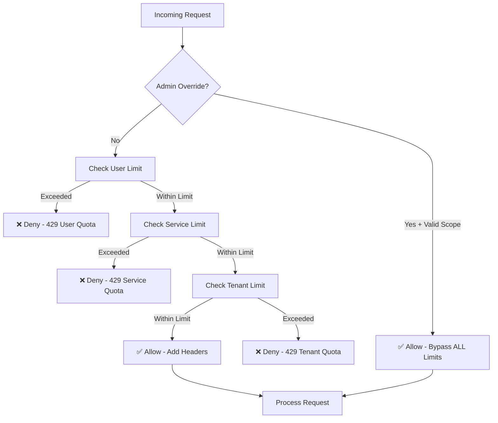

# Cost Management & Rate Limiting Configuration

**Version:** 1.0  
**Last Updated:** 2025-01-20  
**Status:** Implementation Complete

---

## Table of Contents

1. [Overview](#overview)
2. [Rate Limiting Architecture](#rate-limiting-architecture)
3. [Hierarchical Rate Limit Checks](#hierarchical-rate-limit-checks)
4. [Admin Override](#admin-override)
5. [Budget Enforcement](#budget-enforcement)
6. [Cost Computation](#cost-computation)
7. [Configuration](#configuration)
8. [Monitoring & Alerts](#monitoring--alerts)
9. [API Integration](#api-integration)
10. [Testing Scenarios](#testing-scenarios)

---

## Overview

The Listo.Notification service implements a sophisticated cost management and rate limiting system with the following key features:

- **Hierarchical Rate Limiting:** User → Service → Tenant level checks
- **Token Bucket Algorithm:** Redis-backed with atomic Lua script execution
- **Burst Capacity:** Allows initial burst of requests, then rate-limited refill
- **Budget Tracking:** Per-tenant and per-service monthly budgets with alerts at 80% and 100%
- **Admin Override:** Bypass all rate limits with proper authorization
- **Priority-Based Budget Enforcement:** High-priority notifications allowed even when budget exceeds 100%

---

## Rate Limiting Architecture

### Token Bucket Implementation

The service uses a **Redis-backed token bucket** algorithm for rate limiting:

```
┌─────────────────────────────────────────────┐
│           Token Bucket Model                │
├─────────────────────────────────────────────┤
│  Capacity: 60 tokens                        │
│  Burst Size: 20 tokens                      │
│  Refill Rate: 60 tokens/hour                │
│                                             │
│  Initial State:    [████████] 80 tokens    │
│                    (60 + 20 burst)          │
│                                             │
│  After 20 requests: [████] 60 tokens       │
│  After 1 hour:      [████████] 80 tokens   │
└─────────────────────────────────────────────┘
```

### Redis Key Structure

```
rl:user:{tenantId}:{userId}:{channel}
rl:service:{tenantId}:{serviceOrigin}:{channel}
rl:tenant:{tenantId}:{channel}
```

### Lua Script (Atomic Operations)

The Lua script ensures atomic token consumption:

```lua
local key = KEYS[1]
local maxTokens = tonumber(ARGV[1])
local refillRate = tonumber(ARGV[2])
local now = tonumber(ARGV[3])
local windowSeconds = tonumber(ARGV[4])
local burstSize = tonumber(ARGV[5])

local tokens = tonumber(redis.call('HGET', key, 'tokens')) or maxTokens
local lastRefill = tonumber(redis.call('HGET', key, 'last_refill')) or now

local elapsed = now - lastRefill
local tokensToAdd = math.floor(elapsed * refillRate)
tokens = math.min(tokens + tokensToAdd, maxTokens + burstSize)

if tokens >= 1 then
    tokens = tokens - 1
    redis.call('HSET', key, 'tokens', tokens)
    redis.call('HSET', key, 'last_refill', now)
    redis.call('EXPIRE', key, windowSeconds)
    return {1, tokens}
else
    return {0, 0}
end
```

---

## Hierarchical Rate Limit Checks

### Check Flow



### Hierarchy Rules

1. **Admin Override** (if header `X-Admin-Override: true` and `notifications:admin` scope)
   - ✅ Bypasses ALL rate limits
   - ✅ Logged but not separately audited

2. **User Quota** (per-user, per-channel)
   - Default: 60 requests/hour with burst of 20
   - Uses Redis token bucket
   - Rolling window

3. **Service Quota** (per-service, per-channel, per-tenant)
   - Default: 50k emails/day, 10k SMS/day, 200k push/day
   - Uses 24-hour rolling window from first request
   - Checked via database query for accuracy

4. **Tenant Quota** (aggregate across all services, per-channel)
   - Max cap enforcement
   - Prevents runaway costs across services

### Example Limits

| Level    | Channel | Limit           | Window  | Burst |
|----------|---------|-----------------|---------|-------|
| User     | Email   | 60 requests     | 1 hour  | 20    |
| User     | SMS     | 60 requests     | 1 hour  | 20    |
| User     | Push    | 60 requests     | 1 hour  | 20    |
| Service  | Email   | 50,000 emails   | 24 hours| N/A   |
| Service  | SMS     | 10,000 messages | 24 hours| N/A   |
| Service  | Push    | 200,000 pushes  | 24 hours| N/A   |
| Tenant   | Email   | 100,000 emails  | 24 hours| N/A   |

---

## Admin Override

### Requirements

To use admin override, the request must include:

1. **Header:** `X-Admin-Override: true`
2. **Authorization:** Valid JWT with `notifications:admin` scope OR `Admin` role

### Example Request

```http
POST /api/v1/notifications/send
Authorization: Bearer {jwt_with_admin_scope}
X-Admin-Override: true
X-Service-Origin: orders
Content-Type: application/json

{
  "userId": "user-123",
  "channel": "sms",
  "templateKey": "urgent_alert",
  "priority": "high",
  "data": { ... }
}
```

### Behavior

- ✅ Bypasses user, service, and tenant rate limits
- ✅ Still respects budget limits (but allows high-priority through)
- ✅ Logged for transparency
- ❌ NOT separately audited (to reduce overhead)

---

## Budget Enforcement

### Budget Configuration

Budgets are configured per-tenant, per-service, per-channel:

```json
{
  "tenantId": "tenant-uuid-123",
  "serviceOrigin": "orders",
  "channel": "sms",
  "currency": "USD",
  "monthlyBudgetMicros": 50000000,
  "alertThresholds": [0.8, 1.0],
  "alert80Sent": false,
  "alert100Sent": false
}
```

### Enforcement Logic

```csharp
if (utilization >= 1.0) // 100% budget exceeded
{
    if (priority == High || priority == Urgent)
    {
        // ✅ ALLOW high-priority notifications
        LogWarning("Budget exceeded - allowing high priority");
        return BudgetCheckResult.Allowed(warningMessage: "Budget exceeded");
    }
    else
    {
        // ❌ BLOCK non-critical notifications
        return BudgetCheckResult.Denied(reason: "Budget exceeded");
    }
}
```

### Priority Levels

| Priority | Budget 100%+ Behavior |
|----------|-----------------------|
| Urgent   | ✅ Allowed            |
| High     | ✅ Allowed            |
| Normal   | ❌ Blocked            |
| Low      | ❌ Blocked            |

---

## Cost Computation

### Cost Per Channel (in micros)

**1 micro = 1/1,000,000 of currency unit**

| Channel | Cost per Message | Provider    | Notes                          |
|---------|------------------|-------------|--------------------------------|
| Email   | 950 micros       | SendGrid    | $0.00095/email                 |
| SMS     | 7,900 micros     | Twilio (US) | $0.0079/message × segment count|
| Push    | 0 micros         | FCM         | Free                           |
| In-App  | 0 micros         | SignalR     | Free                           |

### Multi-Segment SMS

For SMS messages that exceed 160 characters:

```csharp
var segmentCount = CalculateSegmentCount(messageBody);
var costMicros = 7900 * segmentCount;
```

| Message Length | Segments | Cost (USD)  |
|----------------|----------|-------------|
| 1-160 chars    | 1        | $0.0079     |
| 161-320 chars  | 2        | $0.0158     |
| 321-480 chars  | 3        | $0.0237     |

---

## Configuration

### Database Tables

#### RateLimiting Table

```sql
CREATE TABLE RateLimiting (
    Id UNIQUEIDENTIFIER PRIMARY KEY,
    TenantId UNIQUEIDENTIFIER NULL,
    ServiceOrigin NVARCHAR(100) NOT NULL,
    Channel NVARCHAR(50) NOT NULL,
    Enabled BIT NOT NULL DEFAULT 1,
    PerUserMax INT NOT NULL,
    PerUserWindowSeconds INT NOT NULL,
    PerUserMaxCap INT NOT NULL,
    BurstSize INT NOT NULL DEFAULT 20,
    PerServiceMax INT NOT NULL,
    PerServiceWindowSeconds INT NOT NULL,
    PerServiceMaxCap INT NOT NULL,
    CreatedAt DATETIME2 NOT NULL DEFAULT GETUTCDATE(),
    UpdatedAt DATETIME2 NOT NULL DEFAULT GETUTCDATE()
);
```

#### BudgetConfig Table

```sql
CREATE TABLE BudgetConfig (
    Id UNIQUEIDENTIFIER PRIMARY KEY,
    TenantId UNIQUEIDENTIFIER NOT NULL,
    ServiceOrigin NVARCHAR(100) NOT NULL,
    Channel NVARCHAR(50) NOT NULL,
    Currency NVARCHAR(3) NOT NULL,
    MonthlyBudgetMicros BIGINT NOT NULL,
    Alert80Sent BIT NOT NULL DEFAULT 0,
    Alert100Sent BIT NOT NULL DEFAULT 0,
    CreatedAt DATETIME2 NOT NULL DEFAULT GETUTCDATE(),
    UpdatedAt DATETIME2 NOT NULL DEFAULT GETUTCDATE()
);
```

### Default Configuration (Seed Data)

```csharp
new RateLimitingEntity
{
    TenantId = null, // Global default
    ServiceOrigin = "*",
    Channel = "email",
    Enabled = true,
    PerUserMax = 60,
    PerUserWindowSeconds = 3600, // 1 hour
    PerUserMaxCap = 100,
    BurstSize = 20,
    PerServiceMax = 50000,
    PerServiceWindowSeconds = 86400, // 24 hours
    PerServiceMaxCap = 100000
}
```

---

## Monitoring & Alerts

### Budget Monitor Function

**Schedule:** Every hour (NCRONTAB: `0 0 * * * *`)

**Thresholds:**
- **80%:** Warning alert sent to admins
- **100%:** Critical alert + Service Bus event published

**Service Bus Event:**

```json
{
  "eventType": "BudgetThresholdCrossed",
  "tenantId": "tenant-uuid",
  "serviceOrigin": "orders",
  "channel": "sms",
  "thresholdPercent": 100,
  "actualPercent": 105.3,
  "currentSpend": 527.50,
  "budget": 500.00,
  "currency": "USD",
  "timestamp": "2025-01-20T15:00:00Z"
}
```

### Alert Reset

Alert flags are reset automatically on the 1st day of each month at midnight UTC.

---

## API Integration

### Rate Limit Response Headers

Every API response includes:

```http
X-RateLimit-Limit: 60
X-RateLimit-Remaining: 42
X-RateLimit-Reset: 1705765200
```

### 429 Too Many Requests Response

```json
{
  "error": {
    "code": "RATE_LIMIT_EXCEEDED",
    "message": "Rate limit exceeded. Please retry after the specified time.",
    "retryAfter": 3600,
    "limit": 60,
    "remaining": 0
  }
}
```

### Budget Exceeded Response (for non-critical)

```json
{
  "error": {
    "code": "BUDGET_EXCEEDED",
    "message": "Monthly budget exceeded for sms channel. Current utilization: 105.3%",
    "utilization": 1.053,
    "currentSpend": 527.50,
    "budget": 500.00,
    "currency": "USD"
  }
}
```

---

## Testing Scenarios

### Scenario 1: Normal Request Within Limits

```http
POST /api/v1/notifications/send
Authorization: Bearer {jwt}
X-Service-Origin: orders

Response: 200 OK
X-RateLimit-Limit: 60
X-RateLimit-Remaining: 59
```

### Scenario 2: User Rate Limit Exceeded

```http
POST /api/v1/notifications/send (61st request in hour)

Response: 429 Too Many Requests
Retry-After: 3240
X-RateLimit-Remaining: 0
```

### Scenario 3: Admin Override

```http
POST /api/v1/notifications/send
Authorization: Bearer {jwt_with_admin_scope}
X-Admin-Override: true

Response: 200 OK
(No rate limit applied)
```

### Scenario 4: Budget Exceeded - High Priority Allowed

```http
POST /api/v1/notifications/send
{
  "priority": "high",
  "channel": "sms"
}

Response: 200 OK
(Allowed despite budget exceeded)
```

### Scenario 5: Budget Exceeded - Normal Priority Blocked

```http
POST /api/v1/notifications/send
{
  "priority": "normal",
  "channel": "sms"
}

Response: 402 Payment Required
(Budget exceeded, non-critical blocked)
```

### Scenario 6: Multi-Channel Quota Consumption

```http
POST /api/v1/notifications/send
{
  "channels": ["email", "push"],
  "priority": "normal"
}

Result:
- Email channel: 1 token consumed
- Push channel: 1 token consumed
- Both checked independently
```

---

## Best Practices

1. **Configure Tenant-Specific Limits** for high-volume tenants
2. **Monitor Budget Utilization** regularly via dashboards
3. **Use Admin Override Sparingly** - only for critical operational needs
4. **Set Realistic Budgets** based on historical usage patterns
5. **Test Rate Limits** in staging before production deployment
6. **Review Burst Capacity** - 20 tokens allows initial burst, then rate-limited

---

## Related Documentation

- [Authentication Configuration](./AUTHENTICATION_CONFIGURATION.md)
- [Service Event Mappings](./SERVICE_EVENT_MAPPINGS.md)
- [Database Schema](../NOTIFICATION_MGMT_PLAN.md#4-data-modeling--database-schema)

---

**Implementation Status:** ✅ Complete  
**Components Implemented:**
- ✅ RateLimitingService (hierarchical checks)
- ✅ BudgetEnforcementService (priority-based blocking)
- ✅ RateLimitingMiddleware (HTTP integration)
- ✅ BudgetMonitorFunction (hourly monitoring)
- ✅ RedisTokenBucketLimiter (token bucket with burst)
