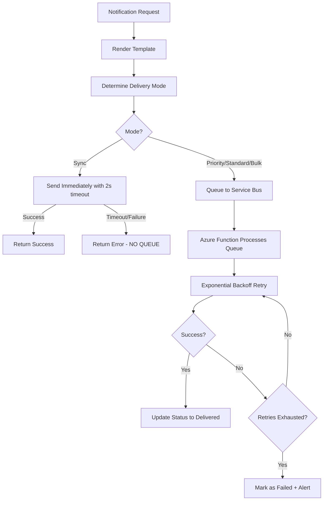
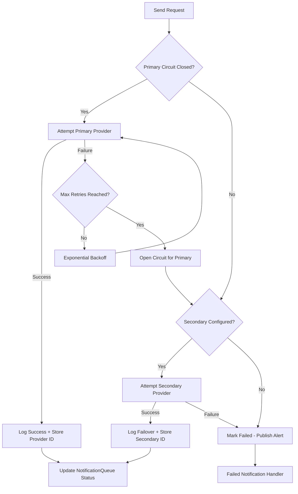

# Notification Delivery Strategy

**Version:** 1.0  
**Last Updated:** 2025-01-20  
**Status:** Specification Complete

---

## Table of Contents

1. [Overview](#overview)
2. [Synchronous vs Asynchronous Delivery](#synchronous-vs-asynchronous-delivery)
3. [Exponential Backoff with Jitter](#exponential-backoff-with-jitter)
4. [Provider Failover Strategy](#provider-failover-strategy)
5. [Webhook Handlers](#webhook-handlers)
6. [Template Rendering & Localization](#template-rendering--localization)
7. [Failed Notification Handling](#failed-notification-handling)
8. [Testing Scenarios](#testing-scenarios)

---

## Overview

The Listo.Notification service implements a sophisticated delivery strategy that balances speed, reliability, and cost-effectiveness:

- **Synchronous Delivery:** 2s timeout, immediate failure (driver assignment, OTP, 2FA)
- **Asynchronous Delivery:** Queue-based with exponential backoff retry
- **Provider Failover:** Circuit breaker pattern with primary/secondary providers
- **Webhook Processing:** Auto-retry on failure with secondary provider attempt
- **Localization:** User preferences + Accept-Language header fallback
- **Failed Notification Handling:** DB storage + alerts + manual retry API

---

## Synchronous vs Asynchronous Delivery

### Delivery Mode Routing

```csharp
public DeliveryMode DetermineDeliveryMode(NotificationRequest request)
{
    // 1. SYNCHRONOUS: driver assignment, OTP, 2FA
    if (IsSync

ynchronousDelivery(request))
        return DeliveryMode.Synchronous;
    
    // 2. PRIORITY QUEUE: high-priority notifications
    if (request.Priority == Priority.High)
        return DeliveryMode.PriorityQueue;
    
    // 3. BULK QUEUE: low-priority or bulk
    if (request.IsBulk || request.Priority == Priority.Low)
        return DeliveryMode.BulkQueue;
    
    // 4. STANDARD QUEUE: default
    return DeliveryMode.StandardQueue;
}
```

### Delivery Modes

| Mode | Use Cases | Timeout | Retry on Timeout | Queue Name | Max Latency |
|------|-----------|---------|------------------|------------|-------------|
| **Synchronous** | Driver assignment, OTP, 2FA | 2s | ❌ NO (immediate failure) | N/A | 2s |
| **Priority Queue** | High-priority alerts | 15s | ✅ Yes (3 attempts) | `listo-notifications-priority` | 5s |
| **Standard Queue** | Order updates, confirmations | 30s | ✅ Yes (6 attempts) | `listo-notifications-queue` | 30s |
| **Bulk Queue** | Marketing, newsletters | 30s | ✅ Yes (6 attempts) | `listo-notifications-bulk` | 5min |

### Synchronous Delivery Rules

**CRITICAL: Synchronous delivery does NOT queue on timeout!**

```csharp
// Synchronous delivery with 2s hard timeout
try
{
    using var cts = new CancellationTokenSource(TimeSpan.FromSeconds(2));
    var result = await provider.SendAsync(notification, cts.Token);
    return DeliveryResult.Succeeded(result.MessageId, "Twilio");
}
catch (OperationCanceledException)
{
    // FAIL IMMEDIATELY - no queueing
    throw new DeliveryTimeoutException(
        "Synchronous delivery timed out after 2s");
}
```

**Business Logic:**
- ✅ Fail immediately on timeout
- ❌ DO NOT automatically queue for async retry
- ❌ DO NOT attempt additional retries
- ✅ Return error to caller

### Asynchronous Delivery Flow



---

## Exponential Backoff with Jitter

### Retry Policy Configuration

**SMS (OTP - High Priority):**
```json
{
  "serviceOrigin": "auth",
  "channel": "sms",
  "maxAttempts": 4,
  "baseDelaySeconds": 3,
  "backoffFactor": 2.0,
  "maxBackoffSeconds": 120,
  "jitterMs": 1000,
  "timeoutSeconds": 20
}
```

**Email (Standard):**
```json
{
  "serviceOrigin": "*",
  "channel": "email",
  "maxAttempts": 6,
  "baseDelaySeconds": 5,
  "backoffFactor": 2.0,
  "maxBackoffSeconds": 600,
  "jitterMs": 1000,
  "timeoutSeconds": 30
}
```

**Push (Normal Priority):**
```json
{
  "serviceOrigin": "orders",
  "channel": "push",
  "maxAttempts": 3,
  "baseDelaySeconds": 2,
  "backoffFactor": 2.0,
  "maxBackoffSeconds": 300,
  "jitterMs": 500,
  "timeoutSeconds": 15
}
```

### Delay Calculation Formula

```
delay = min(baseDelay * (backoffFactor ^ attemptNumber), maxBackoff) + random(0, jitter)
```

**Example for SMS (baseDelay=3s, backoff=2.0, max=120s, jitter=1s):**

| Attempt | Calculation | Delay (without jitter) | With Jitter (random) |
|---------|-------------|------------------------|----------------------|
| 0 (1st) | 3 * 2^0 = 3s | 3s | 3-4s |
| 1 (2nd) | 3 * 2^1 = 6s | 6s | 6-7s |
| 2 (3rd) | 3 * 2^2 = 12s | 12s | 12-13s |
| 3 (4th) | 3 * 2^3 = 24s | 24s | 24-25s |

### Implementation

Fully implemented in `ExponentialBackoffRetryService.cs` with:
- ✅ Per-attempt timeout
- ✅ Jitter to prevent thundering herd
- ✅ Max backoff cap
- ✅ Cancellation token support
- ✅ Detailed logging for each attempt

---

## Provider Failover Strategy

### Configuration

**SMS Channel:**
- **Primary:** Twilio (US/Canada/International)
- **Secondary:** AWS SNS (fallback)
- **Circuit Breaker:** 5 consecutive failures → open for 60s
- **Health Check:** Every 30s when circuit open

**Email Channel:**
- **Primary:** SendGrid
- **Secondary:** Azure Communication Services
- **Circuit Breaker:** 5 consecutive failures → open for 60s
- **Health Check:** Every 30s when circuit open

**Push Channel:**
- **Primary:** Firebase Cloud Messaging (FCM)
- **Secondary:** None (FCM high availability)
- **Circuit Breaker:** 10 consecutive failures → open for 120s

### Notification ID Tracking

**IMPORTANT:** Same notification ID is used across all provider attempts!

```csharp
// Notification entity structure for tracking multiple providers
public class NotificationEntity
{
    public Guid Id { get; set; } // SAME ID across all attempts
    public string[] ProviderMessageIds { get; set; } // Array of provider IDs
    public string[] ProviderNames { get; set; } // ["Twilio", "AWS_SNS"]
    public int AttemptCount { get; set; }
    public DateTime? LastAttemptAt { get; set; }
}

// Example after failover:
// Id: notif-123
// ProviderMessageIds: ["twilio-msg-456", "sns-msg-789"]
// ProviderNames: ["Twilio", "AWS_SNS"]
// Status: "delivered" (succeeded on secondary)
```

**Best Practice for `providerMessageId`:**
- Store as **array** to track all attempts
- Index corresponds to attempt number
- Primary provider = index 0, secondary = index 1, etc.
- Allows full audit trail of delivery attempts

### Failover Flow



### Circuit Breaker States

| State | Description | Behavior |
|-------|-------------|----------|
| **Closed** | Normal operation | All requests go to primary provider |
| **Open** | Too many failures | All requests skip primary, try secondary |
| **Half-Open** | Testing recovery | Single test request to primary |

**State Transitions:**
- Closed → Open: After 5 consecutive failures
- Open → Half-Open: After 60s break duration
- Half-Open → Closed: If test request succeeds
- Half-Open → Open: If test request fails (another 60s break)

---

## Webhook Handlers

### 1. Twilio SMS Status Webhook

**Endpoint:** `POST /api/v1/webhooks/twilio/sms-status`

**Signature Validation:**
```csharp
// X-Twilio-Signature header validation
var url = $"{scheme}://{host}{path}{queryString}";
var data = url + sortedFormParameters;
var hmac = HMACSHA1(authToken, data);
var expectedSignature = Base64(hmac);
return FixedTimeEquals(expectedSignature, twilioSignature);
```

**Event Types:**
- `queued` → Update status to "Queued"
- `sent` → Update status to "Sent"
- `delivered` → Update status to "Delivered" ✅
- `failed` → **AUTO-RETRY** with secondary provider
- `undelivered` → **AUTO-RETRY** with secondary provider

**Business Logic on `failed` Event:**
```csharp
[HttpPost("/api/v1/webhooks/twilio/sms-status")]
public async Task<IActionResult> HandleTwilioWebhook([FromForm] TwilioWebhookEvent evt)
{
    // 1. Validate signature
    if (!_validator.ValidateSignature(Request, twilioSignature))
        return Unauthorized();
    
    // 2. Update notification status
    var notification = await _db.Notifications.FindAsync(evt.MessageSid);
    notification.Status = MapTwilioStatus(evt.MessageStatus);
    
    // 3. AUTO-RETRY on failure
    if (evt.MessageStatus == "failed" || evt.MessageStatus == "undelivered")
    {
        _logger.LogWarning("Twilio delivery failed for {MessageSid}. Auto-retrying with secondary provider", evt.MessageSid);
        
        // Immediately attempt secondary provider (AWS SNS)
        await _failoverService.RetryWithSecondaryProviderAsync(notification);
    }
    
    await _db.SaveChangesAsync();
    return Ok();
}
```

### 2. SendGrid Event Webhook

**Endpoint:** `POST /api/v1/webhooks/sendgrid/events`

**Signature Validation:**
```csharp
// ECDSA signature validation
using var ecdsa = ECDsa.Create();
ecdsa.ImportSubjectPublicKeyInfo(publicKeyBytes);
var dataToVerify = Encoding.UTF8.GetBytes(timestamp + payload);
return ecdsa.VerifyData(dataToVerify, signatureBytes, HashAlgorithmName.SHA256);
```

**Event Types:**
- `delivered` → Update status to "Delivered" ✅
- `opened` → Track engagement metric
- `clicked` → Track engagement metric
- `bounce` → **AUTO-RETRY** with secondary (Azure Communication Services)
- `dropped` → **AUTO-RETRY** with secondary
- `spam_report` → Mark as failed, do NOT retry
- `unsubscribe` → Update user preferences, do NOT retry

### 3. FCM Delivery Status

**Endpoint:** `POST /api/v1/webhooks/fcm/delivery-status`

**Event Types:**
- `delivered` → Update status to "Delivered" ✅
- `failed` → **AUTO-RETRY** (same provider, FCM has high availability)

---

## Template Rendering & Localization

### Rendering Timing

**✅ RENDER BEFORE QUEUING TO SERVICE BUS**

```csharp
// 1. Resolve locale
var locale = await ResolveLocaleAsync(userId, acceptLanguageHeader);

// 2. Fetch template
var template = await GetTemplateAsync(templateKey, locale);
if (template == null)
    throw new TemplateNotFoundException($"Template {templateKey} not found for locale {locale}");

// 3. Render with data
var renderedContent = await RenderTemplateAsync(template, data);

// 4. Queue with rendered content
await QueueToServiceBusAsync(new QueuedNotification
{
    NotificationId = notificationId,
    RenderedContent = renderedContent, // ✅ Already rendered
    Locale = locale,
    // ... other fields
});
```

**Why render before queuing?**
- ✅ Fail fast if template missing
- ✅ Reduce processing in Azure Functions
- ✅ Consistent rendering logic
- ✅ Easier debugging (rendered content stored)

### Locale Resolution

**Priority Order:**
1. **User Preferences Table** (primary source)
2. **Accept-Language Header** (fallback)
3. **Tenant Default** (if configured)
4. **System Default** (en-US)

```csharp
public async Task<string> ResolveLocaleAsync(string userId, string? acceptLanguageHeader)
{
    // 1. Check user preferences (primary)
    var userPrefs = await _db.Preferences
        .Where(p => p.UserId == userId)
        .Select(p => p.PreferredLocale)
        .FirstOrDefaultAsync();
    
    if (!string.IsNullOrEmpty(userPrefs))
        return userPrefs;
    
    // 2. Parse Accept-Language header (fallback)
    if (!string.IsNullOrEmpty(acceptLanguageHeader))
    {
        var languages = ParseAcceptLanguage(acceptLanguageHeader);
        return languages.FirstOrDefault() ?? "en-US";
    }
    
    // 3. System default
    return "en-US";
}
```

**Template Availability:**
- ✅ ALL locales MUST exist for each template
- ❌ NO fallback to default locale (will throw exception)
- ✅ Templates validated at deployment time
- ✅ Missing locale = deployment failure

---

## Failed Notification Handling

### When All Retries Exhausted

**Actions Taken:**
1. ✅ Store in database with `Failed` status
2. ✅ Publish alert event to Service Bus
3. ✅ Admin API available for manual retry

### Database Storage

```sql
UPDATE NotificationQueue
SET Status = 'failed',
    FailedAt = GETUTCDATE(),
    LastError = 'Retry exhausted after 6 attempts. Last error: Twilio API timeout',
    AttemptCount = 6
WHERE Id = @notificationId;
```

### Alert Event (Service Bus)

```json
{
  "eventType": "NotificationFailed",
  "notificationId": "notif-uuid-123",
  "tenantId": "tenant-uuid-456",
  "userId": "user-uuid-789",
  "channel": "sms",
  "templateKey": "order_confirmed",
  "attemptCount": 6,
  "lastError": "Twilio API timeout",
  "failedAt": "2025-01-20T15:30:00Z",
  "providerAttempts": [
    {"provider": "Twilio", "messageId": "SM123", "error": "timeout"},
    {"provider": "AWS_SNS", "messageId": "sns-456", "error": "invalid_number"}
  ]
}
```

### Admin Manual Retry API

**Endpoint:** `POST /api/v1/admin/notifications/{id}/retry`

```http
POST /api/v1/admin/notifications/notif-123/retry
Authorization: Bearer {admin_jwt}
X-Admin-Override: true
Content-Type: application/json

{
  "reason": "Customer support request - SMS delivery failed due to temporary provider outage",
  "forceProvider": "AWS_SNS"
}
```

**Response:**
```json
{
  "success": true,
  "notificationId": "notif-123",
  "retryAttemptId": "retry-uuid-999",
  "status": "queued",
  "estimatedDeliveryTime": "2025-01-20T15:35:00Z"
}
```

---

## Testing Scenarios

### Scenario 1: Synchronous Delivery Success

```http
POST /api/v1/notifications/send
{
  "templateKey": "driver_assigned",
  "priority": "high",
  "synchronous": true,
  "channel": "push"
}

Response: 200 OK (1.2s)
{
  "notificationId": "notif-123",
  "status": "delivered",
  "deliveredAt": "2025-01-20T15:30:01.234Z",
  "providerMessageId": "fcm-msg-456"
}
```

### Scenario 2: Synchronous Delivery Timeout (NO QUEUE)

```http
POST /api/v1/notifications/send
{
  "templateKey": "driver_assigned",
  "synchronous": true
}

Response: 504 Gateway Timeout (2.0s)
{
  "error": {
    "code": "DELIVERY_TIMEOUT",
    "message": "Synchronous delivery timed out after 2s. Notification NOT queued.",
    "notificationId": "notif-123"
  }
}
```

### Scenario 3: Async Delivery with Retry

```http
POST /api/v1/notifications/send
{
  "templateKey": "order_confirmed",
  "priority": "normal",
  "channel": "email"
}

Response: 202 Accepted
{
  "notificationId": "notif-456",
  "status": "queued",
  "queueName": "listo-notifications-queue"
}

// Background processing with exponential backoff
// Attempt 1: Failed (SendGrid timeout)
// Wait 5s + jitter
// Attempt 2: Failed (SendGrid 503)
// Wait 10s + jitter
// Attempt 3: Success with Azure Communication Services (failover)
```

### Scenario 4: Webhook Auto-Retry

```http
# Twilio sends webhook
POST /api/v1/webhooks/twilio/sms-status
X-Twilio-Signature: {signature}
{
  "MessageSid": "SM123",
  "MessageStatus": "failed",
  "ErrorCode": "30005"
}

# System auto-retries with AWS SNS (secondary provider)
# Notification ID remains "notif-123"
# ProviderMessageIds: ["SM123", "sns-msg-789"]
# Status updated to "delivered" after successful AWS SNS delivery
```

### Scenario 5: Localization Fallback

```http
POST /api/v1/notifications/send
Headers:
  Accept-Language: es-MX, en-US;q=0.9

# 1. Check user preferences → NULL
# 2. Parse Accept-Language → "es-MX"
# 3. Fetch template "order_confirmed" for "es-MX"
# 4. If template exists → render in Spanish
# 5. If template missing → THROW exception (no fallback)
```

### Scenario 6: Manual Retry via Admin API

```http
POST /api/v1/admin/notifications/notif-failed-123/retry
Authorization: Bearer {admin_jwt}
X-Admin-Override: true
{
  "reason": "Customer escalation - retry with secondary provider",
  "forceProvider": "AWS_SNS"
}

Response: 200 OK
{
  "success": true,
  "retryAttemptId": "retry-999",
  "status": "queued"
}
```

---

## Implementation Status

### ✅ Completed Components

1. **ExponentialBackoffRetryService** - Full implementation with jitter and timeout
2. **NotificationDeliveryService** - Delivery mode routing and queue name resolution
3. **Comprehensive Documentation** - This document

### ⏳ Infrastructure Layer Implementation Required

The following components require Infrastructure layer implementation with proper dependencies:

1. **ProviderFailoverService** - Requires Polly NuGet package and provider SDK integration
2. **Webhook Controllers** - Requires API controllers with signature validation
3. **Template Rendering Enhancement** - Requires locale resolution from DbContext
4. **Failed Notification Processor** - Requires Service Bus publisher
5. **Admin Retry API** - Requires API controller with admin authorization

---

**Document Status:** ✅ Specification Complete  
**Implementation:** Application Layer Services Complete, Infrastructure Layer Pending  
**Next Steps:** Implement Infrastructure components with Polly circuit breaker and webhook handlers
